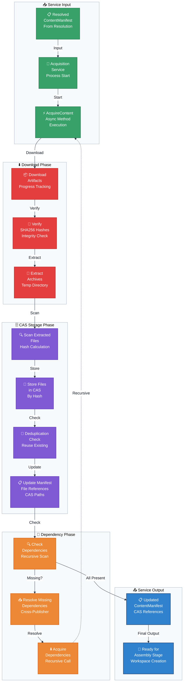

# Flowchart: Content Acquisition Layer

This flowchart details the critical transformation step where a `ContentManifest` with artifact references is processed, downloaded, and stored in the Content-Addressable Storage (CAS) system.

**Acquisition Workflow:**

| Phase | Process | Details | Key Benefits |
|-------|---------|---------|--------------|
| **Download** | Artifact retrieval | Downloads files from publisher-hosted URLs with progress tracking | Supports any hosting provider |
| **Verification** | Hash validation | Verifies SHA256 hashes match catalog metadata | Ensures file integrity |
| **Extraction** | Archive processing | Extracts ZIP/RAR archives to temporary directory | Handles compressed content |
| **CAS Storage** | Content-addressable storage | Stores files by SHA256 hash, deduplicates automatically | Saves disk space, enables sharing |
| **Dependency Resolution** | Recursive acquisition | Resolves and acquires dependencies (same-catalog and cross-publisher) | Ensures complete installation |

**Content-Addressable Storage (CAS) Benefits:**

- **Deduplication**: Files shared across multiple mods are stored only once
- **Integrity**: Files are verified by hash and immutable once stored
- **Efficiency**: Workspace strategies (symlink/hardlink) reference CAS files without duplication
- **Reliability**: Corrupted files are automatically detected and re-downloaded

**Cross-Publisher Dependencies:**

The acquisition phase handles dependencies that reference content from other publishers:
1. Check if dependency is already installed in ManifestPool
2. If missing, check if user is subscribed to the dependency's publisher
3. If not subscribed, prompt user to subscribe via genhub:// link
4. Recursively acquire dependency content before continuing with main content
