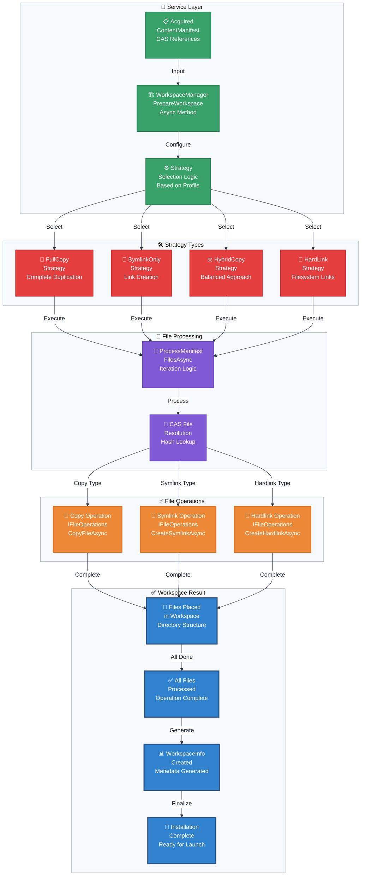

# Flowchart: Workspace Assembly Layer

This flowchart details the final stage where a fully resolved and acquired `ContentManifest` is used to build the isolated game workspace from CAS-stored files.

> [!NOTE]
> **Tool Profile Bypass**: For profiles identified as `IsToolProfile` (containing exactly one `ModdingTool` content), the entire Workspace Assembly layer is bypassed. The system instead launches the tool executable directly from the content storage directory.

**Strategy Comparison Matrix:**

| Strategy | Disk Usage | Performance | Platform Compatibility | Admin Rights | Use Case |
|----------|------------|-------------|----------------------|--------------|----------|
| **FullCopy** | High | Fast Launch | Maximum | No | Stable releases |
| **SymlinkOnly** | Minimal | Fast Launch | Platform-dependent | Sometimes | Development |
| **HybridCopy** | Medium | Balanced | Good | No | General use |
| **HardLink** | Low | Fast Launch | Same volume only | No | Power users |

**CAS Integration:**

The workspace assembly layer integrates tightly with the Content-Addressable Storage (CAS) system:

1. **File Resolution**: Each file reference in the manifest is resolved to its CAS location by SHA256 hash
2. **Strategy Application**: The selected workspace strategy determines how files are mapped from CAS to workspace
3. **Deduplication**: Multiple mods sharing the same files reference the same CAS entries
4. **Integrity**: Files are verified during assembly to ensure CAS integrity

**Workspace Strategies Explained:**

- **FullCopy**: Copies all files from CAS to workspace (maximum compatibility, high disk usage)
- **SymlinkOnly**: Creates symbolic links from workspace to CAS (minimal disk usage, requires symlink support)
- **HybridCopy**: Copies small files, symlinks large files (balanced approach, recommended default)
- **HardLink**: Creates hard links from workspace to CAS (low disk usage, same volume required)
