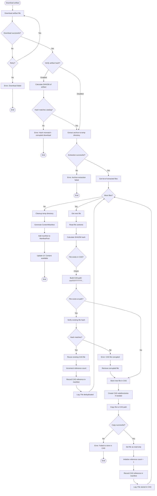

# Content-Addressable Storage (CAS) Flow

This flowchart illustrates how GenHub stores downloaded content using content-addressable storage, where files are stored by their SHA256 hash for deduplication and integrity verification.

## Overview

The CAS system ensures that identical files are stored only once, regardless of how many mods use them. This saves disk space and enables efficient workspace strategies (symlink, hardlink, copy).

## Flow Diagram



## Key Components

### CAS Directory Structure

```
GenHub/
└── cas/
    ├── 00/
    │   ├── 0123456789abcdef...
    │   └── 0fedcba987654321...
    ├── 01/
    │   └── ...
    ├── ...
    └── ff/
        └── ...
```

- **Path Format**: `cas/{first2chars}/{remaining62chars}`
- **Example**: SHA256 `a1b2c3d4...` → `cas/a1/b2c3d4...`
- **Purpose**: Avoid too many files in single directory (filesystem performance)

### Hash Calculation
- **Algorithm**: SHA256
- **Input**: File contents (binary)
- **Output**: 64-character hexadecimal string
- **Library**: `System.Security.Cryptography.SHA256`

### Reference Counting
- **Purpose**: Track how many manifests reference each CAS file
- **Storage**: `cas_references.json` or in-memory cache
- **Schema**:
```json
{
  "references": {
    "a1b2c3d4...": {
      "count": 3,
      "size": 1048576,
      "manifests": [
        "1.0.publisher.mod.content1",
        "1.0.publisher.mod.content2",
        "1.0.publisher.map.content3"
      ]
    }
  }
}
```

### Manifest File References
- **Model**: `ContentManifest.Files[]`
- **Fields**:
  - `relativePath`: Path within mod (e.g., "Data/INI/Weapon.ini")
  - `sourceType`: "CAS" (content-addressable storage)
  - `hash`: SHA256 hash (CAS key)
  - `size`: File size in bytes
  - `installTarget`: Where to install (e.g., "GameDirectory")

### Deduplication Benefits

#### Example Scenario
- Mod A includes `Weapon.ini` (hash: `abc123...`)
- Mod B includes same `Weapon.ini` (hash: `abc123...`)
- Mod C includes different `Weapon.ini` (hash: `def456...`)

**Storage**:
- Without CAS: 3 copies of `Weapon.ini`
- With CAS: 2 copies (A and B share one)

**Disk Savings**:
- Common files (e.g., `gamemd.exe`, `ra2md.ini`) stored once
- Large mods with shared assets save significant space

## Workspace Strategies

### Symlink Strategy (Default)
- **Process**: Create symbolic links from game directory to CAS files
- **Pros**: No disk space duplication, instant "installation"
- **Cons**: Requires symlink support (Windows 10+, admin rights or Developer Mode)

### Hardlink Strategy
- **Process**: Create hard links from game directory to CAS files
- **Pros**: No disk space duplication, no admin rights needed
- **Cons**: Same filesystem required, files appear as copies

### Copy Strategy
- **Process**: Copy files from CAS to game directory
- **Pros**: Works everywhere, no special permissions
- **Cons**: Duplicates disk space, slower installation

## Integrity Verification

### On Download
1. Calculate SHA256 of downloaded artifact
2. Compare with catalog's expected hash
3. Reject if mismatch (corrupted download)

### On Storage
1. Calculate SHA256 of each extracted file
2. Use hash as CAS key
3. Store file at `cas/{hash[0:2]}/{hash[2:]}`

### On Retrieval
1. Read file from CAS by hash
2. Optionally verify hash matches (paranoid mode)
3. Use file for workspace strategy

### On Cleanup
1. Check reference count
2. If count = 0, file can be deleted
3. Reclaim disk space

## Error Handling

### Download Errors
- Retry with exponential backoff
- Try mirror URLs if available
- Clear error message to user

### Extraction Errors
- Validate archive format before extraction
- Handle corrupted archives gracefully
- Cleanup partial extractions

### Hash Mismatches
- Reject corrupted downloads
- Remove corrupted CAS files
- Re-download if possible

### Disk Space Errors
- Check available space before download
- Warn user if space is low
- Cleanup old/unused CAS files

### Permission Errors
- Handle read-only filesystem
- Fallback to copy strategy if symlink fails
- Clear error messages

## Cleanup and Maintenance

### Orphaned Files
- **Definition**: CAS files with reference count = 0
- **Detection**: Scan CAS directory, check references
- **Action**: Delete to reclaim space

### Corrupted Files
- **Detection**: Hash verification fails
- **Action**: Remove and re-download

### Disk Space Management
- **Monitor**: Track CAS directory size
- **Warn**: Alert user when space is low
- **Cleanup**: Offer to remove unused content

## Performance Optimizations

### Parallel Processing
- Download and extract in parallel
- Hash calculation in background threads
- Batch file operations

### Caching
- Cache reference counts in memory
- Cache manifest metadata
- Avoid redundant hash calculations

### Incremental Updates
- Only re-hash changed files
- Reuse existing CAS files when possible
- Skip unchanged files during updates

## Related Files

- `GenHub.Core/Services/Storage/ContentAddressableStorage.cs`
- `GenHub.Core/Services/Storage/WorkspaceStrategy.cs`
- `GenHub.Core/Models/Manifest/ContentManifest.cs`
- `GenHub.Core/Services/Manifest/ManifestPool.cs`
- `GenHub/Features/Content/Services/ContentInstaller.cs`
