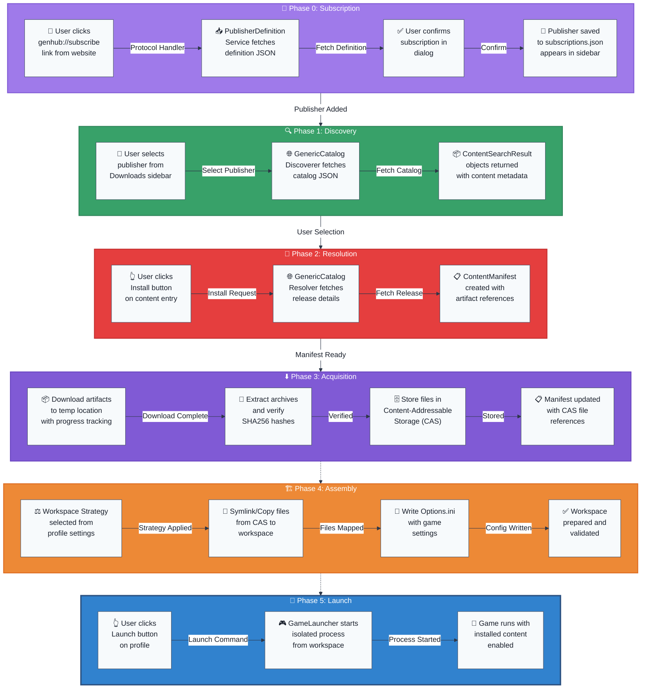

# Flowchart: Complete User Installation Flow

This flowchart illustrates the end-to-end process when a user subscribes to a publisher and installs content, showing how all architectural layers work together with the subscription system.

**End-to-End Data Flow Analysis:**

| Phase | Input Data | Processing Method | Output Data | Key Transformation |
|-------|------------|-------------------|-------------|-------------------|
| **Subscription** | genhub:// URL | Protocol handler + definition fetch | Subscribed publisher | URL → Publisher registration |
| **Discovery** | Publisher selection | Catalog fetch + parsing | `ContentSearchResult` collection | Catalog JSON → Structured results |
| **Resolution** | Content selection | Release fetch + parsing | `ContentManifest` | Lightweight data → Installation plan |
| **Acquisition** | Artifact URLs | Download + hash verification + CAS storage | Files in CAS | Remote artifacts → Local deduplicated storage |
| **Assembly** | File references + strategy | CAS file mapping + workspace creation | Ready workspace | CAS references → Functional environment |
| **Launch** | Workspace path + config | Process creation + monitoring | Running game process | Static files → Active game session |

**Real-World Implementation Example:**

1. **Subscription**: User clicks genhub://subscribe link → Definition fetch → Publisher added to sidebar
2. **Discovery**: User selects publisher → Catalog fetch → Content list displayed
3. **Resolution**: User clicks Install → Release details fetched → Manifest with artifact URLs created
4. **Acquisition**: Artifacts downloaded (150MB) → SHA256 verified → Files stored in CAS by hash
5. **Assembly**: Strategy selection → Files symlinked/copied from CAS → Workspace validated
6. **Launch**: Process execution → Isolated environment → Content-enabled gameplay experience
