# Dependency Resolution Flow

This flowchart illustrates the dependency resolution process when users install content or create game profiles with dependencies.

## Overview

The dependency resolution system ensures that all required content is installed before the main content, handles transitive dependencies, detects circular dependencies, validates version constraints, and checks for conflicts.

## Flow Diagram

```mermaid
flowchart TD
    Start([User selects content for profile]) --> CheckDeps{Content has dependencies?}

    CheckDeps -->|No| InstallMain[Install main content]
    InstallMain --> End1([End])

    CheckDeps -->|Yes| GetDepList[Get dependency list from manifest]
    GetDepList --> InitResolver[Initialize dependency resolver]
    InitResolver --> CreateGraph[Create dependency graph]

    CreateGraph --> CircularCheck{Check for circular dependencies}
    CircularCheck -->|Found| ErrorCircular[Show error: Circular dependency detected]
    ErrorCircular --> DisplayChain[Display dependency chain]
    DisplayChain --> End2([End])

    CircularCheck -->|None| ProcessDeps[Process dependencies]
    ProcessDeps --> DepLoop{More dependencies?}

    DepLoop -->|No| AllResolved{All dependencies resolved?}
    AllResolved -->|Yes| SortDeps[Topological sort dependencies]
    SortDeps --> InstallDeps[Install dependencies in order]
    InstallDeps --> InstallMain2[Install main content]
    InstallMain2 --> End3([End])

    AllResolved -->|No| ErrorUnresolved[Show error: Unresolved dependencies]
    ErrorUnresolved --> ListMissing[List missing dependencies]
    ListMissing --> End4([End])

    DepLoop -->|Yes| GetNextDep[Get next dependency]
    GetNextDep --> ParseDep[Parse dependency:<br/>- publisherId<br/>- contentId<br/>- versionConstraint]

    ParseDep --> CheckInstalled{Already installed?}
    CheckInstalled -->|Yes| CheckVersion{Version compatible?}

    CheckVersion -->|No| VersionConflict[Version conflict detected]
    VersionConflict --> ShowConflict[Show conflict dialog:<br/>- Required version<br/>- Installed version]
    ShowConflict --> UserResolve{User action?}

    UserResolve -->|Update| UpdateContent[Update to compatible version]
    UpdateContent --> DepLoop

    UserResolve -->|Keep| KeepCurrent[Keep current version]
    KeepCurrent --> WarnIncompat[Warn: May cause issues]
    WarnIncompat --> DepLoop

    UserResolve -->|Cancel| CancelInstall[Cancel installation]
    CancelInstall --> End5([End])

    CheckVersion -->|Yes| MarkResolved[Mark dependency as resolved]
    MarkResolved --> DepLoop

    CheckInstalled -->|No| SamePublisher{Same publisher?}

    SamePublisher -->|Yes| FindInCatalog[Find in current catalog]
    FindInCatalog --> FoundInCatalog{Found?}

    FoundInCatalog -->|No| ErrorNotFound[Error: Dependency not found in catalog]
    ErrorNotFound --> End6([End])

    FoundInCatalog -->|Yes| CheckConflicts[Check conflicts]

    SamePublisher -->|No| CrossPublisher[Cross-publisher dependency]
    CrossPublisher --> CheckSubscribed{Publisher subscribed?}

    CheckSubscribed -->|No| PromptSubscribe[Prompt user to subscribe]
    PromptSubscribe --> UserSubscribe{User subscribes?}

    UserSubscribe -->|No| ErrorNoSub[Error: Required publisher not subscribed]
    ErrorNoSub --> End7([End])

    UserSubscribe -->|Yes| FetchDefinition[Fetch publisher definition]
    FetchDefinition --> FetchCatalog[Fetch catalog]
    FetchCatalog --> FindContent[Find content in catalog]
    FindContent --> FoundCross{Found?}

    FoundCross -->|No| ErrorCrossNotFound[Error: Content not found in publisher catalog]
    ErrorCrossNotFound --> End8([End])

    FoundCross -->|Yes| CheckConflicts

    CheckSubscribed -->|Yes| FetchCatalog2[Fetch publisher catalog]
    FetchCatalog2 --> FindContent2[Find content in catalog]
    FindContent2 --> FoundCross2{Found?}

    FoundCross2 -->|No| ErrorCrossNotFound2[Error: Content not found]
    ErrorCrossNotFound2 --> End9([End])

    FoundCross2 -->|Yes| CheckConflicts

    CheckConflicts --> ConflictsWith{Has ConflictsWith?}
    ConflictsWith -->|Yes| CheckConflictInstalled{Conflicting content installed?}

    CheckConflictInstalled -->|Yes| ErrorConflict[Error: Conflicts with installed content]
    ErrorConflict --> ShowConflictDetails[Show conflict details]
    ShowConflictDetails --> UserResolveConflict{User action?}

    UserResolveConflict -->|Remove conflicting| RemoveConflict[Remove conflicting content]
    RemoveConflict --> CheckExclusive

    UserResolveConflict -->|Cancel| CancelInstall2[Cancel installation]
    CancelInstall2 --> End10([End])

    CheckConflictInstalled -->|No| CheckExclusive

    ConflictsWith -->|No| CheckExclusive

    CheckExclusive{IsExclusive flag?}
    CheckExclusive -->|Yes| CheckOtherExclusive{Other exclusive content of same type?}

    CheckOtherExclusive -->|Yes| ErrorExclusive[Error: Exclusive content conflict]
    ErrorExclusive --> ShowExclusiveDetails[Show exclusive conflict details]
    ShowExclusiveDetails --> UserResolveExclusive{User action?}

    UserResolveExclusive -->|Replace| ReplaceExclusive[Remove existing exclusive content]
    ReplaceExclusive --> AddToQueue

    UserResolveExclusive -->|Cancel| CancelInstall3[Cancel installation]
    CancelInstall3 --> End11([End])

    CheckOtherExclusive -->|No| AddToQueue

    CheckExclusive -->|No| AddToQueue[Add to installation queue]
    AddToQueue --> CheckTransitive{Has transitive dependencies?}

    CheckTransitive -->|Yes| RecursiveResolve[Recursively resolve dependencies]
    RecursiveResolve --> DepLoop

    CheckTransitive -->|No| DepLoop
```

## Key Components

### Dependency Types

#### Catalog Dependencies

- **Model**: `CatalogDependency.cs`
- **Fields**:
  - `publisherId`: Publisher identifier
  - `contentId`: Content identifier
  - `versionConstraint`: Semantic version constraint (e.g., ">=1.0.0", "^2.0.0")
  - `isOptional`: Whether dependency is optional

#### Manifest Dependencies

- **Model**: `ContentDependency.cs`
- **Fields**:
  - `id`: Manifest ID
  - `name`: Display name
  - `dependencyType`: Required, Optional, Recommended
  - `installBehavior`: Auto, Prompt, Manual
  - `minVersion`: Minimum version required

### Dependency Resolver

#### Same-Catalog Resolution

- **Service**: `GenericCatalogResolver.cs`
- **Process**:
  1. Search current catalog for dependency
  2. Validate version constraint
  3. Check for conflicts
  4. Add to resolution queue

#### Cross-Publisher Resolution

- **Service**: `CrossPublisherDependencyResolver.cs`
- **Process**:
  1. Check if publisher is subscribed
  2. Fetch publisher definition and catalog
  3. Search catalog for content
  4. Validate version constraint
  5. Add to resolution queue

### Conflict Detection

#### ConflictsWith

- **Purpose**: Explicit conflicts between content items
- **Example**: Two mods that modify the same game files incompatibly
- **Resolution**: User must choose one or cancel

#### IsExclusive

- **Purpose**: Only one content of this type can be active
- **Example**: UI themes, total conversion mods
- **Resolution**: Replace existing or cancel

### Circular Dependency Detection

- **Algorithm**: Depth-first search with visited tracking
- **Detection**: If a node is visited twice in the same path
- **Output**: Display full dependency chain to user

### Version Constraint Validation

- **Format**: Semantic versioning (SemVer)
- **Operators**:
  - `>=1.0.0`: Greater than or equal
  - `^2.0.0`: Compatible with 2.x.x
  - `~1.2.0`: Compatible with 1.2.x
  - `1.0.0`: Exact version

### Transitive Dependencies

- **Definition**: Dependencies of dependencies
- **Resolution**: Recursive resolution with deduplication
- **Example**: Mod A → Mod B → Mod C (all must be installed)

## Installation Order

### Topological Sort

- **Purpose**: Ensure dependencies are installed before dependents
- **Algorithm**: Kahn's algorithm or DFS-based topological sort
- **Output**: Ordered list of content to install

### Installation Queue

1. Base dependencies (no dependencies)
2. First-level dependencies
3. Second-level dependencies
4. ... (continue until all resolved)
5. Main content (last)

## Error Handling

### Missing Dependencies

- Display list of missing content
- Provide subscription links for cross-publisher dependencies
- Allow user to cancel or resolve manually

### Version Conflicts

- Show required vs. installed versions
- Offer to update/downgrade
- Warn about potential compatibility issues

### Circular Dependencies

- Display full dependency chain
- Explain the circular reference
- Suggest manual resolution

### Network Errors

- Retry mechanism for catalog fetching
- Fallback to cached catalogs
- Clear error messages

## Related Files

- `GenHub.Core/Models/Providers/CatalogDependency.cs`
- `GenHub.Core/Models/Manifest/ContentDependency.cs`
- `GenHub/Features/Content/Services/Catalog/CrossPublisherDependencyResolver.cs`
- `GenHub/Features/Content/Services/ContentResolvers/GenericCatalogResolver.cs`
- `GenHub.Core/Services/Publishers/PublisherDefinitionService.cs`
