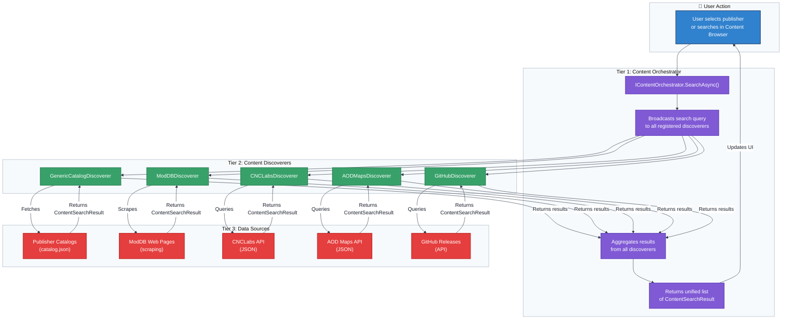

# Flowchart: Content Discovery

This flowchart details the process of discovering content from publishers and other sources, coordinated by the `ContentOrchestrator`.

**Discovery Workflow:**

1.  **Initiation**: The user selects a publisher from the Downloads sidebar or initiates a search from the UI.
2.  **Orchestration**: The `IContentOrchestrator` receives the request and forwards it to every registered `IContentDiscoverer`.
3.  **Discoverer Action**: Each `ContentDiscoverer` performs its source-specific action (catalog fetch, API call, web scrape, file scan) and returns lightweight `ContentSearchResult` objects.
4.  **Aggregation**: The orchestrator collects all results from discoverers and returns a unified list.
5.  **Display**: Results are displayed in the Content Browser UI for user selection.

**Publisher/Catalog Model:**

The GenericCatalogDiscoverer implements the 3-tier hosting model:
- **Tier 1**: PublisherDefinition (publisher identity + catalog URLs)
- **Tier 2**: PublisherCatalog (content items + releases + dependencies)
- **Tier 3**: Artifacts (downloadable files referenced by catalog)

Users subscribe to publishers via `genhub://` protocol links, which point to Tier 1 definitions. The definition contains stable URLs to Tier 2 catalogs, allowing publishers to migrate hosting without breaking subscriptions.
