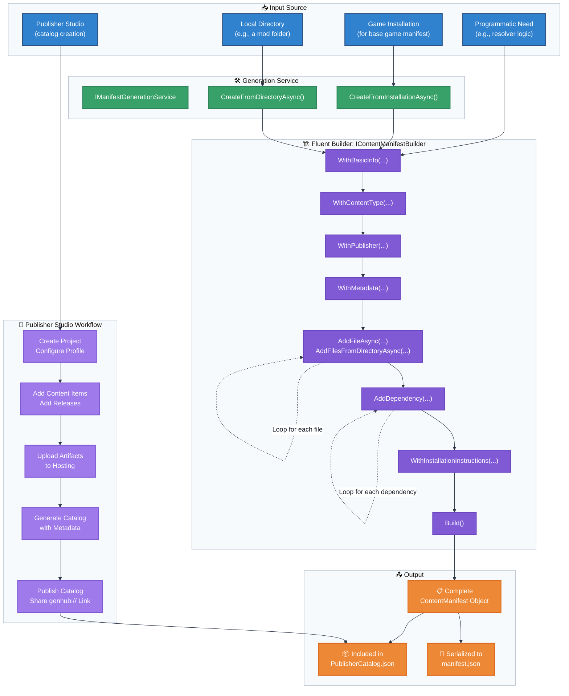

# Flowchart: ContentManifest Creation

This flowchart outlines the process of creating a `ContentManifest` file, either programmatically via a builder or automatically through a generation service.

**Manifest Creation Workflow:**

1. **Input Source Selection**: Determine the source of content (Publisher Studio, local directory, game installation, or programmatic)
2. **Publisher Studio Path** (for content creators):
   - Create project and configure publisher profile
   - Add content items with metadata (name, description, tags, screenshots)
   - Add releases with version numbers and changelogs
   - Upload artifacts to hosting provider (Google Drive, GitHub, Dropbox)
   - Generate catalog JSON with all content and release metadata
   - Publish catalog and share genhub:// subscription link
3. **Generation Service Path** (for local content):
   - Scan directory or installation for files
   - Calculate file hashes and sizes
   - Generate manifest with file metadata
4. **Builder Path** (for programmatic creation):
   - Use fluent builder API to construct manifest
   - Add basic info, content type, publisher, metadata
   - Add files and dependencies
   - Build final manifest object
5. **Output**: Resulting ContentManifest is either serialized to manifest.json or included in PublisherCatalog.json

**Publisher Studio Integration:**

The Publisher Studio provides a complete workflow for content creators to become publishers without writing JSON:

- **Multi-Catalog Support**: Create separate catalogs for mods, maps, tools
- **Addon Chain Management**: Define mod → addon → sub-addon relationships
- **Cross-Publisher Dependencies**: Reference content from other publishers
- **Hosting Provider Integration**: OAuth with Google Drive, GitHub, Dropbox
- **Validation**: Circular dependency detection, version constraint validation
- **One-Click Publishing**: Generate and upload catalog with single action

**Optimization Note**:
During game installation detection, the system first checks the `IContentManifestPool` for existing manifests matching the installation. If a valid manifest is found, the generation process is skipped entirely to prevent unnecessary directory scanning, ensuring that Steam-integrated and other stable installations do not trigger redundant CAS operations.
