# Profile Lifecycle Flow

This flowchart illustrates the complete lifecycle of a game profile, from creation through launch, execution, and cleanup.

## Overview

Game profiles are user-configured instances of a game with specific content (mods, maps, addons), settings, and workspace strategies. Each profile is isolated and can be launched independently.

## Flow Diagram

```mermaid
flowchart TD
    Start([User creates new profile]) --> SelectGame[Select target game]
    SelectGame --> NameProfile[Enter profile name]
    NameProfile --> SelectContent[Select content from ManifestPool]

    SelectContent --> ContentLoop{More content to add?}
    ContentLoop -->|Yes| BrowseContent[Browse available content]
    BrowseContent --> UserSelect[User selects content item]
    UserSelect --> CheckCompat{Compatible with game?}

    CheckCompat -->|No| WarnIncompat[Warn: Incompatible content]
    WarnIncompat --> ContentLoop

    CheckCompat -->|Yes| AddToProfile[Add to profile content list]
    AddToProfile --> ContentLoop

    ContentLoop -->|No| ResolveDeps[Resolve dependencies]
    ResolveDeps --> DepSuccess{All dependencies resolved?}

    DepSuccess -->|No| ShowDepError[Show dependency errors]
    ShowDepError --> UserFixDeps{User fixes dependencies?}
    UserFixDeps -->|Yes| SelectContent
    UserFixDeps -->|No| End1([End])

    DepSuccess -->|Yes| ConfigureSettings[Configure game settings]
    ConfigureSettings --> SetResolution[Set resolution]
    SetResolution --> SetGraphics[Set graphics options]
    SetGraphics --> SetAudio[Set audio options]
    SetAudio --> SetGameplay[Set gameplay options]

    SetGameplay --> SelectWorkspace[Select workspace strategy]
    SelectWorkspace --> WorkspaceChoice{Which strategy?}

    WorkspaceChoice -->|Symlink| CheckSymlink{Symlink supported?}
    CheckSymlink -->|No| WarnSymlink[Warn: Requires Windows 10+ Developer Mode]
    WarnSymlink --> SelectWorkspace

    CheckSymlink -->|Yes| SetSymlink[Set workspace strategy: Symlink]
    SetSymlink --> SaveProfile

    WorkspaceChoice -->|Hardlink| SetHardlink[Set workspace strategy: Hardlink]
    SetHardlink --> SaveProfile

    WorkspaceChoice -->|Copy| SetCopy[Set workspace strategy: Copy]
    SetCopy --> SaveProfile

    SaveProfile[Save profile to profiles.json]
    SaveProfile --> ValidateProfile{Profile valid?}

    ValidateProfile -->|No| ErrorValidation[Show validation errors]
    ErrorValidation --> ConfigureSettings

    ValidateProfile -->|Yes| AddToList[Add to profile list]
    AddToList --> ShowSuccess[Show success notification]
    ShowSuccess --> ProfileReady([Profile ready])

    ProfileReady --> UserLaunch{User launches profile?}
    UserLaunch -->|No| End2([End])

    UserLaunch -->|Yes| LoadProfile[Load profile from profiles.json]
    LoadProfile --> ValidateContent{All content still available?}

    ValidateContent -->|No| ErrorMissing[Error: Content missing from ManifestPool]
    ErrorMissing --> ShowMissing[Show missing content list]
    ShowMissing --> UserFixMissing{User action?}

    UserFixMissing -->|Reinstall| ReinstallContent[Reinstall missing content]
    ReinstallContent --> LoadProfile

    UserFixMissing -->|Remove| RemoveFromProfile[Remove missing content from profile]
    RemoveFromProfile --> LoadProfile

    UserFixMissing -->|Cancel| End3([End])

    ValidateContent -->|Yes| PrepareWorkspace[Prepare workspace directory]
    PrepareWorkspace --> CreateWorkDir[Create workspace directory]
    CreateWorkDir --> ApplyStrategy{Apply workspace strategy}

    ApplyStrategy -->|Symlink| CreateSymlinks[Create symbolic links]
    CreateSymlinks --> SymlinkSuccess{Success?}

    SymlinkSuccess -->|No| ErrorSymlink[Error: Symlink creation failed]
    ErrorSymlink --> FallbackPrompt[Prompt: Fallback to copy?]
    FallbackPrompt --> UserFallback{User accepts?}

    UserFallback -->|Yes| CopyFiles
    UserFallback -->|No| End4([End])

    SymlinkSuccess -->|Yes| WriteOptions

    ApplyStrategy -->|Hardlink| CreateHardlinks[Create hard links]
    CreateHardlinks --> HardlinkSuccess{Success?}

    HardlinkSuccess -->|No| ErrorHardlink[Error: Hardlink creation failed]
    ErrorHardlink --> FallbackPrompt2[Prompt: Fallback to copy?]
    FallbackPrompt2 --> UserFallback2{User accepts?}

    UserFallback2 -->|Yes| CopyFiles
    UserFallback2 -->|No| End5([End])

    HardlinkSuccess -->|Yes| WriteOptions

    ApplyStrategy -->|Copy| CopyFiles[Copy files to workspace]
    CopyFiles --> CopySuccess{Success?}

    CopySuccess -->|No| ErrorCopy[Error: File copy failed]
    ErrorCopy --> CheckSpace{Disk space issue?}

    CheckSpace -->|Yes| ErrorSpace[Error: Insufficient disk space]
    ErrorSpace --> End6([End])

    CheckSpace -->|No| ErrorPermission[Error: Permission denied]
    ErrorPermission --> End7([End])

    CopySuccess -->|Yes| WriteOptions[Write Options.ini]

    WriteOptions --> MapSettings[Map profile settings to game settings]
    MapSettings --> WriteINI[Write to workspace/Options.ini]
    WriteINI --> WriteSuccess{Write successful?}

    WriteSuccess -->|No| ErrorWrite[Error: Failed to write Options.ini]
    ErrorWrite --> End8([End])

    WriteSuccess -->|Yes| LaunchGame[Launch game executable]
    LaunchGame --> FindExe{Game executable found?}

    FindExe -->|No| ErrorExe[Error: Game executable not found]
    ErrorExe --> End9([End])

    FindExe -->|Yes| StartProcess[Start game process]
    StartProcess --> ProcessStarted{Process started?}

    ProcessStarted -->|No| ErrorStart[Error: Failed to start game]
    ErrorStart --> LogError[Log error details]
    LogError --> End10([End])

    ProcessStarted -->|Yes| MonitorProcess[Monitor game process]
    MonitorProcess --> ProcessRunning{Process still running?}

    ProcessRunning -->|Yes| WaitInterval[Wait 1 second]
    WaitInterval --> MonitorProcess

    ProcessRunning -->|No| GameExited[Game exited]
    GameExited --> GetExitCode[Get process exit code]
    GetExitCode --> CheckCrash{Exit code indicates crash?}

    CheckCrash -->|Yes| LogCrash[Log crash information]
    LogCrash --> ShowCrashDialog[Show crash dialog]
    ShowCrashDialog --> Cleanup

    CheckCrash -->|No| NormalExit[Normal exit]
    NormalExit --> Cleanup[Cleanup workspace]

    Cleanup --> WorkspaceType{Workspace strategy?}

    WorkspaceType -->|Symlink| RemoveSymlinks[Remove symbolic links]
    RemoveSymlinks --> CleanupDone

    WorkspaceType -->|Hardlink| RemoveHardlinks[Remove hard links]
    RemoveHardlinks --> CleanupDone

    WorkspaceType -->|Copy| DeleteCopies[Delete copied files]
    DeleteCopies --> CleanupDone

    CleanupDone[Cleanup complete]
    CleanupDone --> RemoveWorkDir[Remove workspace directory]
    RemoveWorkDir --> UpdateLastPlayed[Update profile last played timestamp]
    UpdateLastPlayed --> End11([End])
```



## Key Components

### Profile Creation

#### Profile Model

- **File**: `GenHub.Core/Models/GameProfile.cs`
- **Fields**:
  - `id`: Unique identifier
  - `name`: User-defined name
  - `gameId`: Target game identifier
  - `contentIds`: List of manifest IDs
  - `workspaceStrategy`: Symlink, Hardlink, or Copy
  - `settings`: Game-specific settings
  - `created`: Creation timestamp
  - `lastPlayed`: Last launch timestamp

#### Content Selection

- **Source**: ManifestPool (installed content)
- **Filtering**: By target game compatibility
- **Validation**: Dependency resolution, conflict checking

#### Settings Configuration

- **ViewModel**: `GameProfileSettingsViewModel.cs`
- **Categories**:
  - Display (resolution, windowed mode)
  - Graphics (quality, effects)
  - Audio (volume, music)
  - Gameplay (difficulty, speed)

### Profile Launch

#### Workspace Preparation

- **Service**: `ProfileLauncherFacade.cs`
- **Process**:
  1. Create workspace directory (e.g., `workspaces/profile-{id}`)
  2. Resolve content files from CAS
  3. Apply workspace strategy
  4. Write Options.ini

#### Workspace Strategies

##### Symlink Strategy

- **Command**: `mklink /D` (Windows) or `ln -s` (Unix)
- **Pros**: No disk space duplication, instant setup
- **Cons**: Requires Developer Mode or admin rights
- **Cleanup**: Remove symlinks only (CAS files remain)

##### Hardlink Strategy

- **Command**: `mklink /H` (Windows) or `ln` (Unix)
- **Pros**: No disk space duplication, no special permissions
- **Cons**: Same filesystem required
- **Cleanup**: Remove hardlinks (CAS files remain)

##### Copy Strategy

- **Command**: File copy
- **Pros**: Works everywhere, no special requirements
- **Cons**: Duplicates disk space, slower setup
- **Cleanup**: Delete all copied files

#### Options.ini Generation

- **Service**: `GameSettingsMapper.cs`
- **Process**:
  1. Load profile settings
  2. Map to game-specific INI format
  3. Write to workspace/Options.ini
  4. Validate INI syntax

#### Game Launch

- **Process**:
  1. Find game executable path
  2. Set working directory to workspace
  3. Start process with arguments
  4. Monitor process lifecycle

### Process Monitoring

#### Monitoring Loop

- **Interval**: 1 second
- **Checks**:
  - Process still running
  - Process exit code
  - Crash detection

#### Crash Detection

- **Indicators**:
  - Non-zero exit code
  - Unexpected termination
  - Exception logs
- **Action**: Log crash details, show dialog

### Cleanup

#### Workspace Cleanup

- **Trigger**: Game process exits
- **Process**:
  1. Remove workspace files (based on strategy)
  2. Delete workspace directory
  3. Preserve logs and save files (if configured)

#### Reference Counting

- **Purpose**: Track CAS file usage
- **Action**: Decrement reference count for profile content
- **Cleanup**: Remove unused CAS files (if count = 0)

## Profile Management

### Profile Storage

- **File**: `profiles.json` (user data directory)
- **Schema**:

```json
{
  "profiles": [
    {
      "id": "uuid",
      "name": "My Mod Profile",
      "gameId": "generals-zh",
      "contentIds": ["1.0.publisher.mod.content1", "..."],
      "workspaceStrategy": "Symlink",
      "settings": { ... },
      "created": "2026-03-15T10:00:00Z",
      "lastPlayed": "2026-03-15T12:30:00Z"
    }
  ]
}
```

### Profile Operations

- **Create**: Add new profile to profiles.json
- **Edit**: Modify content or settings
- **Duplicate**: Clone existing profile
- **Delete**: Remove profile and cleanup workspace
- **Export**: Share profile configuration
- **Import**: Load profile from file

## Error Handling

### Content Validation Errors

- Missing content from ManifestPool
- Incompatible content versions
- Unresolved dependencies

### Workspace Errors

- Symlink creation failure (permissions)
- Hardlink creation failure (filesystem)
- Copy failure (disk space, permissions)

### Launch Errors

- Game executable not found
- Process start failure
- Crash on startup

### Cleanup Errors

- File deletion failure (in use)
- Permission errors
- Orphaned workspace directories

## Performance Optimizations

### Lazy Loading

- Load profile settings only when needed
- Defer content validation until launch
- Cache workspace paths

### Parallel Operations

- Copy files in parallel (copy strategy)
- Create symlinks in parallel
- Background dependency resolution

### Caching

- Cache resolved dependencies
- Cache game settings mappings
- Cache workspace paths

## Related Files

- `GenHub.Core/Models/GameProfile.cs`
- `GenHub/Features/GameProfiles/ViewModels/GameProfileSettingsViewModel.cs`
- `GenHub/Features/GameProfiles/Services/ProfileLauncherFacade.cs`
- `GenHub/Features/GameProfiles/Services/GameSettingsMapper.cs`
- `GenHub.Core/Services/Storage/WorkspaceStrategy.cs`
- `GenHub.Core/Services/Manifest/ManifestPool.cs`
