# Publisher Ecosystem Flow

This flowchart illustrates the complete ecosystem of publishers creating content (GameClients and GamePatches), users creating custom patches, and multiplayer gameplay with synchronized profiles.

## Overview

Publishers like CommunityOutpost, GeneralsOnline, and TheSuperHackers create and distribute GameClients (code) and GamePatches (data). Users can create their own custom patches and play on GeneralsOnline servers with other users who have matching GameProfiles (synchronized data and code).

## Flow Diagram

```mermaid
flowchart TD
    %% Publisher Content Creation
    subgraph Publishers["Publishers (Content Creators)"]
        CO[CommunityOutpost]
        GO[GeneralsOnline]
        TSH[TheSuperHackers]
    end

    %% Publisher Creates Content
    CO --> CreateCOContent[Create Content]
    GO --> CreateGOContent[Create Content]
    TSH --> CreateTSHContent[Create Content]

    CreateCOContent --> COGameClient[GameClient: GenTool
Type: Code/Executable]
    CreateCOContent --> COGamePatch[GamePatch: Official Patches
Type: Data/Assets]
    CreateCOContent --> COAddons[Addons: Maps, Mods
Type: Data/Assets]

    CreateGOContent --> GOGameClient[GameClient: GeneralsOnline Client
Type: Code/Executable]
    CreateGOContent --> GOGamePatch[GamePatch: GO Balance Patches
Type: Data/Assets]
    CreateGOContent --> GOAddons[Addons: GO Maps
Type: Data/Assets]

    CreateTSHContent --> TSHGameClient[GameClient: TSH Launcher
Type: Code/Executable]
    CreateTSHContent --> TSHGamePatch[GamePatch: TSH Fixes
Type: Data/Assets]
    CreateTSHContent --> TSHAddons[Addons: TSH Tools
Type: Data/Assets]

    %% Publisher Studio Workflow
    COGameClient --> PublisherStudio[Publisher Studio]
    COGamePatch --> PublisherStudio
    COAddons --> PublisherStudio
    GOGameClient --> PublisherStudio
    GOGamePatch --> PublisherStudio
    GOAddons --> PublisherStudio
    TSHGameClient --> PublisherStudio
    TSHGamePatch --> PublisherStudio
    TSHAddons --> PublisherStudio

    PublisherStudio --> CreateManifest[Create Content Manifest]
    CreateManifest --> DefineMetadata[Define Metadata:
- Name, Version
- Description
- ContentType
- TargetGame]

    DefineMetadata --> ContentTypeCheck{ContentType?}

    ContentTypeCheck -->|GameClient| MarkAsCode[Mark as Code:
- Executable files
- DLLs, binaries
- Engine modifications]
    ContentTypeCheck -->|GamePatch| MarkAsData[Mark as Data:
- INI files
- Art assets
- Audio files
- Maps]
    ContentTypeCheck -->|Addon| MarkAsAddon[Mark as Addon:
- Extends base content
- Can be code or data]

    MarkAsCode --> AddDependencies
    MarkAsData --> AddDependencies
    MarkAsAddon --> AddDependencies

    AddDependencies[Add Dependencies:
- Base game
- Required patches
- Required clients]

    AddDependencies --> UploadToCatalog[Upload to Publisher Catalog]
    UploadToCatalog --> PublishDefinition[Publish Publisher Definition]

    %% User Discovery
    PublishDefinition --> UserDiscovers[User Discovers Content]

    subgraph GenHubApp["GeneralsHub Application"]
        UserDiscovers --> DownloadsBrowser[Downloads Browser]
        DownloadsBrowser --> BrowsePublishers[Browse Publishers:
- CommunityOutpost
- GeneralsOnline
- TheSuperHackers]

        BrowsePublishers --> SelectContent[Select Content to Install]
        SelectContent --> ContentPipeline[Content Pipeline]

        ContentPipeline --> Discovery[Discovery Phase:
Fetch catalog from publisher]
        Discovery --> Resolution[Resolution Phase:
Resolve dependencies]
        Resolution --> Acquisition[Acquisition Phase:
Download artifacts]
        Acquisition --> Assembly[Assembly Phase:
Store in CAS]

        Assembly --> ManifestPool[Content Manifest Pool]
    end

    %% User Creates Custom Patches
    ManifestPool --> UserCreatesCustom{User wants custom patch?}

    UserCreatesCustom -->|Yes| CustomPatchCreation[Create Custom Patch]
    CustomPatchCreation --> CustomPatchExamples[Custom Patch Examples:
- Banned Alphas
- OP Tox Buses
- No Humvees
- Custom Balance]

    CustomPatchExamples --> CustomPatchType[Custom Patch Type: GamePatch
Data: INI modifications]
    CustomPatchType --> CustomManifest[Create Custom Manifest]
    CustomManifest --> CustomToPool[Add to Manifest Pool]

    UserCreatesCustom -->|No| ProfileCreation

    CustomToPool --> ProfileCreation

    %% Profile Creation
    ProfileCreation[Create Game Profile]
    ProfileCreation --> SelectGameClient[Select GameClient:
- GenTool
- GeneralsOnline Client
- TSH Launcher]

    SelectGameClient --> SelectPatches[Select GamePatches:
- Official patches
- Balance patches
- Custom patches]

    SelectPatches --> SelectAddons[Select Addons:
- Maps
- Mods
- Tools]

    SelectAddons --> ProfileConfig[Profile Configuration:
enabledContentIds list]

    ProfileConfig --> ProfileExample[Example Profile:
- GameClient: GO Client code
- GamePatch: GO Balance data
- GamePatch: Custom No Humvees data
- Addon: Custom maps data]

    ProfileExample --> DependencyResolution[Dependency Resolution]

    DependencyResolution --> ResolveTransitive[Resolve Transitive Dependencies:
- Base game installation
- Required patches
- Required clients]

    ResolveTransitive --> WorkspacePrep[Workspace Preparation]

    %% Workspace Preparation
    WorkspacePrep --> FetchFromCAS[Fetch Files from CAS]
    FetchFromCAS --> ApplyStrategy[Apply Workspace Strategy:
- Symlink code files
- Copy/link data files]

    ApplyStrategy --> MergeContent[Merge Content:
1. Base game code
2. GameClient code
3. GamePatch data
4. Addon data]

    MergeContent --> WorkspaceReady[Workspace Ready:
Code + Data synchronized]

    %% Multiplayer Gameplay
    WorkspaceReady --> MultiplayerChoice{Play multiplayer?}

    MultiplayerChoice -->|No| SinglePlayer[Launch Single Player]
    SinglePlayer --> GameLaunch

    MultiplayerChoice -->|Yes| ConnectToGO[Connect to GeneralsOnline Server]

    ConnectToGO --> ServerCheck[Server Checks Profile]

    ServerCheck --> ProfileSync{Profiles match?}

    ProfileSync -->|No| SyncError[Error: Profile mismatch
- Different GameClient version
- Different GamePatch data
- Incompatible mods]

    SyncError --> FixProfile[User must:
1. Match server GameClient
2. Match server GamePatches
3. Disable incompatible addons]

    FixProfile --> ProfileCreation

    ProfileSync -->|Yes| MatchPlayers[Match with Players:
Same GameClient code
Same GamePatch data]

    MatchPlayers --> SyncValidation[Sync Validation:
- Code checksums match
- Data checksums match
- Version compatibility]

    SyncValidation --> GameLaunch[Launch Game]

    GameLaunch --> GameRunning[Game Running:
Code from GameClient
Data from GamePatches]

    GameRunning --> GameEnd[Game Ends]

    GameEnd --> PlayAgain{Play again?}
    PlayAgain -->|Yes| MultiplayerChoice
    PlayAgain -->|No| End([End])

    %% Styling
    classDef publisher fill:#4CAF50,stroke:#2E7D32,color:#fff
    classDef code fill:#2196F3,stroke:#1565C0,color:#fff
    classDef data fill:#FF9800,stroke:#E65100,color:#fff
    classDef user fill:#9C27B0,stroke:#6A1B9A,color:#fff
    classDef system fill:#607D8B,stroke:#37474F,color:#fff

    class CO,GO,TSH publisher
    class COGameClient,GOGameClient,TSHGameClient,MarkAsCode code
    class COGamePatch,GOGamePatch,TSHGamePatch,COAddons,GOAddons,TSHAddons,MarkAsData,MarkAsAddon data
    class CustomPatchCreation,CustomPatchExamples,CustomPatchType user
    class ManifestPool,ContentPipeline,WorkspacePrep,ProfileCreation system
```



## Key Concepts

### GameClient (Code)

GameClients contain executable code and engine modifications:

- **Examples**: GenTool, GeneralsOnline Client, TSH Launcher
- **Content**: `.exe`, `.dll`, binary files, engine patches
- **Purpose**: Modify game behavior, add features, fix bugs
- **Manifest Type**: `ContentType.GameClient`

### GamePatch (Data)

GamePatches contain data and assets:

- **Examples**: Official patches, balance patches, custom INI mods
- **Content**: `.ini`, `.big`, `.w3d`, `.tga`, audio files
- **Purpose**: Modify game data, balance, visuals, audio
- **Manifest Type**: `ContentType.GamePatch`

### Addons (Code or Data)

Addons extend base content:

- **Examples**: Maps, mods, tools, texture packs
- **Content**: Can be code or data depending on addon type
- **Purpose**: Add new content without replacing base game
- **Manifest Type**: `ContentType.Addon` with `extendsContentId`

## Profile Synchronization for Multiplayer

For multiplayer gameplay on GeneralsOnline servers, all players must have matching profiles:

### Code Synchronization

- **GameClient Version**: All players must use the same GameClient executable
- **Code Checksums**: Binary files are validated for integrity
- **Engine Modifications**: Custom engine patches must match

### Data Synchronization

- **GamePatch Version**: All players must have the same GamePatch data
- **INI Files**: Balance modifications must be identical
- **Assets**: Maps, textures, and audio must match

### Profile Matching Flow

```mermaid
sequenceDiagram
    participant User
    participant GenHub
    participant GOServer as GeneralsOnline Server
    participant OtherPlayers

    User->>GenHub: Launch Profile
    GenHub->>GenHub: Calculate Profile Hash
(Code + Data checksums)
    GenHub->>GOServer: Connect with Profile Hash
    GOServer->>GOServer: Validate Profile Hash
    GOServer->>OtherPlayers: Check for matching profiles
    OtherPlayers-->>GOServer: Profile Hashes
    GOServer->>GOServer: Match players with same hash
    GOServer-->>GenHub: Match Found
    GenHub->>User: Start Game
```

## Custom Patch Creation Examples

### Example 1: Banned Alphas

```json
{
  "id": "custom.patch.banned-alphas",
  "name": "Banned Alphas",
  "contentType": "GamePatch",
  "targetGame": "ZeroHour",
  "description": "Disables Alpha Aurora Bombers",
  "files": [
    {
      "relativePath": "Data/INI/Object/AmericaAircraft.ini",
      "sourceType": "ContentAddressable",
      "hash": "abc123..."
    }
  ],
  "dependencies": [
    {
      "id": "1.104.steam.gameinstallation.zerohour",
      "installBehavior": "RequireExisting"
    }
  ]
}
```

### Example 2: OP Tox Buses

```json
{
  "id": "custom.patch.op-tox-buses",
  "name": "OP Tox Buses",
  "contentType": "GamePatch",
  "targetGame": "ZeroHour",
  "description": "Increases Toxin Tractor damage and speed",
  "files": [
    {
      "relativePath": "Data/INI/Object/GLAVehicle.ini",
      "sourceType": "ContentAddressable",
      "hash": "def456..."
    }
  ],
  "dependencies": [
    {
      "id": "1.104.steam.gameinstallation.zerohour",
      "installBehavior": "RequireExisting"
    }
  ]
}
```

### Example 3: No Humvees

```json
{
  "id": "custom.patch.no-humvees",
  "name": "No Humvees",
  "contentType": "GamePatch",
  "targetGame": "ZeroHour",
  "description": "Removes Humvees from USA faction",
  "files": [
    {
      "relativePath": "Data/INI/Object/AmericaVehicle.ini",
      "sourceType": "ContentAddressable",
      "hash": "ghi789..."
    }
  ],
  "dependencies": [
    {
      "id": "1.104.steam.gameinstallation.zerohour",
      "installBehavior": "RequireExisting"
    }
  ]
}
```

## Profile Example with Mixed Content

```json
{
  "id": "profile_go_competitive",
  "name": "GeneralsOnline Competitive",
  "gameInstallationId": "steam_zerohour",
  "gameClient": {
    "gameType": "ZeroHour",
    "executablePath": "GeneralsOnline.exe"
  },
  "enabledContentIds": [
    "1.104.steam.gameinstallation.zerohour",
    "generalsonline.gameclient.go-client",
    "generalsonline.gamepatch.balance-v2.1",
    "custom.patch.banned-alphas",
    "custom.patch.no-humvees",
    "communityoutpost.addon.tournament-maps"
  ]
}
```

**Content Breakdown**:

- **Base Game**: `1.104.steam.gameinstallation.zerohour` (code + data)
- **GameClient**: `generalsonline.gameclient.go-client` (code)
- **GamePatch**: `generalsonline.gamepatch.balance-v2.1` (data)
- **Custom Patches**: `banned-alphas`, `no-humvees` (data)
- **Addon**: `tournament-maps` (data)

## Workspace Assembly

When the profile is launched, the workspace is assembled in this order:

1. **Base Game Installation**: Copy/symlink base game files
2. **GameClient Code**: Apply GeneralsOnline executable and DLLs
3. **GamePatch Data**: Apply balance patch INI files
4. **Custom Patch Data**: Apply banned alphas and no humvees INI modifications
5. **Addon Data**: Add tournament maps

**Result**: A synchronized workspace where:

- **Code** = Base game + GeneralsOnline client
- **Data** = Base game + Balance patch + Custom patches + Maps

## Related Documentation

- [Publisher Studio Workflow](./Publisher-Studio-Workflow.md)
- [Content Dependencies](../features/content/content-dependencies.md)
- [Game Profiles](../features/gameprofiles.md)
- [Workspace Management](../features/workspace.md)
- [Manifest Creation](./Manifest-Creation-Flow.md)
