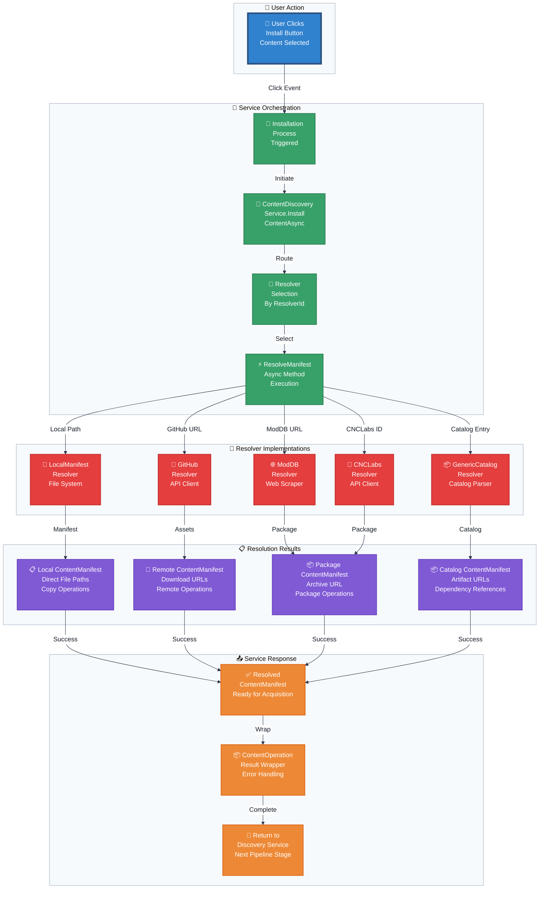

# Flowchart: Content Resolution Layer

This flowchart details the process of resolving a lightweight `ContentSearchResult` object into a detailed, installable `ContentManifest`.

**Resolution Strategy Matrix:**

| Resolver Type | Input Source | Processing Method | Output Manifest | SourceType |
|---------------|--------------|-------------------|-----------------|------------|
| **LocalManifest** | `*.manifest.json` files | Direct file reading | File paths | `Copy` |
| **GitHub** | Release API endpoints | Asset enumeration | Download URLs | `Remote` |
| **ModDB** | Web page scraping | HTML parsing | Archive URL | `Package` |
| **GenericCatalog** | Publisher catalog JSON | Catalog parsing + release selection | Artifact URLs | `Remote` |
| **CNCLabs** | CNCLabs API | API query + manifest factory | Archive URL | `Package` |

**GenericCatalogResolver Details:**

The GenericCatalogResolver is the primary resolver for publisher-created content. It:
1. Receives a CatalogContentItem reference from the discoverer
2. Selects the appropriate release version (latest or user-specified)
3. Extracts artifact metadata (filename, downloadUrl, sha256, sizeBytes)
4. Resolves dependencies recursively (same-catalog and cross-publisher)
5. Builds a complete ContentManifest with all files and dependencies

This resolver enables the decentralized publisher model where content creators host their own catalogs and artifacts.
