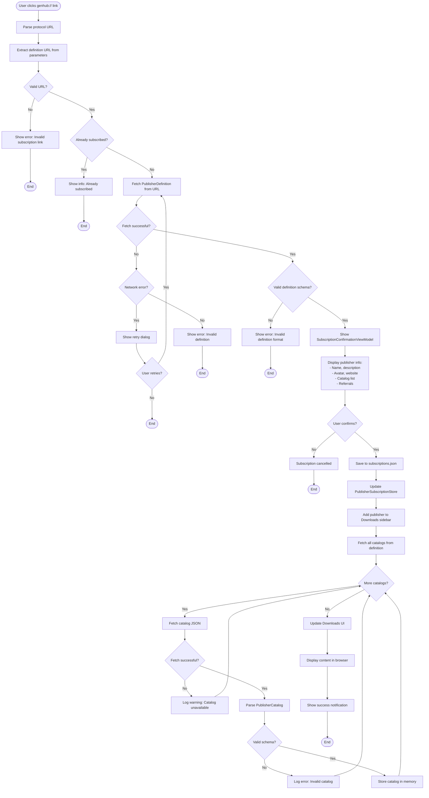

# Subscription System Flow

This flowchart illustrates the complete subscription workflow when a user clicks a `genhub://` protocol link to subscribe to a publisher.

## Overview

The subscription system enables users to discover and subscribe to content publishers through shareable `genhub://` protocol links. Once subscribed, publishers appear in the Downloads UI sidebar, and their catalogs become browsable.

## Flow Diagram



## Key Components

### Protocol Handler

- **File**: `App.xaml.cs` (protocol registration)
- **Trigger**: `genhub://subscribe?url=<definition-url>`
- **Action**: Activates subscription workflow

### Subscription Confirmation Dialog

- **ViewModel**: `SubscriptionConfirmationViewModel.cs`
- **Purpose**: Display publisher information and request user confirmation
- **Data Displayed**:
  - Publisher name, description, avatar
  - Website and support URLs
  - List of available catalogs
  - Referral publishers (if any)

### Subscription Storage

- **File**: `subscriptions.json` (user data directory)
- **Service**: `PublisherSubscriptionStore.cs`
- **Schema**:

```json
{
  "subscriptions": [
    {
      "publisherId": "unique-id",
      "definitionUrl": "https://...",
      "subscribedDate": "2026-03-15T10:30:00Z",
      "lastUpdated": "2026-03-15T10:30:00Z"
    }
  ]
}
```

### Catalog Fetching

- **Service**: `PublisherDefinitionService.cs`
- **Process**:
  1. Read catalog URLs from definition
  2. Fetch each catalog JSON
  3. Parse and validate schema
  4. Store in memory for UI display

### Downloads UI Integration

- **ViewModel**: `DownloadsBrowserViewModel.cs`
- **Sidebar**: Displays subscribed publishers alongside core providers
- **Content Browser**: Shows catalog content when publisher selected

## Error Handling

### Network Errors

- Retry mechanism with user prompt
- Fallback to mirror URLs (if defined)
- Graceful degradation (show cached data)

### Validation Errors

- Schema version checking
- Required field validation
- URL format validation

### User Experience

- Non-blocking notifications
- Clear error messages
- Undo subscription option

## Related Files

- `GenHub.Core/Models/Providers/PublisherDefinition.cs`
- `GenHub.Core/Services/Publishers/PublisherDefinitionService.cs`
- `GenHub/Features/Content/ViewModels/Catalog/SubscriptionConfirmationViewModel.cs`
- `GenHub/Features/Downloads/ViewModels/DownloadsBrowserViewModel.cs`
- `GenHub.Core/Services/Publishers/PublisherSubscriptionStore.cs`
