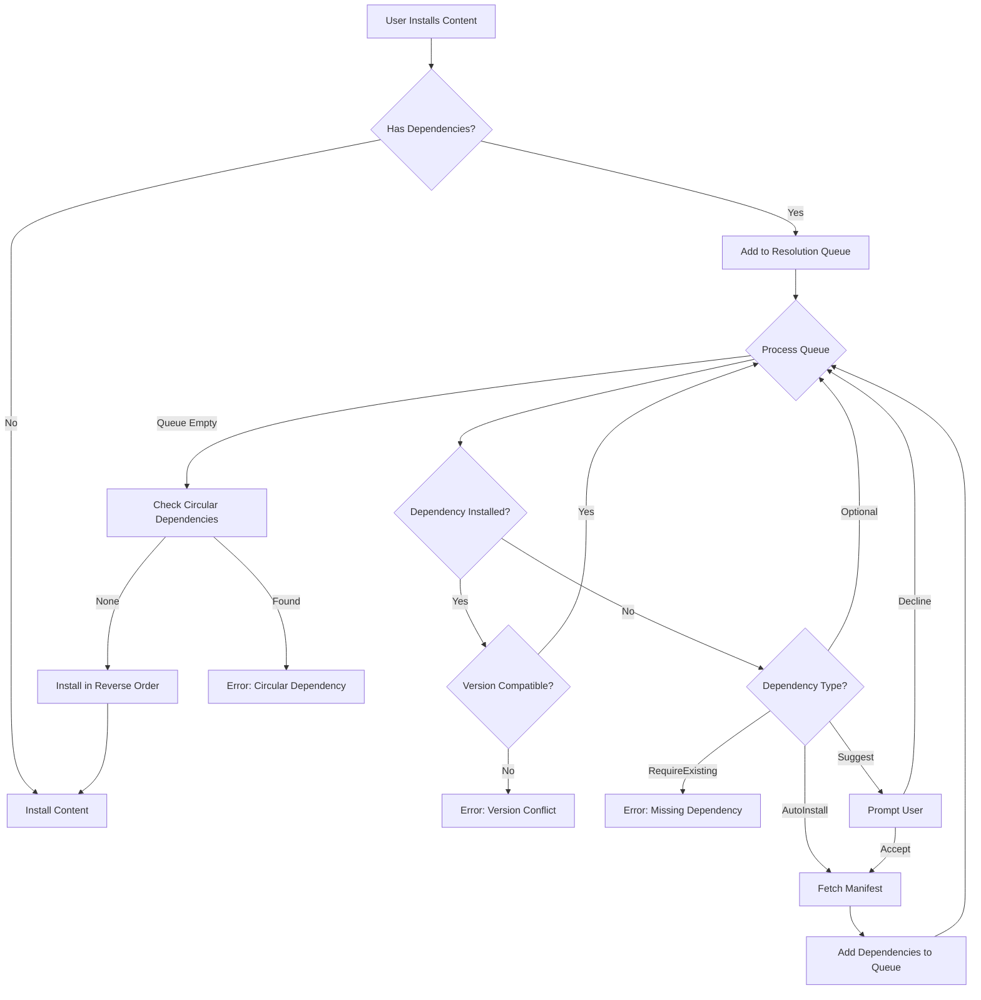
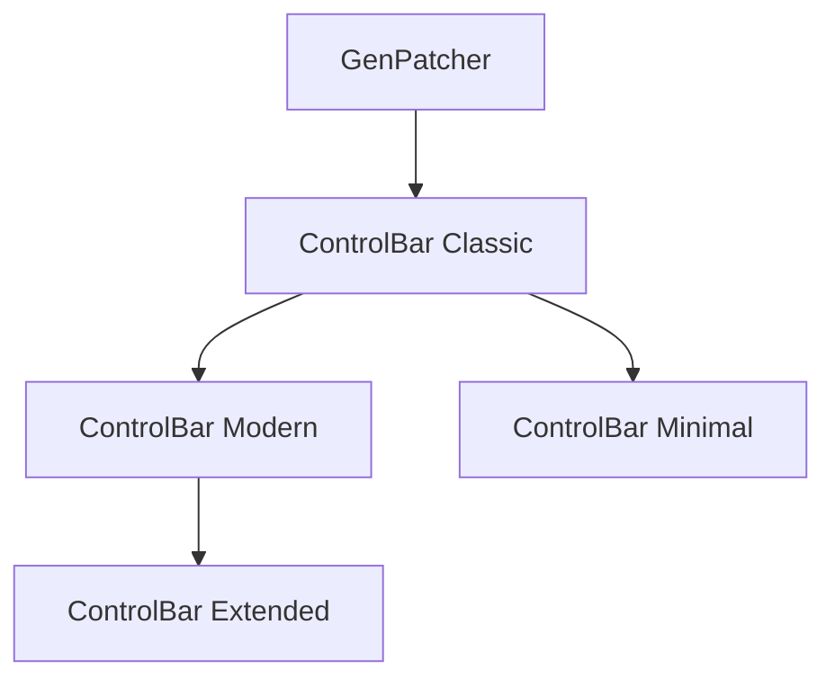
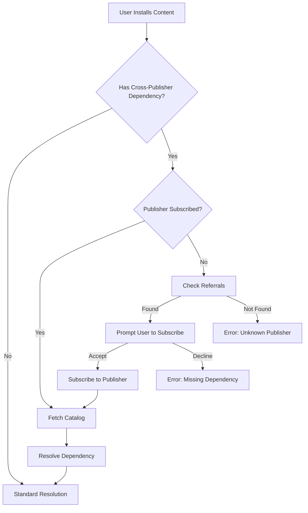

# Content Dependency System

**Last Updated**: 2026-03-15
**Status**: Production
**Related**: [Provider Configuration](provider-configuration.md), [Publisher Studio](../tools/publisher-studio.md)

---

## Overview

GenHub's dependency system enables content creators to define relationships between mods, maps, and addons. The system supports complex dependency chains, cross-publisher references, version constraints, and automatic resolution during installation.

### Why Dependencies Matter

- **Addon Chains**: Mods can have addons that extend functionality (e.g., ControlBar → ControlBar Extended)
- **Shared Libraries**: Multiple mods can depend on common frameworks (e.g., GenPatcher)
- **Cross-Publisher**: Content from one publisher can depend on content from another
- **Version Safety**: Ensure compatible versions are installed together
- **User Experience**: Automatic dependency resolution eliminates manual installation steps

### Dependency Contexts

GenHub uses dependencies in two contexts:

1. **Catalog Dependencies** (`CatalogDependency`): Defined by publishers in catalogs, used during content discovery
2. **Manifest Dependencies** (`ContentDependency`): Runtime dependencies used during game profile creation and installation

This document focuses on **ContentDependency** (manifest dependencies), which are the runtime representation used throughout the application.

---

## ContentDependency Model

The `ContentDependency` class represents a dependency relationship in a content manifest.

**Location**: `GenHub.Core/Models/Manifest/ContentDependency.cs`

### Core Fields

```csharp
public class ContentDependency
{
    // Identity
    public string Id { get; set; }                    // Manifest ID or content identifier
    public string Name { get; set; }                  // Human-readable name

    // Dependency Behavior
    public DependencyType DependencyType { get; set; }           // How to handle this dependency
    public InstallBehavior InstallBehavior { get; set; }         // Installation strategy

    // Publisher Constraints
    public bool StrictPublisher { get; set; }                    // Must match exact publisher
    public PublisherType? PublisherType { get; set; }            // Required publisher type

    // Version Constraints
    public string MinVersion { get; set; }                       // Minimum compatible version
    public string MaxVersion { get; set; }                       // Maximum compatible version
    public string ExactVersion { get; set; }                     // Exact version required
    public List<string> CompatibleVersions { get; set; }         // Whitelist of versions

    // Game Compatibility
    public List<string> CompatibleGameTypes { get; set; }        // Supported games

    // Conflict Management
    public bool IsExclusive { get; set; }                        // Cannot coexist with others
    public List<string> ConflictsWith { get; set; }              // Explicit conflicts

    // Optional Dependencies
    public bool IsOptional { get; set; }                         // Not required for operation
}
```

### Field Descriptions

#### Identity Fields

- **Id**: The manifest ID (format: `1.0.publisher.contentType.contentId`) or a generic content identifier
- **Name**: Display name shown to users during dependency resolution

#### Dependency Behavior

- **DependencyType**: Defines how the dependency should be handled (see Dependency Types section)
- **InstallBehavior**: Controls installation strategy (see Install Behavior section)

#### Publisher Constraints

- **StrictPublisher**: When `true`, the dependency must come from a specific publisher (matched by `Id`)
- **PublisherType**: Restricts dependency to specific publisher types (e.g., `ModDB`, `CNCLabs`, `GenericCatalog`)

#### Version Constraints

Version constraints ensure compatibility between content and dependencies:

- **MinVersion**: Minimum acceptable version (inclusive)
- **MaxVersion**: Maximum acceptable version (inclusive)
- **ExactVersion**: Requires exact version match (overrides min/max)
- **CompatibleVersions**: Whitelist of compatible versions (overrides min/max)

Version comparison uses semantic versioning (SemVer) when possible, falling back to string comparison.

#### Game Compatibility

- **CompatibleGameTypes**: List of supported games (e.g., `["ZeroHour", "GeneralsOnline"]`)

#### Conflict Management

- **IsExclusive**: When `true`, this dependency cannot coexist with other content of the same type
- **ConflictsWith**: List of manifest IDs that conflict with this dependency

#### Optional Dependencies

- **IsOptional**: When `true`, the dependency is recommended but not required for installation

---

## Dependency Types

The `DependencyType` enum defines how dependencies are handled during resolution.

```csharp
public enum DependencyType
{
    RequireExisting,    // Must already be installed
    AutoInstall,        // Automatically install if missing
    Suggest,            // Recommend to user but don't require
    Optional            // Optional enhancement
}
```

### RequireExisting

**Behavior**: The dependency must already be installed. If missing, installation fails with an error.

**Use Cases**:

- Base game requirements (e.g., Zero Hour for a mod)
- Large frameworks that should be installed separately
- Content that requires manual configuration

**Example**:

```json
{
  "id": "1.0.moddb.mod.contra",
  "name": "Contra 009",
  "dependencyType": "RequireExisting",
  "installBehavior": "Required",
  "minVersion": "009.0.0"
}
```

### AutoInstall

**Behavior**: If the dependency is missing, automatically download and install it before installing the main content.

**Use Cases**:

- Small addons and patches
- Shared libraries and frameworks
- Required components that can be automatically resolved

**Example**:

```json
{
  "id": "1.0.genpatcher.mod.genpatcher",
  "name": "GenPatcher",
  "dependencyType": "AutoInstall",
  "installBehavior": "Required",
  "exactVersion": "1.0.0"
}
```

### Suggest

**Behavior**: Show a recommendation to the user but allow installation without it.

**Use Cases**:

- Optional enhancements
- Recommended companion mods
- Quality-of-life improvements

**Example**:

```json
{
  "id": "1.0.moddb.mod.shockwave-music-pack",
  "name": "Shockwave Music Pack",
  "dependencyType": "Suggest",
  "installBehavior": "Optional",
  "isOptional": true
}
```

### Optional

**Behavior**: Listed as an optional dependency but not actively suggested during installation.

**Use Cases**:

- Advanced features that most users don't need
- Experimental components
- Developer tools

**Example**:

```json
{
  "id": "1.0.moddb.tool.debug-console",
  "name": "Debug Console",
  "dependencyType": "Optional",
  "installBehavior": "Optional",
  "isOptional": true
}
```

---

## Install Behavior

The `InstallBehavior` enum controls how dependencies are installed.

```csharp
public enum InstallBehavior
{
    Required,           // Must be installed
    Optional,           // User can choose to skip
    Recommended,        // Suggested but not required
    Automatic           // Install silently without prompting
}
```

### Behavior Matrix

| DependencyType | Typical InstallBehavior | User Prompt | Auto-Install |
|----------------|-------------------------|-------------|--------------|
| RequireExisting | Required | Error if missing | No |
| AutoInstall | Required/Automatic | Optional | Yes |
| Suggest | Recommended | Yes | No |
| Optional | Optional | No | No |

---

## Version Constraints

Version constraints ensure compatibility between content and dependencies.

### Constraint Types

#### MinVersion / MaxVersion

Defines a version range (inclusive).

```json
{
  "id": "1.0.moddb.mod.shockwave",
  "name": "Shockwave",
  "minVersion": "1.2.0",
  "maxVersion": "1.2.9"
}
```

**Matches**: 1.2.0, 1.2.5, 1.2.9
**Rejects**: 1.1.9, 1.3.0

#### ExactVersion

Requires an exact version match.

```json
{
  "id": "1.0.genpatcher.mod.genpatcher",
  "name": "GenPatcher",
  "exactVersion": "1.0.0"
}
```

**Matches**: 1.0.0
**Rejects**: 1.0.1, 0.9.9

#### CompatibleVersions

Whitelist of compatible versions.

```json
{
  "id": "1.0.moddb.mod.rise-of-the-reds",
  "name": "Rise of the Reds",
  "compatibleVersions": ["2.0.0", "2.1.0", "2.2.0"]
}
```

**Matches**: 2.0.0, 2.1.0, 2.2.0
**Rejects**: 2.3.0, 1.9.0

### Version Comparison

GenHub uses semantic versioning (SemVer) for version comparison:

1. Parse version string as `major.minor.patch[-prerelease][+build]`
2. Compare major, minor, patch numerically
3. Prerelease versions are lower than release versions
4. If parsing fails, fall back to string comparison

**Examples**:

- `1.2.3` < `1.2.4` < `1.3.0` < `2.0.0`
- `1.0.0-alpha` < `1.0.0-beta` < `1.0.0`
- `1.0.0+build1` == `1.0.0+build2` (build metadata ignored)

---

## Dependency Resolution

Dependency resolution is the process of identifying and installing all required dependencies before installing the main content.

### Resolution Algorithm

GenHub uses a **queue-based breadth-first traversal** algorithm:

```
1. Start with main content manifest
2. Add all dependencies to resolution queue
3. For each dependency in queue:
   a. Check if already installed
   b. Check version constraints
   c. If missing and AutoInstall: fetch manifest and add to queue
   d. If missing and RequireExisting: fail with error
   e. If missing and Suggest/Optional: prompt user
4. Detect circular dependencies
5. Install dependencies in reverse order (deepest first)
6. Install main content
```

### Resolution Flow Diagram



### Transitive Dependencies

Transitive dependencies are dependencies of dependencies. GenHub automatically resolves transitive dependencies.

**Example**:

```
Mod A depends on Mod B
Mod B depends on GenPatcher
User installs Mod A
→ GenHub installs: GenPatcher → Mod B → Mod A
```

### Circular Dependency Detection

Circular dependencies occur when two or more content items depend on each other.

**Example**:

```
Mod A depends on Mod B
Mod B depends on Mod A
```

GenHub detects circular dependencies during resolution and fails with an error. Publishers should avoid circular dependencies by restructuring content relationships.

**Detection Algorithm**:

```
1. Maintain a "resolution path" stack
2. Before resolving a dependency, check if it's already in the stack
3. If found, circular dependency detected
4. Report the cycle path to the user
```

---

## Complex Dependency Chains

### ModDB Addon Chains

ModDB supports addon chains where content extends other content.

**Example: Shockwave Addon Chain**

```
Shockwave (Base Mod)
  ├─ Shockwave Chaos (Addon)
  │   └─ Shockwave Chaos Extended (Sub-Addon)
  └─ Shockwave Reborn (Addon)
```

**Manifest Structure**:

**Shockwave Chaos** (depends on Shockwave):

```json
{
  "id": "1.0.moddb.addon.shockwave-chaos",
  "name": "Shockwave Chaos",
  "contentType": "Addon",
  "dependencies": [
    {
      "id": "1.0.moddb.mod.shockwave",
      "name": "Shockwave",
      "dependencyType": "RequireExisting",
      "installBehavior": "Required",
      "minVersion": "1.2.0"
    }
  ]
}
```

**Shockwave Chaos Extended** (depends on Shockwave Chaos):

```json
{
  "id": "1.0.moddb.addon.shockwave-chaos-extended",
  "name": "Shockwave Chaos Extended",
  "contentType": "Addon",
  "dependencies": [
    {
      "id": "1.0.moddb.addon.shockwave-chaos",
      "name": "Shockwave Chaos",
      "dependencyType": "RequireExisting",
      "installBehavior": "Required",
      "exactVersion": "1.0.0"
    }
  ]
}
```

### GenPatcher ControlBar Dependencies

GenPatcher's ControlBar system has complex dependency chains with multiple variants.

**ControlBar Variants**:

- **ControlBar Classic**: Base implementation
- **ControlBar Modern**: Depends on Classic
- **ControlBar Minimal**: Depends on Classic
- **ControlBar Extended**: Depends on Modern

**Dependency Graph**:



**ControlBar Extended Manifest**:

```json
{
  "id": "1.0.genpatcher.addon.controlbar-extended",
  "name": "ControlBar Extended",
  "contentType": "Addon",
  "dependencies": [
    {
      "id": "1.0.genpatcher.addon.controlbar-modern",
      "name": "ControlBar Modern",
      "dependencyType": "AutoInstall",
      "installBehavior": "Required",
      "exactVersion": "1.0.0"
    }
  ]
}
```

When a user installs ControlBar Extended, GenHub automatically installs:

1. GenPatcher (dependency of ControlBar Classic)
2. ControlBar Classic (dependency of ControlBar Modern)
3. ControlBar Modern (dependency of ControlBar Extended)
4. ControlBar Extended

---

## Cross-Publisher Dependencies

Cross-publisher dependencies allow content from one publisher to depend on content from another publisher.

### Referrals System

Publishers can reference other publishers using the **referrals** system in their definition.

**PublisherDefinition with Referrals**:

```json
{
  "$schemaVersion": 2,
  "publisher": {
    "id": "my-publisher",
    "name": "My Publisher"
  },
  "catalogs": [...],
  "referrals": [
    {
      "publisherId": "genpatcher",
      "definitionUrl": "https://example.com/genpatcher/definition.json"
    }
  ]
}
```

### Cross-Publisher Resolution Flow



### Cross-Publisher Dependency Example

**Publisher A's Mod** (depends on Publisher B's framework):

```json
{
  "id": "1.0.publisher-a.mod.my-mod",
  "name": "My Mod",
  "dependencies": [
    {
      "id": "1.0.publisher-b.mod.framework",
      "name": "Framework",
      "dependencyType": "AutoInstall",
      "installBehavior": "Required",
      "strictPublisher": true,
      "minVersion": "2.0.0"
    }
  ]
}
```

**Resolution Steps**:

1. User installs "My Mod" from Publisher A
2. GenHub detects dependency on Publisher B's content
3. Check if Publisher B is subscribed
4. If not subscribed, check Publisher A's referrals for Publisher B
5. Prompt user to subscribe to Publisher B
6. Fetch Publisher B's catalog
7. Resolve "Framework" dependency
8. Install Framework → My Mod

### Publisher Type Constraints

Instead of strict publisher matching, you can constrain by publisher type:

```json
{
  "id": "genpatcher",
  "name": "GenPatcher",
  "dependencyType": "AutoInstall",
  "installBehavior": "Required",
  "publisherType": "GenericCatalog",
  "minVersion": "1.0.0"
}
```

This allows any publisher of type `GenericCatalog` to provide GenPatcher, not just a specific publisher.

---

## Dependency Resolution Service

**Location**: `GenHub/Features/Content/Services/Catalog/CrossPublisherDependencyResolver.cs`

### Key Methods

```csharp
public class CrossPublisherDependencyResolver
{
    // Resolve all dependencies for a manifest
    public async Task<DependencyResolutionResult> ResolveAsync(
        ContentManifest manifest,
        CancellationToken cancellationToken = default)

    // Check if a dependency is satisfied
    public bool IsDependencySatisfied(
        ContentDependency dependency,
        IEnumerable<ContentManifest> installedContent)

    // Find a manifest that satisfies a dependency
    public ContentManifest FindSatisfyingManifest(
        ContentDependency dependency,
        IEnumerable<ContentManifest> availableContent)

    // Detect circular dependencies
    public bool HasCircularDependency(
        ContentManifest manifest,
        Stack<string> resolutionPath)
}
```

### DependencyResolutionResult

```csharp
public class DependencyResolutionResult
{
    public bool Success { get; set; }
    public List<ContentManifest> InstallOrder { get; set; }
    public List<ContentDependency> MissingDependencies { get; set; }
    public List<ContentDependency> ConflictingDependencies { get; set; }
    public string ErrorMessage { get; set; }
}
```

---

## Examples

### Example 1: Basic Mod with Dependencies

**Scenario**: A mod that requires GenPatcher and suggests a music pack.

```json
{
  "id": "1.0.my-publisher.mod.my-mod",
  "name": "My Mod",
  "version": "1.0.0",
  "contentType": "Mod",
  "targetGame": "ZeroHour",
  "dependencies": [
    {
      "id": "1.0.genpatcher.mod.genpatcher",
      "name": "GenPatcher",
      "dependencyType": "AutoInstall",
      "installBehavior": "Required",
      "exactVersion": "1.0.0"
    },
    {
      "id": "1.0.moddb.mod.music-pack",
      "name": "Enhanced Music Pack",
      "dependencyType": "Suggest",
      "installBehavior": "Recommended",
      "isOptional": true
    }
  ]
}
```

**Resolution**:

1. User installs "My Mod"
2. GenHub detects GenPatcher dependency (AutoInstall)
3. GenPatcher is automatically downloaded and installed
4. GenHub suggests Enhanced Music Pack (user can accept or decline)
5. My Mod is installed

### Example 2: ControlBar Extended Chain

**Scenario**: User installs ControlBar Extended, which has a deep dependency chain.

```json
{
  "id": "1.0.genpatcher.addon.controlbar-extended",
  "name": "ControlBar Extended",
  "version": "1.0.0",
  "contentType": "Addon",
  "dependencies": [
    {
      "id": "1.0.genpatcher.addon.controlbar-modern",
      "name": "ControlBar Modern",
      "dependencyType": "AutoInstall",
      "installBehavior": "Required",
      "exactVersion": "1.0.0"
    }
  ]
}
```

**ControlBar Modern**:

```json
{
  "id": "1.0.genpatcher.addon.controlbar-modern",
  "name": "ControlBar Modern",
  "dependencies": [
    {
      "id": "1.0.genpatcher.addon.controlbar-classic",
      "name": "ControlBar Classic",
      "dependencyType": "AutoInstall",
      "installBehavior": "Required",
      "exactVersion": "1.0.0"
    }
  ]
}
```

**ControlBar Classic**:

```json
{
  "id": "1.0.genpatcher.addon.controlbar-classic",
  "name": "ControlBar Classic",
  "dependencies": [
    {
      "id": "1.0.genpatcher.mod.genpatcher",
      "name": "GenPatcher",
      "dependencyType": "AutoInstall",
      "installBehavior": "Required",
      "exactVersion": "1.0.0"
    }
  ]
}
```

**Resolution**:

1. User installs ControlBar Extended
2. GenHub resolves ControlBar Modern (AutoInstall)
3. GenHub resolves ControlBar Classic (AutoInstall)
4. GenHub resolves GenPatcher (AutoInstall)
5. Install order: GenPatcher → ControlBar Classic → ControlBar Modern → ControlBar Extended

### Example 3: Cross-Publisher Dependency

**Scenario**: Publisher A's mod depends on Publisher B's framework.

**Publisher A's Catalog**:

```json
{
  "publisher": { "id": "publisher-a", "name": "Publisher A" },
  "content": [
    {
      "id": "my-mod",
      "name": "My Mod",
      "releases": [
        {
          "version": "1.0.0",
          "dependencies": [
            {
              "publisherId": "publisher-b",
              "contentId": "framework",
              "versionConstraint": ">=2.0.0"
            }
          ]
        }
      ]
    }
  ],
  "referrals": [
    {
      "publisherId": "publisher-b",
      "definitionUrl": "https://example.com/publisher-b/definition.json"
    }
  ]
}
```

**Resolution**:

1. User installs "My Mod" from Publisher A
2. GenHub detects dependency on Publisher B's "Framework"
3. Check if Publisher B is subscribed (not subscribed)
4. Check Publisher A's referrals (found Publisher B)
5. Prompt user: "My Mod requires Framework from Publisher B. Subscribe to Publisher B?"
6. User accepts → Subscribe to Publisher B
7. Fetch Publisher B's catalog
8. Resolve Framework dependency (version >= 2.0.0)
9. Install Framework → My Mod

### Example 4: Circular Dependency Detection

**Scenario**: Two mods incorrectly depend on each other.

**Mod A**:

```json
{
  "id": "1.0.publisher.mod.mod-a",
  "name": "Mod A",
  "dependencies": [
    {
      "id": "1.0.publisher.mod.mod-b",
      "name": "Mod B",
      "dependencyType": "AutoInstall"
    }
  ]
}
```

**Mod B**:

```json
{
  "id": "1.0.publisher.mod.mod-b",
  "name": "Mod B",
  "dependencies": [
    {
      "id": "1.0.publisher.mod.mod-a",
      "name": "Mod A",
      "dependencyType": "AutoInstall"
    }
  ]
}
```

**Resolution**:

1. User installs Mod A
2. GenHub resolves Mod B (AutoInstall)
3. GenHub resolves Mod A (already in resolution path)
4. Circular dependency detected: Mod A → Mod B → Mod A
5. Error: "Circular dependency detected: Mod A depends on Mod B, which depends on Mod A"

---

## Best Practices

### For Publishers

1. **Use AutoInstall for Small Dependencies**: If the dependency is small and can be automatically resolved, use `AutoInstall` with `Required` behavior.

2. **Use RequireExisting for Large Dependencies**: If the dependency is large (e.g., a base mod), use `RequireExisting` to avoid automatic downloads.

3. **Specify Version Constraints**: Always specify version constraints to ensure compatibility.

4. **Avoid Circular Dependencies**: Structure content relationships to avoid circular dependencies.

5. **Use Referrals for Cross-Publisher Dependencies**: Include referrals in your definition to help users discover dependencies from other publishers.

6. **Test Dependency Chains**: Test complex dependency chains to ensure they resolve correctly.

7. **Document Dependencies**: Include dependency information in your content description.

### For Users

1. **Review Dependencies Before Installing**: Check what dependencies will be installed before confirming.

2. **Keep Dependencies Updated**: Update dependencies when new versions are available.

3. **Subscribe to Referenced Publishers**: If a mod requires content from another publisher, subscribe to that publisher.

4. **Report Circular Dependencies**: If you encounter circular dependencies, report them to the publisher.

---

## Troubleshooting

### Resolution Failures

**Problem**: Dependency resolution fails with "Missing dependency" error.

**Causes**:

- Dependency not available in any subscribed publisher
- Version constraint too strict
- Publisher not subscribed

**Solutions**:

1. Check if the required publisher is subscribed
2. Check if the dependency exists in the publisher's catalog
3. Check version constraints (min/max/exact)
4. Subscribe to the publisher referenced in referrals

### Version Conflicts

**Problem**: Dependency resolution fails with "Version conflict" error.

**Causes**:

- Installed version doesn't meet version constraints
- Multiple dependencies require incompatible versions

**Solutions**:

1. Update the installed dependency to a compatible version
2. Uninstall conflicting content
3. Contact the publisher to update version constraints

### Circular Dependencies

**Problem**: Dependency resolution fails with "Circular dependency detected" error.

**Causes**:

- Two or more content items depend on each other
- Incorrect dependency configuration

**Solutions**:

1. Report the issue to the publisher
2. Manually install one of the dependencies first
3. Wait for the publisher to fix the circular dependency

### Cross-Publisher Resolution Failures

**Problem**: Cross-publisher dependency cannot be resolved.

**Causes**:

- Referenced publisher not in referrals
- Publisher definition URL invalid
- Network connectivity issues

**Solutions**:

1. Check if the publisher is listed in referrals
2. Manually subscribe to the required publisher
3. Check network connectivity
4. Contact the publisher for updated referral information

---

## Related Documentation

- [Provider Configuration](provider-configuration.md) - Publisher catalog schema
- [Publisher Studio](../tools/publisher-studio.md) - Creating and managing dependencies
- [Content Pipeline](../../CONTENT_PIPELINE_REPORT.md) - Content discovery and resolution
- [Provider Infrastructure](provider-infrastructure.md) - Provider architecture

---

## File References

### Core Models

- `GenHub.Core/Models/Manifest/ContentDependency.cs` - Manifest dependency model
- `GenHub.Core/Models/Providers/CatalogDependency.cs` - Catalog dependency model
- `GenHub.Core/Models/Manifest/ContentManifest.cs` - Content manifest

### Services

- `GenHub/Features/Content/Services/Catalog/CrossPublisherDependencyResolver.cs` - Dependency resolution
- `GenHub.Core/Services/Publishers/PublisherDefinitionService.cs` - Publisher management

### ViewModels

- `GenHub/Features/Tools/ViewModels/ContentLibraryViewModel.cs` - Dependency management UI
- `GenHub/Features/Content/ViewModels/ContentBrowserViewModel.cs` - Installation UI

---

**End of Documentation**
