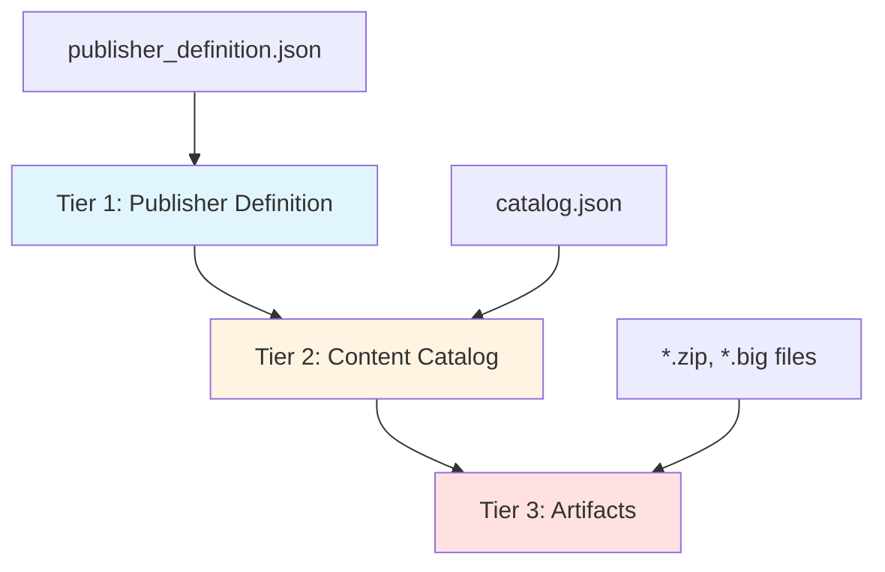
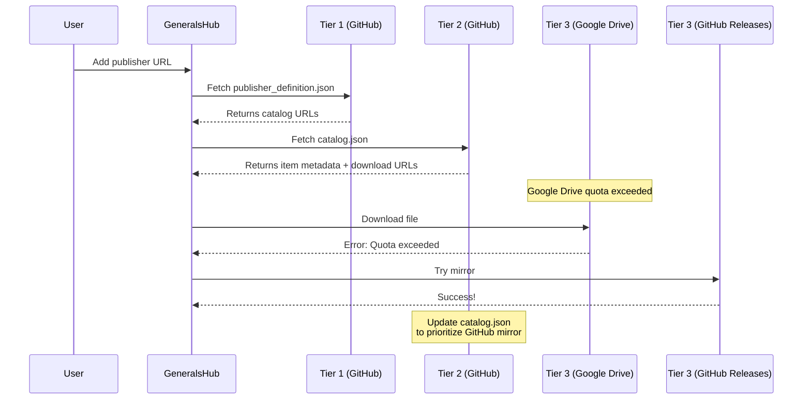

# 3-Tier Hosting Model

## Overview

GeneralsHub implements a **3-tier hosting architecture** that separates content metadata from actual file hosting. This design provides flexibility, reliability, and URL stability for content distribution.

### The Three Tiers



**Tier 1: Publisher Definition** (`publisher_definition.json`)

- Hosted on stable, version-controlled platforms (GitHub, GitLab)
- Contains metadata about the publisher and links to catalogs
- Rarely changes, provides entry point to content ecosystem

**Tier 2: Content Catalog** (`catalog.json`)

- Contains metadata about available content (maps, mods, patches)
- References download URLs for actual files
- Can be updated frequently without changing Tier 1

**Tier 3: Artifacts** (`.zip`, `.big`, `.skudef` files)

- Actual downloadable content files
- Can be hosted on any file hosting service
- URLs referenced in Tier 2 catalog

### Why This Matters

This separation allows:

- **URL Stability**: Publisher definition URL stays constant even when file hosts change
- **Flexibility**: Move large files between hosts without breaking references
- **Reliability**: Use multiple mirrors for redundancy
- **Version Control**: Track metadata changes separately from binary files
- **Cost Optimization**: Use free/cheap storage for large files, reliable hosting for metadata

---

## Tier 1: Publisher Definition

### Purpose

The publisher definition is the **entry point** for all content from a publisher. Users add a single URL to GeneralsHub, which then discovers all available content.

### Schema

```json
{
  "publisher_id": "unique-publisher-identifier",
  "name": "Publisher Display Name",
  "description": "Brief description of the publisher",
  "version": "1.0.0",
  "website": "https://publisher-website.com",
  "contact": {
    "email": "contact@publisher.com",
    "discord": "https://discord.gg/invite"
  },
  "catalogs": [
    {
      "type": "maps",
      "url": "https://example.com/maps-catalog.json",
      "name": "Official Maps",
      "description": "Tournament-approved competitive maps"
    },
    {
      "type": "mods",
      "url": "https://example.com/mods-catalog.json",
      "name": "Gameplay Mods",
      "description": "Balance and gameplay modifications"
    }
  ],
  "metadata": {
    "created": "2024-01-15T00:00:00Z",
    "updated": "2024-03-15T00:00:00Z",
    "schema_version": "1.0"
  }
}
```

### Key Fields

- **publisher_id**: Unique identifier (kebab-case recommended)
- **catalogs**: Array of catalog references with URLs
- **type**: Content type (`maps`, `mods`, `patches`, `replays`)
- **url**: Direct link to catalog.json file

### Hosting Requirements

**Recommended Platforms:**

- GitHub (raw.githubusercontent.com)
- GitLab (gitlab.com/-/raw/)
- Bitbucket
- Self-hosted Git with public access

**Requirements:**

- Must support direct file access (no HTML wrappers)
- Should support HTTPS
- Should have high uptime (99%+)
- Version control recommended for change tracking

### Example URLs

```
GitHub:
https://raw.githubusercontent.com/username/repo/main/publisher_definition.json

GitLab:
https://gitlab.com/username/repo/-/raw/main/publisher_definition.json

Self-hosted:
https://cdn.yoursite.com/generalshub/publisher_definition.json
```

---

## Tier 2: Content Catalogs

### Purpose

Catalogs contain **metadata and download information** for specific content types. They bridge the gap between publisher identity and actual downloadable files.

### Schema

```json
{
  "catalog_id": "publisher-maps-catalog",
  "publisher_id": "publisher-identifier",
  "type": "maps",
  "name": "Official Map Collection",
  "description": "Competitive and casual maps",
  "version": "2.1.0",
  "updated": "2024-03-15T00:00:00Z",
  "items": [
    {
      "id": "tournament-desert-v2",
      "name": "Tournament Desert v2",
      "description": "Balanced 1v1 desert map",
      "version": "2.0.1",
      "author": "MapMaker",
      "tags": ["1v1", "competitive", "desert"],
      "game_version": "1.04",
      "created": "2024-01-10T00:00:00Z",
      "updated": "2024-02-20T00:00:00Z",
      "downloads": [
        {
          "url": "https://drive.google.com/uc?id=FILE_ID&export=download",
          "provider": "google_drive",
          "size": 2457600,
          "checksum": "sha256:abc123...",
          "mirrors": [
            {
              "url": "https://github.com/user/repo/releases/download/v2.0.1/map.zip",
              "provider": "github_release"
            }
          ]
        }
      ],
      "preview": {
        "image": "https://i.imgur.com/preview.jpg",
        "thumbnail": "https://i.imgur.com/thumb.jpg"
      },
      "metadata": {
        "players": "1v1",
        "size": "medium",
        "difficulty": "intermediate"
      }
    }
  ]
}
```

### Key Fields

#### Catalog Level

- **catalog_id**: Unique identifier for this catalog
- **type**: Content type (maps/mods/patches/replays)
- **items**: Array of content items

#### Item Level

- **id**: Unique identifier within catalog
- **downloads**: Array of download options
- **checksum**: SHA-256 hash for integrity verification
- **mirrors**: Alternative download sources

### Download Object Structure

```json
{
  "url": "Direct download URL",
  "provider": "google_drive|github_release|dropbox|direct",
  "size": 1234567,
  "checksum": "sha256:hash_value",
  "mirrors": [
    {
      "url": "Alternative URL",
      "provider": "provider_type"
    }
  ]
}
```

### Hosting Requirements

**Recommended Platforms:**

- GitHub (same as Tier 1)
- GitLab
- CDN services (Cloudflare, AWS CloudFront)
- Self-hosted with CORS enabled

**Requirements:**

- Direct JSON access
- HTTPS support
- CORS headers for web access
- Reasonable update frequency support

---

## Tier 3: Artifacts

### Purpose

Artifacts are the **actual downloadable files** that users install. These are typically large binary files that need reliable, fast hosting.

### File Types

- **Maps**: `.zip` files containing `.map` files and assets
- **Mods**: `.zip` or `.big` files with game modifications
- **Patches**: `.zip` files with executable patches
- **Replays**: `.rep` or `.zip` files with replay data

### Hosting Providers

#### Google Drive

**Pros:**

- 15GB free storage
- Good download speeds
- Familiar interface

**Cons:**

- Virus scan warnings for large files
- Download quota limits
- URL format changes

**URL Format:**

```
Direct download:
https://drive.google.com/uc?id=FILE_ID&export=download

Shareable link:
https://drive.google.com/file/d/FILE_ID/view?usp=sharing
```

**Best Practices:**

- Use direct download URLs in catalog
- Set file permissions to "Anyone with link"
- Monitor quota usage
- Consider Google Workspace for higher limits

#### GitHub Releases

**Pros:**

- Unlimited bandwidth for public repos
- Version control integration
- Reliable infrastructure
- No file size limits (within reason)

**Cons:**

- Requires Git knowledge
- Release management overhead
- 2GB per file limit (soft)

**URL Format:**

```
https://github.com/username/repo/releases/download/v1.0.0/filename.zip
```

**Best Practices:**

- Use semantic versioning for releases
- Include checksums in release notes
- Tag releases properly
- Use release descriptions for changelogs

#### Dropbox

**Pros:**

- 2GB free storage
- Simple sharing
- Good reliability

**Cons:**

- Limited free storage
- Bandwidth limits on free tier
- URL format complexity

**URL Format:**

```
Original:
https://www.dropbox.com/s/FILE_ID/filename.zip?dl=0

Direct download (change dl=0 to dl=1):
https://www.dropbox.com/s/FILE_ID/filename.zip?dl=1
```

**Best Practices:**

- Always use `dl=1` parameter
- Monitor bandwidth usage
- Consider Dropbox Plus for more storage

#### Self-Hosted / CDN

**Pros:**

- Complete control
- No third-party limits
- Custom domain
- Optimal performance with CDN

**Cons:**

- Infrastructure costs
- Maintenance overhead
- Bandwidth costs

**Best Practices:**

- Use CDN for global distribution
- Implement proper caching headers
- Enable HTTPS
- Monitor bandwidth and costs
- Set up proper CORS headers

```nginx
# Nginx example
location /downloads/ {
    add_header Access-Control-Allow-Origin *;
    add_header Cache-Control "public, max-age=31536000";
    add_header Content-Disposition "attachment";
}
```

---

## URL Stability and Migration

### The Problem

File hosting services can:

- Change URL formats
- Impose new restrictions
- Shut down or change pricing
- Experience outages

### The Solution: 3-Tier Architecture



### Migration Strategies

#### Scenario 1: Moving Artifacts Only

**Situation**: Google Drive quota exceeded, moving to GitHub Releases

**Steps:**

1. Upload files to GitHub Releases
2. Update `catalog.json` with new URLs
3. Keep old URLs as mirrors (if still accessible)
4. Commit and push catalog changes

**Impact**:

- Tier 1 unchanged ✓
- Tier 2 updated (one commit)
- Tier 3 migrated

**User Experience**: Seamless (automatic failover to new URLs)

#### Scenario 2: Reorganizing Catalogs

**Situation**: Splitting maps catalog into competitive/casual

**Steps:**

1. Create new catalog files
2. Update `publisher_definition.json` with new catalog URLs
3. Keep old catalog for backward compatibility (optional)

**Impact**:

- Tier 1 updated (one commit)
- Tier 2 restructured
- Tier 3 unchanged ✓

#### Scenario 3: Complete Migration

**Situation**: Moving entire infrastructure to new domain

**Steps:**

1. Set up new hosting infrastructure
2. Copy all files to new locations
3. Update all URLs in catalogs
4. Update publisher definition
5. Set up redirects on old domain (if possible)
6. Notify users of new publisher URL

**Impact**:

- All tiers updated
- Users must update publisher URL

### Minimizing Disruption

**Priority Order:**

1. Keep Tier 1 stable (most important)
2. Update Tier 2 as needed
3. Migrate Tier 3 freely

**Best Practices:**

- Always provide mirrors for Tier 3
- Use version control for Tier 1 & 2
- Document URL changes in commit messages
- Test all URLs before publishing
- Monitor download success rates

---

## Mirror Support

### Why Mirrors Matter

- **Redundancy**: Failover when primary host is down
- **Performance**: Serve users from closest/fastest host
- **Quota Management**: Distribute load across providers
- **Cost Optimization**: Use free tiers effectively

### Implementation

```json
{
  "id": "popular-map",
  "name": "Popular Tournament Map",
  "downloads": [
    {
      "url": "https://github.com/user/repo/releases/download/v1.0/map.zip",
      "provider": "github_release",
      "size": 5242880,
      "checksum": "sha256:abc123...",
      "priority": 1,
      "mirrors": [
        {
          "url": "https://drive.google.com/uc?id=FILE_ID&export=download",
          "provider": "google_drive",
          "priority": 2
        },
        {
          "url": "https://cdn.example.com/maps/map.zip",
          "provider": "direct",
          "priority": 3
        }
      ]
    }
  ]
}
```

### Mirror Strategy

**Primary Host Selection:**

- Highest reliability
- Best performance
- Lowest cost per download

**Mirror Selection:**

- Different provider types
- Geographic diversity
- Complementary quota limits

**Example Strategy:**

```
Primary: GitHub Releases (unlimited bandwidth)
Mirror 1: Google Drive (good for users without GitHub access)
Mirror 2: Self-hosted CDN (full control, custom domain)
```

### Automatic Failover

GeneralsHub attempts downloads in priority order:

1. Try primary URL
2. If fails (timeout, 404, quota), try first mirror
3. Continue through mirrors until success
4. Report failure if all mirrors fail

---

## Best Practices

### Tier 1: Publisher Definition

**DO:**

- Host on version-controlled platform (GitHub/GitLab)
- Use stable, long-term URLs
- Keep file small and focused
- Document changes in commit messages
- Use semantic versioning

**DON'T:**

- Host on file sharing services
- Change URL frequently
- Include large data or binary content
- Use URL shorteners

### Tier 2: Catalogs

**DO:**

- Update regularly with new content
- Include comprehensive metadata
- Provide multiple download options
- Use checksums for all files
- Validate JSON before publishing
- Keep catalogs focused (separate by type)

**DON'T:**

- Embed large data (use references)
- Include broken URLs
- Skip checksum validation
- Mix content types in one catalog

### Tier 3: Artifacts

**DO:**

- Use reliable hosting with good bandwidth
- Provide multiple mirrors
- Include checksums in catalog
- Test download URLs regularly
- Monitor quota usage
- Compress files appropriately

**DON'T:**

- Use temporary file sharing services
- Rely on single host without mirrors
- Skip virus scanning
- Use hosting with aggressive rate limiting

### General Guidelines

**Hosting Selection Matrix:**

| Tier | Recommended | Acceptable | Avoid |
|------|-------------|------------|-------|
| 1 | GitHub, GitLab | Self-hosted Git | Google Drive, Dropbox |
| 2 | GitHub, GitLab, CDN | Self-hosted | File sharing services |
| 3 | GitHub Releases, CDN | Google Drive, Dropbox | Temporary hosts |

**Update Frequency:**

- Tier 1: Rarely (major changes only)
- Tier 2: As needed (new content, URL updates)
- Tier 3: Never (immutable files, use versioning)

**Security:**

- Always use HTTPS
- Validate checksums on download
- Scan files for malware
- Use secure authentication for private content

---

## Complete Examples

### Example 1: Small Publisher (Free Hosting)

**Setup:**

- Tier 1: GitHub repository
- Tier 2: Same GitHub repository
- Tier 3: GitHub Releases + Google Drive mirror

**Structure:**

```
github.com/publisher/generalshub-content/
├── publisher_definition.json          (Tier 1)
├── catalogs/
│   ├── maps.json                      (Tier 2)
│   └── mods.json                      (Tier 2)
└── releases/                          (Tier 3 via GitHub Releases)
```

**publisher_definition.json:**

```json
{
  "publisher_id": "small-publisher",
  "name": "Small Publisher",
  "version": "1.0.0",
  "catalogs": [
    {
      "type": "maps",
      "url": "https://raw.githubusercontent.com/publisher/generalshub-content/main/catalogs/maps.json"
    }
  ]
}
```

**catalogs/maps.json:**

```json
{
  "catalog_id": "small-publisher-maps",
  "type": "maps",
  "items": [
    {
      "id": "desert-storm",
      "name": "Desert Storm",
      "version": "1.0.0",
      "downloads": [
        {
          "url": "https://github.com/publisher/generalshub-content/releases/download/v1.0.0/desert-storm.zip",
          "provider": "github_release",
          "size": 1048576,
          "checksum": "sha256:def456...",
          "mirrors": [
            {
              "url": "https://drive.google.com/uc?id=FILEID&export=download",
              "provider": "google_drive"
            }
          ]
        }
      ]
    }
  ]
}
```

**Cost:** $0/month

### Example 2: Medium Publisher (Hybrid Hosting)

**Setup:**

- Tier 1: GitHub repository
- Tier 2: GitHub repository
- Tier 3: Self-hosted CDN + GitHub Releases mirror

**Structure:**

```
GitHub: github.com/publisher/gh-metadata/
├── publisher_definition.json
└── catalogs/
    ├── maps.json
    ├── mods.json
    └── patches.json

CDN: cdn.publisher.com/
└── downloads/
    ├── maps/
    ├── mods/
    └── patches/
```

**Benefits:**

- Fast downloads from CDN
- Reliable metadata from GitHub
- GitHub Releases as backup
- Full control over primary hosting

**Cost:** ~$5-20/month (CDN bandwidth)

### Example 3: Large Publisher (Professional Setup)

**Setup:**

- Tier 1: GitHub Enterprise
- Tier 2: Multi-region CDN
- Tier 3: Multi-region CDN + mirrors

**Structure:**

```
GitHub Enterprise: github.enterprise.com/publisher/
├── publisher_definition.json
└── catalogs/
    └── [multiple catalogs]

Primary CDN: cdn-us.publisher.com/
Secondary CDN: cdn-eu.publisher.com/
Mirrors: GitHub Releases, Google Drive (legacy)
```

**Features:**

- Geographic load balancing
- High availability
- Version control integration
- Analytics and monitoring
- Custom domain branding

**Cost:** $50-500+/month (depending on traffic)

---

## Troubleshooting

### Common Issues

#### Issue: "Failed to fetch publisher definition"

**Causes:**

- Invalid URL
- CORS issues
- Network connectivity
- File not found (404)

**Solutions:**

1. Verify URL is accessible in browser
2. Check for HTTPS (not HTTP)
3. Ensure raw file URL (not HTML page)
4. Verify CORS headers if self-hosted
5. Check file permissions (public access)

**Testing:**

```bash
# Test URL accessibility
curl -I "https://raw.githubusercontent.com/user/repo/main/publisher_definition.json"

# Should return 200 OK
# Should have Content-Type: application/json or text/plain
```

#### Issue: "Catalog validation failed"

**Causes:**

- Invalid JSON syntax
- Missing required fields
- Incorrect schema version

**Solutions:**

1. Validate JSON syntax: <https://jsonlint.com>
2. Check required fields against schema
3. Verify all URLs are properly formatted
4. Ensure checksums are in correct format

**Validation:**

```bash
# Validate JSON syntax
cat catalog.json | jq empty

# Check for required fields
cat catalog.json | jq '.catalog_id, .type, .items'
```

#### Issue: "Download failed" or "Checksum mismatch"

**Causes:**

- File moved or deleted
- Quota exceeded (Google Drive)
- Corrupted download
- Incorrect checksum in catalog

**Solutions:**

1. Verify file exists at URL
2. Check hosting provider quotas
3. Try mirror URLs
4. Recalculate and update checksum
5. Re-upload file if corrupted

**Checksum Calculation:**

```bash
# Calculate SHA-256 checksum
sha256sum file.zip

# Or on Windows
certutil -hashfile file.zip SHA256
```

#### Issue: "Google Drive virus scan warning"

**Causes:**

- File larger than 100MB triggers scan
- Google can't scan file type
- False positive detection

**Solutions:**

1. Use direct download URL format
2. Provide GitHub Releases mirror
3. Split large files if possible
4. Add bypass parameter (use cautiously)

**URL Format:**

```
Standard:
https://drive.google.com/uc?id=FILE_ID&export=download

With confirmation bypass (for large files):
https://drive.google.com/uc?id=FILE_ID&export=download&confirm=t
```

#### Issue: "CORS error when fetching catalog"

**Causes:**

- Self-hosted server missing CORS headers
- Incorrect CORS configuration

**Solutions:**

**For Nginx:**

```nginx
location /catalogs/ {
    add_header Access-Control-Allow-Origin *;
    add_header Access-Control-Allow-Methods "GET, OPTIONS";
    add_header Access-Control-Allow-Headers "Content-Type";
}
```

**For Apache:**

```apache
<Directory "/var/www/catalogs">
    Header set Access-Control-Allow-Origin "*"
    Header set Access-Control-Allow-Methods "GET, OPTIONS"
</Directory>
```

**For Node.js/Express:**

```javascript
app.use('/catalogs', (req, res, next) => {
  res.header('Access-Control-Allow-Origin', '*');
  next();
});
```

#### Issue: "Mirror failover not working"

**Causes:**

- All mirrors have same issue
- Incorrect mirror URL format
- Client not attempting mirrors

**Solutions:**

1. Test each mirror URL individually
2. Verify mirror priority order
3. Check GeneralsHub logs for failover attempts
4. Ensure mirrors use different providers
5. Update catalog with working mirrors

### Debugging Checklist

**For Publishers:**

- [ ] All URLs return 200 OK
- [ ] JSON files are valid
- [ ] Checksums match actual files
- [ ] CORS headers present (if self-hosted)
- [ ] File permissions set to public
- [ ] Mirrors are functional
- [ ] URLs use HTTPS

**For Users:**

- [ ] Internet connection working
- [ ] Publisher URL is correct
- [ ] GeneralsHub is up to date
- [ ] No firewall blocking downloads
- [ ] Sufficient disk space
- [ ] Antivirus not blocking downloads

### Getting Help

**Information to Provide:**

1. Publisher definition URL
2. Specific content item failing
3. Error message from GeneralsHub
4. Network logs (if available)
5. Operating system and GeneralsHub version

**Where to Report:**

- GitHub Issues: [repository URL]
- Discord: [server invite]
- Email: [support email]

---

## Advanced Topics

### Dynamic Catalog Generation

For publishers with many items, generate catalogs programmatically:

```javascript
// Example: Generate catalog from directory
const fs = require('fs');
const crypto = require('crypto');
const path = require('path');

function generateCatalog(directory) {
  const items = [];
  const files = fs.readdirSync(directory);

  files.forEach(file => {
    if (path.extname(file) === '.zip') {
      const filePath = path.join(directory, file);
      const stats = fs.statSync(filePath);
      const hash = crypto.createHash('sha256');
      const fileBuffer = fs.readFileSync(filePath);
      hash.update(fileBuffer);

      items.push({
        id: path.basename(file, '.zip'),
        name: path.basename(file, '.zip'),
        version: "1.0.0",
        downloads: [{
          url: `https://cdn.example.com/downloads/${file}`,
          provider: "direct",
          size: stats.size,
          checksum: `sha256:${hash.digest('hex')}`
        }]
      });
    }
  });

  return {
    catalog_id: "auto-generated",
    type: "maps",
    items: items,
    updated: new Date().toISOString()
  };
}
```

### Catalog Versioning

Track catalog changes over time:

```json
{
  "catalog_id": "publisher-maps",
  "version": "2.1.0",
  "changelog": [
    {
      "version": "2.1.0",
      "date": "2024-03-15",
      "changes": ["Added 3 new tournament maps", "Updated checksums"]
    },
    {
      "version": "2.0.0",
      "date": "2024-02-01",
      "changes": ["Migrated to GitHub Releases", "Added mirrors"]
    }
  ]
}
```

### Conditional Downloads

Support platform-specific or version-specific downloads:

```json
{
  "id": "cross-platform-mod",
  "downloads": [
    {
      "url": "https://example.com/mod-windows.zip",
      "platform": "windows",
      "checksum": "sha256:abc..."
    },
    {
      "url": "https://example.com/mod-linux.zip",
      "platform": "linux",
      "checksum": "sha256:def..."
    }
  ]
}
```

---

## Summary

The 3-tier hosting model provides:

1. **Stability**: Publisher URLs remain constant
2. **Flexibility**: Easy migration between hosting providers
3. **Reliability**: Mirror support for redundancy
4. **Scalability**: Separate concerns for metadata and files
5. **Cost-Effectiveness**: Optimize hosting per tier

**Key Takeaways:**

- Tier 1 (Publisher Definition): Stable, version-controlled
- Tier 2 (Catalogs): Flexible, frequently updated
- Tier 3 (Artifacts): Distributed, mirrored, optimized for bandwidth

By following this architecture, publishers can provide reliable content distribution while maintaining flexibility to adapt to changing hosting requirements.
