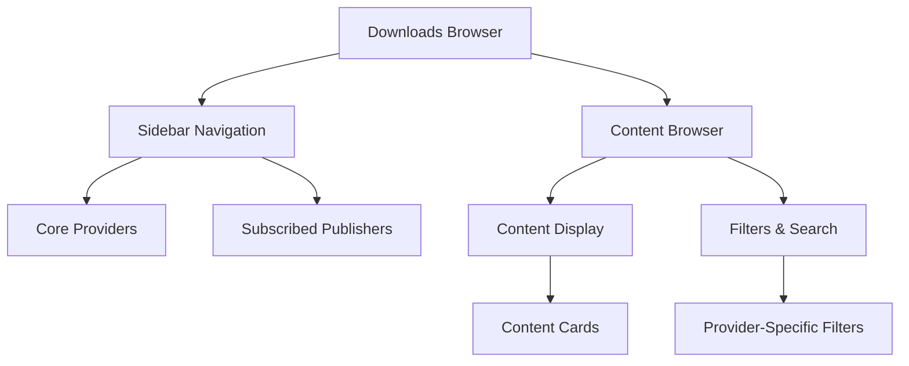

# Downloads UI

The Downloads UI provides a unified interface for discovering, browsing, and installing content from multiple sources including core providers (ModDB, CNCLabs, AODMaps, GitHub) and community publishers via the subscription system.

## Overview

The Downloads browser is the primary interface for content discovery in GenHub. It features:

- **Sidebar Navigation**: Quick access to all content sources
- **Multi-Catalog Support**: Publishers can offer multiple catalogs (mods, maps, tools)
- **Provider-Specific Filters**: Tailored filtering for each content source
- **Unified Search**: Search within selected publisher or across all sources
- **Rich Content Display**: Cards with metadata, screenshots, and version information

## Architecture



## Sidebar Navigation

The sidebar provides hierarchical navigation to all content sources:

### Core Providers

Built-in content sources that don't require subscription:

- **ModDB**: Community mods and addons from ModDB.com
- **CNCLabs**: Maps and content from CNCLabs.net
- **AODMaps**: Map repository from ArmyOfDarkness
- **GitHub**: Content from GitHub releases

### Subscribed Publishers

Publishers added via genhub:// subscription links:

- Dynamically populated from `subscriptions.json`
- Each publisher can have multiple catalogs
- Publishers appear with their configured avatar and name
- Expandable to show catalog list

### Navigation Structure

```
Downloads
├── ModDB
│   ├── Mods
│   ├── Addons
│   └── Maps
├── CNCLabs
│   ├── Maps
│   └── Tools
├── AODMaps
├── GitHub
└── Subscribed Publishers
    ├── SWR Productions
    │   ├── Mods Catalog
    │   └── Maps Catalog
    └── GeneralsOnline
        └── Game Clients
```

## Multi-Catalog Support

Publishers can offer multiple catalogs for different content types:

### Catalog Tabs

When a publisher has multiple catalogs, they appear as tabs:

```
[SWR Productions]
┌─────────────────────────────────────┐
│ [Mods] [Maps] [Tools]               │
├─────────────────────────────────────┤
│ Content from selected catalog...    │
└─────────────────────────────────────┘
```

### Catalog Metadata

Each catalog includes:

- **Name**: Display name (e.g., "Mods Catalog", "Map Pack")
- **Description**: Purpose and content type
- **Content Count**: Number of items in catalog
- **Last Updated**: Catalog update timestamp

### Catalog Switching

- Switching catalogs preserves filters and search
- Each catalog can have different filter options
- Content is loaded on-demand when switching

## Provider-Specific Filters

Each content source can define custom filters:

### ModDB Filters

- **Sections**: Mods, Addons, Maps, Patches
- **Game Type**: Generals, Zero Hour
- **Status**: Released, Beta, Alpha
- **Date Range**: Last week, month, year, all time

### CNCLabs Filters

- **Tags**: Multiplayer, Singleplayer, Skirmish, Tournament
- **Map Size**: Small (2-4), Medium (4-6), Large (6-8)
- **Players**: 2, 4, 6, 8
- **Terrain**: Desert, Snow, Urban, Temperate

### Publisher Catalog Filters

Publishers can define custom filters in their catalog:

```json
{
  "filters": [
    {
      "id": "content-type",
      "name": "Content Type",
      "type": "multiselect",
      "options": ["Mod", "Addon", "Patch"]
    },
    {
      "id": "compatibility",
      "name": "Game Version",
      "type": "select",
      "options": ["1.04", "1.08", "Any"]
    }
  ]
}
```

## Search Functionality

### Search Modes

**Within Publisher** (default):

- Searches only the selected publisher's content
- Fast, focused results
- Preserves active filters

**Across All Publishers**:

- Searches all subscribed publishers and core providers
- Aggregated results with source attribution
- Slower but comprehensive

### Search Features

- **Real-time search**: Results update as you type
- **Fuzzy matching**: Tolerates typos and variations
- **Tag search**: Search by content tags
- **Author search**: Find content by creator
- **Version search**: Find specific versions

### Search Syntax

```
Basic: "rise of the reds"
Tags: tag:multiplayer tag:skirmish
Author: author:"SWR Productions"
Version: version:1.87
Combined: "rotr" tag:mod version:>=1.85
```

## Content Display

### Content Cards

Each content item is displayed as a card with:

**Header**:

- Content name
- Publisher/author
- Version number
- Content type badge

**Body**:

- Description (truncated)
- Screenshot/banner (if available)
- Tags
- File size
- Release date

**Footer**:

- Install button
- View details button
- Dependency indicator
- Download count (if available)

### Card States

- **Not Installed**: Blue install button
- **Installed**: Green checkmark, "Launch" or "Manage" button
- **Update Available**: Orange "Update" button
- **Installing**: Progress bar
- **Error**: Red error indicator

### Metadata Display

**Basic Metadata**:

- Name, version, description
- Author/publisher
- Release date
- File size

**Rich Metadata**:

- Screenshots (gallery)
- Banner image
- Changelog
- Dependencies list
- Tags
- Compatibility info

## Content Actions

### Install Button

Primary action for content:

1. Click "Install"
2. Check dependencies
3. Show dependency confirmation if needed
4. Download and install
5. Add to ManifestPool
6. Show success notification

### View Details

Opens detailed view with:

- Full description
- Complete changelog
- All screenshots
- Dependency tree
- Version history
- Installation instructions

### Check Dependencies

Shows dependency tree before installation:

```
Rise of the Reds 1.87
├── Zero Hour 1.04 (installed ✓)
├── ControlBar Pro 2.0 (not installed)
│   ├── ControlBar Classic 1.5 (not installed)
│   └── ControlBar Base 1.0 (not installed)
└── GenPatcher 1.2 (installed ✓)
```

### View Changelog

Displays version history:

```markdown
## Version 1.87 (2024-01-15)
- Added new units
- Fixed balance issues
- Updated maps

## Version 1.86 (2023-12-01)
- Bug fixes
- Performance improvements
```

## DownloadsBrowserViewModel

Main view model orchestrating the Downloads UI:

### Responsibilities

- **Navigation Management**: Track selected provider/publisher
- **Content Loading**: Fetch content from discoverers
- **Filter Management**: Apply and persist filters
- **Search Coordination**: Execute searches across sources
- **State Management**: Track loading, errors, selections

### Key Properties

```csharp
public class DownloadsBrowserViewModel : ViewModelBase
{
    public ObservableCollection<IContentProvider> CoreProviders { get; }
    public ObservableCollection<PublisherSubscription> SubscribedPublishers { get; }
    public IContentProvider? SelectedProvider { get; set; }
    public PublisherCatalog? SelectedCatalog { get; set; }
    public ObservableCollection<ContentSearchResult> ContentItems { get; }
    public string SearchQuery { get; set; }
    public bool IsLoading { get; set; }
}
```

### Key Methods

- `LoadContentAsync()`: Load content from selected source
- `SearchAsync(string query)`: Execute search
- `ApplyFilters(FilterSet filters)`: Apply filter set
- `SubscribeToPublisher(string definitionUrl)`: Add new subscription
- `RefreshCatalog()`: Reload catalog from source

## ContentBrowserViewModel

Handles content display and interaction:

### Responsibilities

- **Content Rendering**: Display content cards
- **Filtering**: Apply provider-specific filters
- **Sorting**: Sort by name, date, popularity
- **Pagination**: Load content in pages
- **Selection**: Track selected content items

### Sorting Options

- **Name** (A-Z, Z-A)
- **Release Date** (Newest, Oldest)
- **File Size** (Largest, Smallest)
- **Popularity** (Most downloaded, if available)
- **Relevance** (Search results only)

### Pagination

- Load 20 items per page
- Infinite scroll or "Load More" button
- Preserve scroll position on navigation
- Cache loaded pages

## Integration

### ManifestPool Integration

When content is installed:

1. Content is resolved to ContentManifest
2. Files are downloaded and stored in CAS
3. Manifest is added to ManifestPool
4. Content becomes available for game profiles

### Content Pipeline Integration

Downloads UI uses the content pipeline:

```
User Action → Discoverer → Resolver → Deliverer → ManifestPool
```

**Discoverers**:

- `GenericCatalogDiscoverer`: Publisher catalogs
- `ModDBDiscoverer`: ModDB content
- `CNCLabsDiscoverer`: CNCLabs maps
- `AODMapsDiscoverer`: AOD maps
- `GitHubDiscoverer`: GitHub releases

**Resolvers**:

- `GenericCatalogResolver`: Resolve catalog entries
- `ModDBResolver`: Resolve ModDB content
- `CNCLabsResolver`: Resolve CNCLabs content

### Profile Integration

Installed content can be added to game profiles:

1. User creates/edits profile
2. Browse installed content from ManifestPool
3. Select content to include
4. Dependencies are resolved automatically
5. Profile is saved with content references

## Examples

### Browsing ModDB Content

1. Click "ModDB" in sidebar
2. Select "Mods" section
3. Apply filters (Game: Zero Hour, Status: Released)
4. Search for "rise of the reds"
5. Click content card to view details
6. Click "Install" to download

### Subscribing to Publisher

1. Receive genhub:// link from publisher
2. Click link (opens GenHub)
3. Review publisher information in confirmation dialog
4. Click "Subscribe"
5. Publisher appears in sidebar under "Subscribed Publishers"
6. Click publisher to browse their catalogs

### Installing Content with Dependencies

1. Find content in Downloads UI
2. Click "Install"
3. System checks dependencies
4. Confirmation dialog shows dependency tree
5. User reviews and confirms
6. All dependencies are installed first
7. Main content is installed
8. Success notification shown

### Searching Across Publishers

1. Enter search query in search box
2. Toggle "Search all publishers" option
3. Results show content from all sources
4. Each result shows source publisher
5. Click result to view details
6. Install from any source

## Best Practices

### For Users

- Subscribe to trusted publishers only
- Review dependencies before installation
- Keep subscriptions updated
- Use filters to narrow results
- Check changelogs before updating

### For Publishers

- Provide clear content descriptions
- Include screenshots and banners
- Maintain accurate dependency information
- Update catalogs regularly
- Use semantic versioning

## Troubleshooting

### Content Not Appearing

**Symptoms**: Publisher's content doesn't show in Downloads UI

**Causes**:

- Catalog fetch failed
- Invalid catalog JSON
- Network connectivity issues
- Catalog URL changed

**Solutions**:

1. Check network connection
2. Refresh catalog (right-click publisher → Refresh)
3. Check publisher's website for updates
4. Re-subscribe if definition URL changed

### Search Not Working

**Symptoms**: Search returns no results or errors

**Causes**:

- Empty catalog
- Search index not built
- Invalid search query
- Provider-specific search limitations

**Solutions**:

1. Verify catalog has content
2. Try simpler search terms
3. Clear search and try again
4. Check provider-specific search syntax

### Filters Not Applying

**Symptoms**: Filters don't affect displayed content

**Causes**:

- Filter not supported by provider
- Catalog doesn't include filter metadata
- UI state issue

**Solutions**:

1. Verify provider supports the filter
2. Clear all filters and reapply
3. Refresh catalog
4. Restart GenHub if persistent

## Related Documentation

- [Subscription System](./subscription-system.md) - genhub:// protocol details
- [Content Pipeline](./content.md) - Discovery and resolution
- [Publisher Configuration](./publisher-configuration.md) - Catalog structure
- [Content Dependencies](./content-dependencies.md) - Dependency resolution
