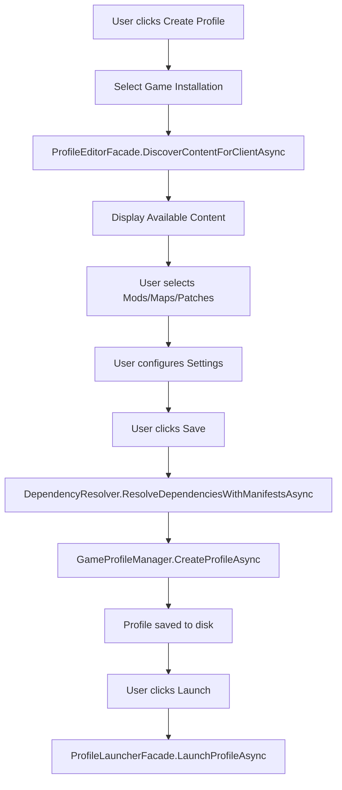
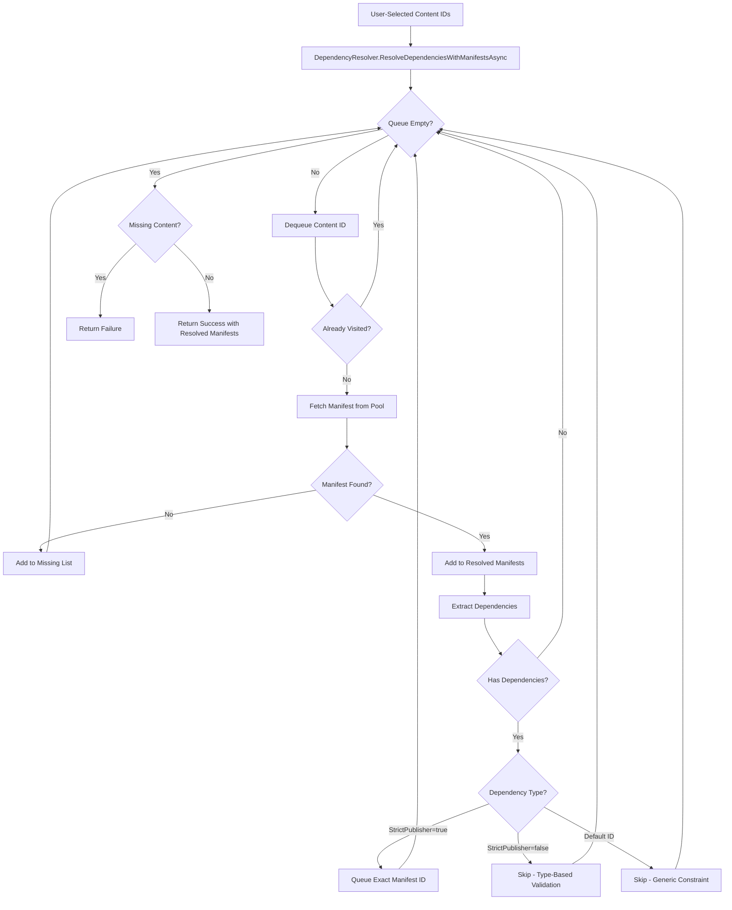
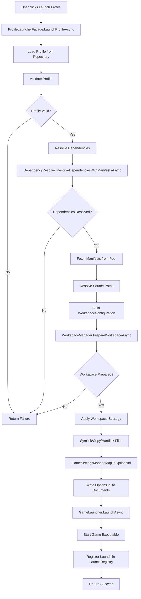
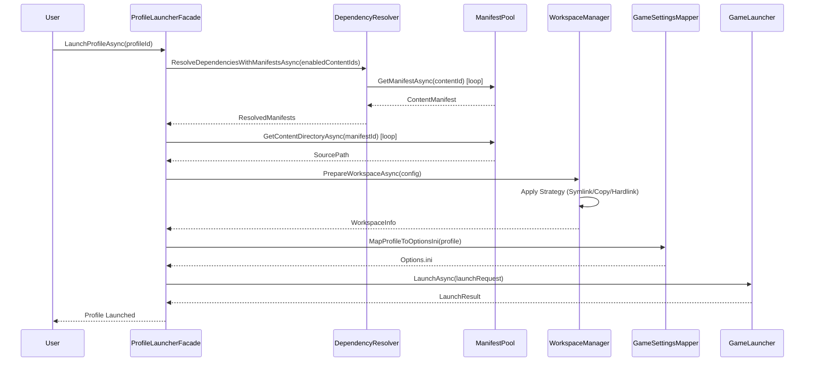

**Game Profiles** are the user-facing units of configuration in GeneralsHub. A profile encapsulates everything needed to launch a specific game state: which mods are enabled, which game engine to use, and what settings (resolution, detail level) to apply.

## Data Model

Profiles are serialized as JSON documents.

```json
{
  "id": "profile_12345",
  "name": "RotR Competitive",
  "gameInstallationId": "steam_zerohour",
  "gameClient": {
    "gameType": "ZeroHour",
    "executablePath": "generals.exe"
  },
  "enabledContentIds": [
    "1.87.swr.mod.rotr",
    "1.0.community.patch.genpatcher"
  ],
  "videoWidth": 1920,
  "videoHeight": 1080,
  "videoWindowed": true,
  "videoSkipEALogo": true,
  "environmentVariables": {
    "gentool_monitor": "1"
  }
}
```

## Persistence Layer

The `GameProfileRepository` handles storage.

- **Format**: Plain JSON files in the user's data directory.
- **Naming**: `{ProfileId}.json`.
- **Resilience**:
  - Atomic writes (via `File.WriteAllTextAsync`).
  - **Corruption Handling**: If a profile fails to deserialize, it is automatically renamed to `.corrupted` to prevent the app from crashing, and a "Corrupted Profile" warning is logged.

## Options.ini Generation

SAGE engine games rely on a global `Options.ini` file in `Documents\Command and Conquer ...`. This creates a conflict when switching between mods (e.g., Mod A needs 800x600, Mod B needs 1080p).

GeneralsHub solves this with **Dynamic Options Injection** at launch time.

### The Injection Process

Built into `GameLauncher.cs`, this process runs immediately before `generals.exe` starts:

1. **Load Existing**: Reads the current `Options.ini` from disk.
   - *Why?* To preserve settings managed by third-party tools (like GenTool or TheSuperHackers' fixes) that GeneralsHub doesn't explicitly track.
2. **Apply Overrides**: Maps `GameProfile` properties to the INI model.
   - `Profile.VideoWidth` -> `Resolution`
   - `Profile.VideoReview` -> `StaticGameLOD`
3. **Windowed Mode**: If `VideoWindowed` is true, ensures `-win` is added to command arguments (required for the engine to actually respect the windowed flag).
4. **Save**: Writes the merged `Options.ini` back to disk.

### Generals Online Support

For the specialized **Generals Online** client, the system also injects settings into `settings.json`, ensuring that unique features of that community client (like 30FPS vs 60FPS toggles) are respected per-profile.

## Copy Profile Feature

The Copy Profile feature allows users to duplicate an existing profile. This is useful for creating variations of a mod setup (e.g., "RotR" and "RotR (No Intro)") without manual reconfiguration.

**Preserved Settings:**

- **Core Config**: Name (suffixed with Copy), Game Installation, and Client.
- **Content**: All enabled Mod, Map, and Patch manifests.
- **Game Settings**: Resolutions, UI scaling, and Audio volumes.
- **Client-Specifics**: Generals Online and TheSuperHackers specific toggles.

The system automatically generates a unique name for the copy and assigns it a new workspace, ensuring complete isolation from the original.

## Launch Options

Profiles support flexible launch configuration:

- **Command Line Arguments**: Sanitized strings passed to the process (e.g., `-quickstart -nologo`).
- **Environment Variables**: Injected into the game process scope (useful for tools like GenTool that read env vars).

---

## Content Selection from ManifestPool

The ManifestPool serves as the central repository of all installed content available for use in game profiles. Understanding how content flows from installation to profile configuration is essential.

### How Users Browse Available Content

When creating or editing a profile, users interact with content through the `GameProfileSettingsViewModel`:

1. **Content Discovery**: The `ProfileEditorFacade.DiscoverContentForClientAsync()` method queries the `IContentManifestPool` to retrieve all available manifests.
2. **Filtering**: Content is filtered by `GameType` (Generals vs ZeroHour) and `ContentType` (Mod, Map, Patch, etc.).
3. **Display**: Each manifest is presented as a `ContentDisplayItem` with metadata like name, version, publisher, and installation type.

```csharp
// ProfileEditorFacade discovers content for a specific game client
var contentResult = await _manifestPool.GetAllManifestsAsync(cancellationToken);
var relevantContent = contentResult.Data?
    .Where(m => m.TargetGame == profile.GameClient.GameType)
    .ToList() ?? [];
```

### How enabledContentIds List is Populated

The `enabledContentIds` list in a `GameProfile` represents the user's content selection:

- **User Selection**: Users toggle content items in the UI, which updates the `SelectedContentIds` collection in `GameProfileSettingsViewModel`.
- **Dependency Resolution**: When saving, the `DependencyResolver` expands the selection to include all transitive dependencies.
- **Profile Update**: The resolved list is persisted to the profile's `EnabledContentIds` property.

```json
{
  "id": "profile_12345",
  "enabledContentIds": [
    "1.87.swr.mod.rotr",
    "1.0.community.patch.genpatcher",
    "1.104.steam.gameinstallation.zerohour"
  ]
}
```

### Relationship Between Installed Content and Profile Configuration

- **Installation**: Content is installed via the Downloads Browser, which stores files in Content-Addressable Storage (CAS) and registers a manifest in the pool.
- **Profile Configuration**: Profiles reference manifests by ID. The actual files remain in CAS until workspace preparation.
- **Workspace Preparation**: At launch time, the `WorkspaceManager` uses the profile's `enabledContentIds` to fetch manifests and map files from CAS to the game directory.

### ManifestPool/ContentManifestPool Integration

The `ContentManifestPool` provides these key operations:

- `GetAllManifestsAsync()`: Retrieves all installed manifests for browsing.
- `GetManifestAsync(manifestId)`: Fetches a specific manifest by ID.
- `GetContentDirectoryAsync(manifestId)`: Returns the source directory for a manifest's files (either CAS or original source path).
- `IsManifestAcquiredAsync(manifestId)`: Checks if content files are available.

```csharp
// Example: Loading content for profile editor
var manifestsResult = await _manifestPool.GetAllManifestsAsync(cancellationToken);
if (manifestsResult.Success && manifestsResult.Data != null)
{
    var availableContent = manifestsResult.Data
        .Where(m => m.ContentType != ContentType.GameInstallation)
        .Select(m => new ContentDisplayItem
        {
            ManifestId = m.Id,
            DisplayName = m.Name,
            ContentType = m.ContentType,
            Version = m.Version
        });
}
```

---

## Profile Creation Workflow

Creating a game profile involves multiple coordinated steps across several services. Here's the complete user journey from "Create Profile" to "Launch".

### Step-by-Step User Journey



### ProfileEditorFacade Auto-Enabling Matching GameInstallation Content

When a profile is created, the `ProfileEditorFacade` automatically includes the base game installation in the content list:

1. **Installation Selection**: User selects a `GameInstallation` (e.g., "Steam Zero Hour").
2. **Auto-Enable**: The facade queries the ManifestPool for the installation's manifest and adds it to `enabledContentIds`.
3. **Implicit Dependency**: The game installation manifest is treated as a base dependency for all other content.

```csharp
// ProfileEditorFacade automatically includes the game installation
var installationManifest = await _manifestPool.GetManifestAsync(
    ManifestId.Create($"1.104.steam.gameinstallation.{gameType}"),
    cancellationToken);

if (installationManifest.Success && installationManifest.Data != null)
{
    profile.EnabledContentIds.Add(installationManifest.Data.Id.Value);
}
```

### How Workspace is Initially Prepared

**Important**: Workspace preparation is **deferred until profile launch** to avoid copying entire game installations during profile creation.

```csharp
// ProfileEditorFacade.CreateProfileWithWorkspaceAsync
// NOTE: Workspace preparation is deferred until profile launch
// This prevents copying entire game installations during profile creation
_logger.LogInformation("Successfully created profile {ProfileId}", profile.Id);
return ProfileOperationResult<GameProfile>.CreateSuccess(profile);
```

At launch time, the `ProfileLauncherFacade` triggers workspace preparation:

1. **Resolve Dependencies**: Expand `enabledContentIds` to include all transitive dependencies.
2. **Fetch Manifests**: Retrieve full manifest objects from the pool.
3. **Resolve Source Paths**: Query the pool for each manifest's content directory.
4. **Prepare Workspace**: Call `WorkspaceManager.PrepareWorkspaceAsync()` with the configuration.

### How ActiveWorkspaceId is Set

The `ActiveWorkspaceId` is set after successful workspace preparation:

```csharp
// ProfileEditorFacade.UpdateProfileWithWorkspaceAsync
var workspaceResult = await _workspaceManager.PrepareWorkspaceAsync(
    workspaceConfig,
    cancellationToken: cancellationToken);

if (workspaceResult.Success && workspaceResult.Data != null)
{
    profile.ActiveWorkspaceId = workspaceResult.Data.Id;

    // Persist ActiveWorkspaceId
    var updateRequest = new UpdateProfileRequest
    {
        ActiveWorkspaceId = profile.ActiveWorkspaceId,
    };
    await _profileManager.UpdateProfileAsync(profile.Id, updateRequest, cancellationToken);
}
```

The `ActiveWorkspaceId` is used on subsequent launches to reuse the existing workspace if no content changes have occurred.

---

## Dependency Resolution During Launch

Dependency resolution ensures that all required content is available before launching a game profile. This process handles transitive dependencies, version constraints, and conflict prevention.

### Automatic Dependency Resolution Through IContentManifestPool

The `DependencyResolver` service orchestrates dependency resolution:

```csharp
public async Task<DependencyResolutionResult> ResolveDependenciesWithManifestsAsync(
    IEnumerable<string> contentIds,
    CancellationToken cancellationToken = default)
{
    var resolvedIds = new HashSet<string>(StringComparer.OrdinalIgnoreCase);
    var resolvedManifests = new List<ContentManifest>();
    var toProcess = new Queue<string>(contentIds);
    var visited = new HashSet<string>(StringComparer.OrdinalIgnoreCase);

    while (toProcess.Count > 0)
    {
        var contentId = toProcess.Dequeue();
        if (!visited.Add(contentId)) continue;

        var manifestResult = await _manifestPool.GetManifestAsync(
            ManifestId.Create(contentId),
            cancellationToken);

        if (manifestResult.Success && manifestResult.Data != null)
        {
            var manifest = manifestResult.Data;
            resolvedManifests.Add(manifest);

            // Queue dependencies for processing
            var relevantDeps = manifest.Dependencies
                .Where(d => d.InstallBehavior == DependencyInstallBehavior.RequireExisting
                         || d.InstallBehavior == DependencyInstallBehavior.AutoInstall);

            foreach (var dep in relevantDeps)
            {
                if (!resolvedIds.Contains(dep.Id))
                {
                    toProcess.Enqueue(dep.Id);
                }
            }
        }
    }

    return DependencyResolutionResult.CreateSuccess(
        [..resolvedIds],
        resolvedManifests,
        missingContentIds);
}
```

### How Transitive Dependencies are Handled

Transitive dependencies are resolved recursively using a breadth-first search:

1. **Initial Queue**: Start with user-selected content IDs.
2. **Fetch Manifest**: For each ID, retrieve the manifest from the pool.
3. **Extract Dependencies**: Parse the manifest's `Dependencies` collection.
4. **Filter Relevant**: Only process dependencies with `RequireExisting` or `AutoInstall` behavior.
5. **Queue Transitive**: Add dependency IDs to the processing queue.
6. **Cycle Detection**: Track visited IDs to prevent infinite loops.

**Example Dependency Chain**:

```
User selects: RotR Mod
  ├─ Depends on: GenPatcher (RequireExisting)
  │   └─ Depends on: Zero Hour Installation (RequireExisting)
  └─ Depends on: RotR Assets (AutoInstall)
```

### Content Conflict Prevention Mechanisms

The system prevents conflicts through several mechanisms:

1. **Strict Publisher Dependencies**: Dependencies with `StrictPublisher = true` require an exact manifest ID match.
2. **Type-Based Dependencies**: Dependencies with `StrictPublisher = false` allow any manifest of the matching `ContentType` and `TargetGame`.
3. **Circular Dependency Detection**: The resolver tracks the processing stack and logs warnings for circular references.

```csharp
// Circular dependency detection
if (processingStack.Contains(contentId))
{
    var circularWarning = $"Circular dependency detected: '{contentId}' is already in the resolution path";
    warnings.Add(circularWarning);
    _logger.LogWarning("Circular dependency detected: {ContentId}", contentId);
    continue;
}
```

1. **Version Constraints**: Dependencies can specify `MinVersion` to ensure compatibility.

### Dependency Resolution Flow Diagram



---

## Manifest Selection Process

Once dependencies are resolved, the system must fetch the actual manifest objects and prepare them for workspace creation.

### How WorkspaceManager Receives Manifests from Profile's enabledContentIds

The `ProfileLauncherFacade` coordinates manifest selection:

```csharp
// ProfileLauncherFacade.LaunchProfileAsync
var resolutionResult = await _dependencyResolver.ResolveDependenciesWithManifestsAsync(
    profile.EnabledContentIds,
    cancellationToken);

if (!resolutionResult.Success)
{
    return ProfileLaunchResult.CreateFailure(
        string.Join(", ", resolutionResult.Errors));
}

var workspaceConfig = new WorkspaceConfiguration
{
    Id = profile.Id,
    Manifests = [..resolutionResult.ResolvedManifests],
    GameClient = profile.GameClient,
    Strategy = profile.WorkspaceStrategy ?? _config.GetDefaultWorkspaceStrategy(),
    BaseInstallationPath = installation.Data.InstallationPath,
    WorkspaceRootPath = _config.GetWorkspacePath(),
};
```

### How Manifests are Resolved from the Pool

Manifests are resolved in two phases:

1. **Dependency Resolution Phase**: The `DependencyResolver` calls `_manifestPool.GetManifestAsync()` for each content ID, building a complete list of required manifests.
2. **Source Path Resolution Phase**: For each manifest, the system queries `_manifestPool.GetContentDirectoryAsync()` to determine where the content files are stored.

```csharp
// ProfileEditorFacade.UpdateProfileWithWorkspaceAsync
var manifestSourcePaths = new Dictionary<string, string>();
foreach (var manifest in workspaceConfig.Manifests)
{
    // Skip GameInstallation manifests - they use BaseInstallationPath
    if (manifest.ContentType == ContentType.GameInstallation)
    {
        continue;
    }

    // For GameClient, use WorkingDirectory if available
    if (manifest.ContentType == ContentType.GameClient &&
        !string.IsNullOrEmpty(profile.GameClient?.WorkingDirectory))
    {
        manifestSourcePaths[manifest.Id.Value] = profile.GameClient.WorkingDirectory;
        continue;
    }

    // For all other content types, query the manifest pool
    var contentDirResult = await _manifestPool.GetContentDirectoryAsync(
        manifest.Id,
        cancellationToken);

    if (contentDirResult.Success && !string.IsNullOrEmpty(contentDirResult.Data))
    {
        manifestSourcePaths[manifest.Id.Value] = contentDirResult.Data;
    }
}

workspaceConfig.ManifestSourcePaths = manifestSourcePaths;
```

### What Happens When a Manifest is Missing or Incompatible

**Missing Manifest**:

- The `DependencyResolver` adds the content ID to the `missingContentIds` list.
- Resolution fails with an error message listing all missing IDs.
- The profile launch is aborted, and the user is notified.

```csharp
if (missingContentIds.Count > 0)
{
    return DependencyResolutionResult.CreateFailure(
        $"Missing or invalid content IDs: {string.Join(", ", missingContentIds)}");
}
```

**Incompatible Manifest**:

- Version constraints are checked during dependency resolution.
- If a dependency specifies `MinVersion` and the installed version is older, the resolution fails.
- The user is prompted to update the content or remove the incompatible item.

### Error Handling

The system provides detailed error messages at each stage:

1. **Manifest Not Found**: "Manifest not found for content ID: {contentId}"
2. **Invalid Manifest ID**: "Invalid manifest ID during dependency resolution: {contentId}"
3. **Circular Dependency**: "Circular dependency detected: '{contentId}' is already in the resolution path"
4. **Missing Dependencies**: "Missing or invalid content IDs: {list}"

---

## Profile Launch Process

The profile launch process is the culmination of all previous workflows, bringing together dependency resolution, workspace preparation, settings injection, and game execution.

### Complete Launch Flow



### Detailed Step Breakdown

#### 1. Resolve Dependencies

```csharp
var resolutionResult = await _dependencyResolver.ResolveDependenciesWithManifestsAsync(
    profile.EnabledContentIds,
    cancellationToken);

if (!resolutionResult.Success)
{
    return ProfileLaunchResult.CreateFailure(
        string.Join(", ", resolutionResult.Errors));
}
```

**Output**: A list of all required manifests, including transitive dependencies.

#### 2. Acquire Files from CAS

Files are not explicitly "acquired" at this stage. Instead, the `WorkspaceManager` uses the manifest's file references to locate content in CAS during workspace preparation.

```csharp
// WorkspaceStrategy (e.g., SymlinkStrategy) maps files from CAS to workspace
foreach (var file in manifest.Files)
{
    if (file.SourceType == ContentSourceType.ContentAddressable)
    {
        var casPath = Path.Combine(casRoot, file.Hash);
        var workspacePath = Path.Combine(workspaceDir, file.RelativePath);

        // Create symlink from workspace to CAS
        CreateSymbolicLink(workspacePath, casPath);
    }
}
```

#### 3. Apply Workspace Strategy

The `WorkspaceManager` selects a strategy based on the profile's `WorkspaceStrategy` setting:

- **SymlinkOnly**: Creates symbolic links from workspace to CAS (fastest, requires admin on Windows).
- **FullCopy**: Copies all files to workspace (slowest, most compatible).
- **HybridCopySymlink**: Copies executables, symlinks data files (balanced).
- **HardLink**: Creates hard links (fast, but limited to same volume).

```csharp
var strategy = strategies.FirstOrDefault(s => s.CanHandle(configuration));
var workspaceInfo = await strategy.PrepareAsync(configuration, progress, cancellationToken);
```

#### 4. Write Options.ini (Game Settings)

The `GameSettingsMapper` converts profile settings to the SAGE engine's `Options.ini` format:

```csharp
// GameLauncher.LaunchAsync
var optionsIniPath = Path.Combine(
    Environment.GetFolderPath(Environment.SpecialFolder.MyDocuments),
    "Command and Conquer Generals Zero Hour Data",
    "Options.ini");

var optionsIni = await _gameSettingsService.LoadOptionsIniAsync(optionsIniPath, cancellationToken);
_gameSettingsMapper.MapProfileToOptionsIni(profile, optionsIni);
await _gameSettingsService.SaveOptionsIniAsync(optionsIniPath, optionsIni, cancellationToken);
```

**Mapped Settings**:

- `VideoWidth` / `VideoHeight` → `Resolution`
- `VideoWindowed` → `Windowed` flag + `-win` command argument
- `VideoSkipEALogo` → `SkipIntro`
- `AudioVolume` → `SoundVolume`, `MusicVolume`, `VoiceVolume`

#### 5. Launch Game Executable

```csharp
var launchRequest = new GameLaunchRequest
{
    ExecutablePath = profile.GameClient.ExecutablePath,
    WorkingDirectory = workspaceInfo.WorkspacePath,
    CommandLineArguments = profile.CommandLineArguments,
    EnvironmentVariables = profile.EnvironmentVariables,
};

var launchResult = await _gameLauncher.LaunchAsync(launchRequest, cancellationToken);
```

The `GameLauncher` starts the process and registers it in the `LaunchRegistry` for tracking.

### Launch Flow Diagram



---

## Profile Validation

Profile validation ensures that all required components are available and correctly configured before launch.

### Content Availability Validation

The `ProfileEditorFacade.ValidateProfileAsync()` method checks that all enabled content manifests exist in the pool:

```csharp
if (profile.EnabledContentIds != null && profile.EnabledContentIds.Count > 0)
{
    var manifestsResult = await _manifestPool.GetAllManifestsAsync(cancellationToken);
    if (manifestsResult.Success && manifestsResult.Data != null)
    {
        var availableManifestIds = manifestsResult.Data
            .Select(m => m.Id.ToString())
            .ToHashSet();

        var missingContent = profile.EnabledContentIds
            .Where(id => !availableManifestIds.Contains(id))
            .ToList();

        if (missingContent.Count > 0)
        {
            errors.Add($"Content manifests not found: {string.Join(", ", missingContent)}");
        }
    }
}
```

### Dependency Validation

Dependency validation is performed during the resolution phase:

1. **Existence Check**: Verify that all dependency manifests are installed.
2. **Version Check**: Ensure that installed versions meet `MinVersion` constraints.
3. **Type Check**: For type-based dependencies, verify that at least one manifest of the required type exists.

### Workspace Validation

The `WorkspaceValidator` performs comprehensive checks:

1. **Configuration Validation**: Ensures all required paths are set and valid.
2. **Prerequisite Validation**: Checks that the selected strategy can be used (e.g., symlink support).
3. **Post-Preparation Validation**: Verifies that the workspace was created correctly.

```csharp
if (configuration.ValidateAfterPreparation)
{
    var validationResult = await workspaceValidator.ValidateWorkspaceAsync(
        workspaceInfo,
        cancellationToken);

    if (!validationResult.Success || !validationResult.Data!.IsValid)
    {
        var errors = validationResult.Data!.Issues
            .Where(i => i.Severity == ValidationSeverity.Error)
            .Select(i => i.Message);

        return OperationResult<WorkspaceInfo>.CreateFailure(
            $"Workspace validation failed: {string.Join(", ", errors)}");
    }
}
```

### Settings Validation

Settings validation ensures that game settings are within acceptable ranges:

- **Resolution**: Must be a valid screen resolution.
- **Audio Volumes**: Must be between 0 and 100.
- **Executable Path**: Must point to a valid game executable.

---

## Profile Migration

Profile migration handles updates to profile structure, content versions, and settings schemas.

### Version Updates

When the profile schema version changes, the `GameProfileRepository` applies migrations:

```csharp
// Example migration from v1 to v2
if (profile.SchemaVersion == 1)
{
    // Add new WorkspaceStrategy field with default value
    profile.WorkspaceStrategy = WorkspaceStrategy.SymlinkOnly;
    profile.SchemaVersion = 2;

    await _profileRepository.SaveProfileAsync(profile, cancellationToken);
}
```

### Content Updates

When content is updated (e.g., a mod releases a new version), the profile's `enabledContentIds` may need to be updated:

1. **Manifest Replacement**: The `ManifestReplacedMessage` is broadcast when content is updated.
2. **Profile Update**: The `GameProfileSettingsViewModel` listens for this message and updates the profile's content list.
3. **Workspace Invalidation**: The `ActiveWorkspaceId` is cleared, forcing workspace recreation on next launch.

```csharp
// GameProfileSettingsViewModel.Receive(ManifestReplacedMessage)
public void Receive(ManifestReplacedMessage message)
{
    if (SelectedContentIds.Contains(message.OldManifestId))
    {
        SelectedContentIds.Remove(message.OldManifestId);
        SelectedContentIds.Add(message.NewManifestId);

        // Trigger profile save
        SaveProfileAsync().FireAndForget();
    }
}
```

### Settings Migration

Settings migration handles changes to the `Options.ini` schema or new game settings:

```csharp
// Example: Migrating old "Resolution" field to separate Width/Height
if (profile.VideoWidth == 0 && profile.VideoHeight == 0 && !string.IsNullOrEmpty(profile.Resolution))
{
    var parts = profile.Resolution.Split('x');
    if (parts.Length == 2 && int.TryParse(parts[0], out var width) && int.TryParse(parts[1], out var height))
    {
        profile.VideoWidth = width;
        profile.VideoHeight = height;
        profile.Resolution = null; // Clear old field
    }
}
```

**Migration Triggers**:

- Application startup (automatic migration of all profiles).
- Profile load (on-demand migration if schema version is outdated).
- Content update (when manifest IDs change).
