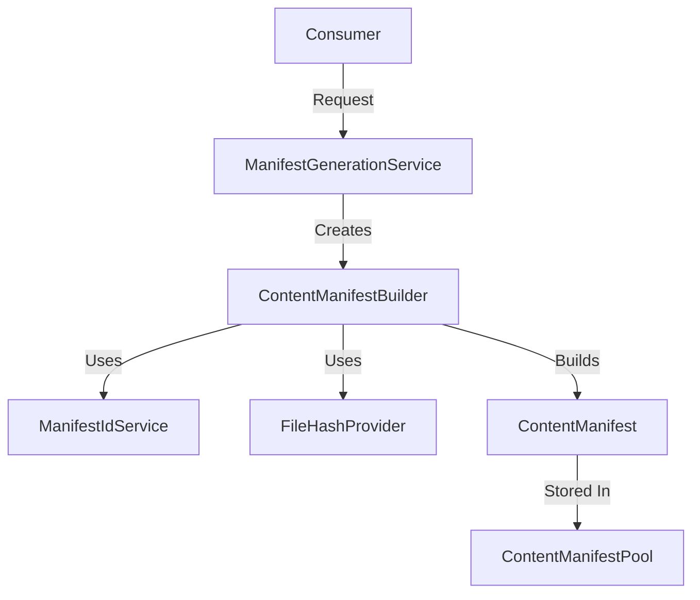

The **Manifest Service** is the declarative backbone of GeneralsHub. It provides a robust, type-safe, and deterministic way to describe every piece of content in the ecosystem—from base game installations to complex community mods.

## Architecture

The system follows a **Builder Pattern** architecture to construct immutable manifest objects, ensuring validity at every step.



### Core Components

| Component | Responsibility |
| :--- | :--- |
| **ManifestGenerationService** | High-level factory. Orchestrates the creation of builders for specific scenarios (Game Clients, Content Packages, Referrals). |
| **ContentManifestBuilder** | Fluent API for constructing manifests. Handles file scanning, hashing, and dependency mapping. |
| **ManifestIdService** | Generates deterministic, collision-resistant 5-segment IDs (e.g., `1.0.genhub.mod.rotr`). |
| **ContentManifest** | The final Data Transfer Object (DTO). Represents the "Source of Truth" for a content package. |

## Content Manifest Structure

A `ContentManifest` is a JSON-serializable object that describes *what* a package is and *how* to use it.

```json
{
  "manifestVersion": "1.1",
  "id": "1.87.genhub.mod.rotr",
  "name": "Rise of the Reds",
  "version": "1.87",
  "contentType": "Mod",
  "targetGame": "ZeroHour",
  "publisher": {
    "name": "SWR Productions",
    "publisherType": "genhub"
  },
  "dependencies": [
    {
      "id": "1.04.steam.gameinstallation.zerohour",
      "dependencyType": "GameInstallation",
      "installBehavior": "Required"
    }
  ],
  "files": [
    {
      "relativePath": "Data/INIZH.big",
      "hash": "sha256:e3b0c44298fc1c149afbf4c8996fb924...",
      "size": 10240,
      "sourceType": "ContentAddressable"
    }
  ]
}
```

## API Reference

### IManifestGenerationService

The entry point for creating manifests. It abstracts away the complexity of configuring the builder.

```csharp
public interface IManifestGenerationService
{
    // Scans a directory and builds a manifest for a Mod/Map/Patch
    Task<IContentManifestBuilder> CreateContentManifestAsync(...);

    // Creates a manifest for a detected base game (Generals/ZH)
    Task<IContentManifestBuilder> CreateGameInstallationManifestAsync(...);

    // Creates a "Pointer" manifest that refers to another publisher or content
    Task<ContentManifest> CreatePublisherReferralAsync(...);
}
```

### IContentManifestBuilder (Fluent API)

The builder allows for chaining methods to construct complex manifests programmatically.

```csharp
var manifest = builder
    .WithBasicInfo("swr", "Rise of the Reds", "1.87")
    .WithContentType(ContentType.Mod, GameType.ZeroHour)
    .WithMetadata("The ultimate expansion mod for Zero Hour.")
    .AddDependency(baseGameId, "Zero Hour", ContentType.GameInstallation, DependencyInstallBehavior.Required)
    .Build();
```

#### Key Methods

- **`AddFilesFromDirectoryAsync`**: Recursively scans a folder. It automatically:
  - Computes SHA256 hashes for file integrity.
  - Detects executable files (`.exe`, `.dll`) and sets permission flags.
  - Classifies files (e.g., maps go to `UserMapsDirectory`).
- **`WithInstallationInstructions`**: Defines how the workspace should be assembled (e.g., `HybridCopySymlink`).
- **`AddPatchFile`**: Registers a file that should be applied as a binary patch during installation.

## Implementation Details

### ID Generation Logic

IDs are generated centrally by `ManifestIdService` to ensure determinism.

- **Format**: `schema.version.publisher.type.name`
- **Normalization**: User versions like "1.87" are normalized to "187" to maintain the dot-separated schema structure.

### Hash Optimization

To improve performance when scanning large game installations (which can be several GBs):

- **Content Packages**: Full SHA256 hashing is performed.
- **Game Installations**: Hashing is selectively optimized. The system is designed to eventually support CSV-based authority (pre-calculated hashes) to skip runtime hashing entirely.

### Verification & Validation

The builder performs validation *during construction*:

- **ManifestIdValidator**: Ensures the generated ID is valid before setting it.
- **Dependency checks**: Ensures circular dependencies or invalid version ranges are caught early.

## Usage Scenarios

### 1. Mod Packaging (Dev Tool)

Developers use the `CreateContentManifestAsync` flow to package their mods. The builder scans their `Output/` directory, hashes every file, and produces a `manifest.json` that can be distributed.

### 2. Game Detection (Runtime)

When GenHub detects a new Game Installation (e.g., Steam), it calls `CreateGameInstallationManifestAsync`. This scans the folder on disk and creates a "Virtual Manifest" in memory, allowing the rest of the system to treat the local game files exactly like a downloaded mod.

The virtual manifest includes:

- All game files with their SHA256 hashes
- Game installation metadata (version, install path)
- Dependencies on base game requirements
- Content type marked as `GameInstallation`

This approach enables the workspace system to treat game installations as first-class content, allowing mods to depend on specific game versions and enabling the reconciliation system to detect game file modifications.

### 3. Content Download (User Action)

When users download content from publishers (ModDB, CNCLabs, GitHub), the content pipeline:

1. **Discovers** available content via discoverers
2. **Resolves** lightweight search results into full manifests
3. **Delivers** content by downloading and extracting files
4. **Stores** files in Content-Addressable Storage (CAS)
5. **Generates** final manifest with CAS references

The manifest is then added to the ManifestPool, making it available for game profiles.

## Manifest Validation

The manifest service performs validation at multiple stages:

### Schema Validation

- Manifest ID format (5-segment structure)
- Required fields presence
- Field type correctness
- Version string format

### Content Validation

- File hash verification (SHA256)
- File size validation
- Download URL accessibility
- Dependency resolution

### Dependency Validation

- Circular dependency detection
- Version constraint compatibility
- Required dependencies availability
- Conflict detection (ConflictsWith, IsExclusive)

## Manifest Lifecycle

### Creation

1. Content is packaged or downloaded
2. Files are hashed and stored in CAS
3. Manifest is generated with file references
4. Manifest is validated
5. Manifest is added to ManifestPool

### Usage

1. User creates game profile
2. User selects content from ManifestPool
3. Dependencies are resolved automatically
4. Workspace is prepared with selected manifests
5. Game is launched with content applied

### Updates

1. Publisher releases new version
2. User downloads update
3. New manifest is created with updated version
4. Old manifest remains in pool (version history)
5. User can switch between versions in profiles

### Removal

1. User removes content from ManifestPool
2. Manifest is marked for deletion
3. CAS garbage collection removes unreferenced files
4. Profiles using the manifest are invalidated

## Advanced Features

### Content-Addressable Storage Integration

Manifests reference files by SHA256 hash rather than file paths. This enables:

- **Deduplication**: Same file used by multiple mods stored once
- **Integrity**: Files verified on every access
- **Immutability**: Files never modified, only replaced
- **Efficiency**: Workspace strategies (symlink, hardlink) leverage CAS

### Manifest Factories

Publisher-specific factories convert external content formats into manifests:

- **ModDBManifestFactory**: Converts ModDB downloads
- **CNCLabsManifestFactory**: Converts CNCLabs content
- **GitHubManifestFactory**: Converts GitHub releases
- **GenericCatalogResolver**: Converts publisher catalogs

### Post-Extraction Splitting

A single downloaded archive can produce multiple manifests:

- **GeneralsOnline**: One ZIP → 60Hz variant + MapPack
- **ControlBar**: One release → Multiple resolution variants
- **Mod + Addons**: Base mod + optional addons

This is achieved through file filtering patterns in catalog definitions.

## Best Practices

### For Content Creators

- Use semantic versioning (1.0.0, 1.1.0, 2.0.0)
- Include comprehensive changelogs
- Specify all dependencies explicitly
- Test manifests before publishing
- Provide clear installation instructions

### For Users

- Keep manifests organized in ManifestPool
- Review dependencies before installation
- Use version constraints for stability
- Backup profiles before major updates
- Report manifest issues to publishers

### For Developers

- Validate manifests during creation
- Handle missing dependencies gracefully
- Implement proper error messages
- Test with various content types
- Document custom manifest fields

## Troubleshooting

### Common Issues

**Manifest ID Conflicts**

- Ensure unique content IDs per publisher
- Use proper version normalization
- Check for duplicate manifests in pool

**Dependency Resolution Failures**

- Verify all dependencies are installed
- Check version constraints compatibility
- Look for circular dependencies
- Review dependency logs

**File Hash Mismatches**

- Re-download corrupted content
- Verify CAS integrity
- Check for file modifications
- Clear CAS cache if needed

**Workspace Preparation Errors**

- Check disk space availability
- Verify file permissions
- Review workspace strategy settings
- Check for conflicting content

## Schema Reference

### ManifestFile Complete Schema

The `ManifestFile` class represents a single file entry in a content manifest. Each file is tracked with integrity hashes, source information, and installation targets.

```json
{
  "relativePath": "Data/INIZH.big",
  "hash": "sha256:e3b0c44298fc1c149afbf4c8996fb92427ae41e4649b934ca495991b7852b855",
  "size": 10485760,
  "sourceType": "ContentAddressable",
  "installTarget": "Workspace",
  "permissions": {
    "isReadOnly": false,
    "requiresElevation": false,
    "unixPermissions": "644"
  },
  "isExecutable": false,
  "downloadUrl": "https://example.com/files/INIZH.big",
  "isRequired": true,
  "sourcePath": "extracted/Data/INIZH.big",
  "patchSourceFile": "patches/INIZH.patch",
  "packageInfo": {
    "packageUrl": "https://example.com/mod.zip",
    "expectedHash": "sha256:abc123...",
    "packageType": "Zip",
    "extractionPath": "ModFiles/"
  }
}
```

**Field Descriptions**:

- **relativePath** (string, required): Path relative to installation root. Used for workspace placement.
- **hash** (string, required): SHA256 hash prefixed with `sha256:`. Used for CAS lookup and integrity verification.
- **size** (long, required): File size in bytes. Used for download progress and disk space validation.
- **sourceType** (ContentSourceType, required): Defines where the file originates. See ContentSourceType enum below.
- **installTarget** (ContentInstallTarget, optional): Where to install the file. Defaults to `Workspace`.
- **permissions** (FilePermissions, optional): Cross-platform permission specifications.
- **isExecutable** (bool, optional): Whether the file is executable. Auto-detected for `.exe`, `.dll`, `.so` files.
- **downloadUrl** (string, optional): Direct download URL for `RemoteDownload` source type.
- **isRequired** (bool, optional): Whether the file is required for content to function. Defaults to `true`.
- **sourcePath** (string, optional): Source path for copy operations, relative to base installation or extraction path.
- **patchSourceFile** (string, optional): Path to patch file when `sourceType` is `PatchFile`. Relative to mod's content root.
- **packageInfo** (ExtractionConfiguration, optional): Package extraction details when `sourceType` is `ExtractedPackage`.

### ContentSourceType Enum

Defines the origin of content files, enabling the system to handle diverse content sources uniformly.

```json
{
  "sourceType": "ContentAddressable"
}
```

**Values**:

- **Unknown** (0): Content source is undefined. Default value, should be replaced during manifest generation.
- **GameInstallation** (1): Content comes from detected game installation (Steam, EA, GOG).
  - Used for: Base game files, official patches
  - Example: `generals.exe`, `Data/INI/Object/AmericaTankCrusader.ini`
- **ContentAddressable** (2): Content stored in CAS by SHA256 hash.
  - Used for: Downloaded mods, maps, addons after extraction
  - Example: Files in `%AppData%/GenHub/CAS/e3/b0/c44298fc1c149afbf4c8996fb92427ae41e4649b934ca495991b7852b855`
- **LocalFile** (3): Content is a local file on the filesystem.
  - Used for: User-created content, development builds
  - Example: `C:/Users/Dev/MyMod/Data/INI/Object/CustomUnit.ini`
- **RemoteDownload** (4): Content must be downloaded from a URL.
  - Used for: Large files not yet downloaded, on-demand assets
  - Example: High-resolution texture packs, optional voice packs
- **ExtractedPackage** (5): Content extracted from an archive.
  - Used for: Files during extraction process, before CAS storage
  - Example: Files from `mod-v1.0.zip` during installation
- **PatchFile** (6): Content is a binary patch applied to existing files.
  - Used for: Incremental updates, file modifications
  - Example: `.patch` files applied to base game files

**Usage Example**:

```csharp
// CAS-stored mod file
new ManifestFile {
    RelativePath = "Data/INIZH.big",
    SourceType = ContentSourceType.ContentAddressable,
    Hash = "sha256:e3b0c44...",
    Size = 10485760
}

// Remote download
new ManifestFile {
    RelativePath = "Videos/Intro.bik",
    SourceType = ContentSourceType.RemoteDownload,
    DownloadUrl = "https://cdn.example.com/intro.bik",
    Hash = "sha256:abc123...",
    Size = 52428800
}
```

### ContentInstallTarget Enum

Defines where content should be installed, supporting both workspace and user data directories.

```json
{
  "installTarget": "UserMapsDirectory"
}
```

**Values**:

- **Workspace** (0): Install to game's workspace directory (default).
  - Used for: Game clients, mods, patches, addons
  - Location: `%AppData%/GenHub/Workspaces/{profile-id}/`
  - Example: `Data/`, `Shaders/`, `generals.exe`
- **UserDataDirectory** (1): Install to user's Documents folder for the game.
  - Used for: User-specific content, settings, saves
  - Location (Generals): `Documents/Command and Conquer Generals Data/`
  - Location (Zero Hour): `Documents/Command and Conquer Generals Zero Hour Data/`
  - Example: `Options.ini`, custom maps, replays
- **UserMapsDirectory** (2): Install to Maps subdirectory in user data.
  - Used for: Custom maps
  - Location (Generals): `Documents/Command and Conquer Generals Data/Maps/`
  - Location (Zero Hour): `Documents/Command and Conquer Generals Zero Hour Data/Maps/`
  - Example: `MyCustomMap.map`
- **UserReplaysDirectory** (3): Install to Replays subdirectory in user data.
  - Used for: Replay files
  - Location (Generals): `Documents/Command and Conquer Generals Data/Replays/`
  - Location (Zero Hour): `Documents/Command and Conquer Generals Zero Hour Data/Replays/`
  - Example: `Tournament_Final.rep`
- **UserScreenshotsDirectory** (4): Install to Screenshots subdirectory in user data.
  - Used for: Screenshot files
  - Location (Generals): `Documents/Command and Conquer Generals Data/Screenshots/`
  - Location (Zero Hour): `Documents/Command and Conquer Generals Zero Hour Data/Screenshots/`
- **System** (5): Install to system location (requires elevation).
  - Used for: Prerequisites like VC++ redistributables, DirectX
  - Location: `C:/Windows/System32/` or similar
  - Example: `vcruntime140.dll`

**Usage Example**:

```csharp
// Map file goes to user maps directory
new ManifestFile {
    RelativePath = "Tournament_Arena.map",
    SourceType = ContentSourceType.ContentAddressable,
    InstallTarget = ContentInstallTarget.UserMapsDirectory,
    Hash = "sha256:def456...",
    Size = 2048576
}

// Mod file goes to workspace
new ManifestFile {
    RelativePath = "Data/INI/Object/CustomUnit.ini",
    SourceType = ContentSourceType.ContentAddressable,
    InstallTarget = ContentInstallTarget.Workspace,
    Hash = "sha256:789abc...",
    Size = 4096
}
```

### ContentDependency Advanced Fields

The `ContentDependency` class provides sophisticated dependency management with publisher constraints, version ranges, and conflict detection.

```json
{
  "id": "1.04.steam.gameinstallation.zerohour",
  "name": "Zero Hour",
  "dependencyType": "GameInstallation",
  "installBehavior": "Required",
  "publisherType": "steam",
  "strictPublisher": false,
  "minVersion": "1.04",
  "maxVersion": null,
  "exactVersion": "1.04",
  "compatibleVersions": ["1.04", "1.04.1"],
  "compatibleGameTypes": ["ZeroHour"],
  "isExclusive": false,
  "conflictsWith": ["1.04.ea.gameinstallation.zerohour"],
  "isOptional": false,
  "requiredPublisherTypes": ["steam", "gog"],
  "incompatiblePublisherTypes": ["ea"]
}
```

**Advanced Field Descriptions**:

- **publisherType** (string, optional): Publisher type identifier from `IContentProvider.SourceName`.
  - Enables dependencies like "requires Steam version of Zero Hour" vs "any Zero Hour"
  - Examples: `"steam"`, `"ea"`, `"gog"`, `"genhub"`, `"moddb"`
- **strictPublisher** (bool, optional): Whether publisher type must match exactly.
  - `true`: Only content from specified publisher satisfies dependency
  - `false`: Any publisher can satisfy if other constraints match
  - Example: GeneralsOnline requires Zero Hour but doesn't care about publisher
- **exactVersion** (string, optional): Exact version required, overrides min/max.
  - Used for: Critical dependencies requiring specific versions
  - Example: `"1.04"` for Zero Hour, `"1.08"` for Generals
- **compatibleVersions** (List<string>, optional): List of compatible versions.
  - Alternative to version ranges for non-sequential versioning
  - Example: `["1.04", "1.04.1", "1.04.2"]`
- **compatibleGameTypes** (List<GameType>, optional): Restricts which game types satisfy dependency.
  - Used when dependency can be satisfied by multiple game types
  - Example: GeneralsOnline client only compatible with `ZeroHour`
- **isExclusive** (bool, optional): Whether this dependency cannot coexist with others.
  - Used for: Mutually exclusive content (e.g., different game clients)
  - Example: GeneralsOnline and Gentool cannot both be active
- **conflictsWith** (List<ManifestId>, optional): Explicit list of conflicting content IDs.
  - More granular than `isExclusive`
  - Example: Mod A conflicts with Mod B's specific version
- **isOptional** (bool, optional): Whether dependency is optional.
  - Optional dependencies enhance functionality but aren't required
  - Example: Mod optionally depends on ControlBar for better UX
- **requiredPublisherTypes** (List<string>, optional): Whitelist of acceptable publisher types.
  - Dependency can only be satisfied by content from these publishers
  - Example: `["steam", "gog"]` excludes EA version
- **incompatiblePublisherTypes** (List<string>, optional): Blacklist of unacceptable publisher types.
  - Content from these publishers cannot satisfy dependency
  - Example: `["ea"]` excludes EA version due to known incompatibilities

**Usage Example**:

```csharp
// Strict Steam-only dependency
new ContentDependency {
    Id = ManifestId.Create("1.04.steam.gameinstallation.zerohour"),
    Name = "Zero Hour (Steam)",
    DependencyType = ContentType.GameInstallation,
    PublisherType = "steam",
    StrictPublisher = true,
    ExactVersion = "1.04"
}

// Flexible dependency with version range
new ContentDependency {
    Id = ManifestId.Create("1.0.genhub.mod.rotr"),
    Name = "Rise of the Reds",
    DependencyType = ContentType.Mod,
    MinVersion = "1.85",
    MaxVersion = "2.0",
    IsOptional = false
}
```

### ContentManifest Advanced Fields

Beyond the basic structure shown earlier, `ContentManifest` includes advanced fields for publisher integration, content references, and installation customization.

```json
{
  "manifestVersion": "1.1",
  "id": "1.87.genhub.mod.rotr",
  "name": "Rise of the Reds",
  "version": "1.87",
  "contentType": "Mod",
  "targetGame": "ZeroHour",
  "originalProviderName": "ModDB",
  "originalContentId": "rise-of-the-reds",
  "sourcePath": "C:/Downloads/ROTR_1.87",
  "contentReferences": [
    {
      "publisherId": "swr-productions",
      "contentId": "rotr-addon-pack",
      "referenceType": "Addon"
    }
  ],
  "knownAddons": [
    "1.0.genhub.addon.rotr-extra-units",
    "1.0.genhub.addon.rotr-hd-textures"
  ],
  "requiredDirectories": [
    "Data/",
    "Maps/",
    "Shaders/"
  ],
  "installationInstructions": {
    "preInstallSteps": [
      {
        "type": "ValidateGameVersion",
        "parameters": { "minVersion": "1.04" }
      }
    ],
    "postInstallSteps": [
      {
        "type": "RunScript",
        "parameters": { "scriptPath": "setup.bat" }
      }
    ],
    "workspaceStrategy": "HybridCopySymlink",
    "downloadHash": "sha256:abc123..."
  }
}
```

**Advanced Field Descriptions**:

- **originalProviderName** (string, optional): Name of the publisher that originally supplied this manifest.
  - Used for: Cache invalidation, update checking
  - Examples: `"ModDB"`, `"GitHub"`, `"CNCLabs"`, `"GenericCatalog"`
- **originalContentId** (string, optional): Publisher-specific content identifier.
  - Used for: Tracking content across updates, cache invalidation
  - Examples: `"rise-of-the-reds"` (ModDB slug), `"12345"` (numeric ID)
- **sourcePath** (string, optional): Original source path for local content.
  - Used for: GameInstallation manifests to persist installation paths
  - Example: `"C:/Program Files (x86)/EA Games/Command & Conquer Generals Zero Hour"`
- **contentReferences** (List<ContentReference>, optional): Cross-publisher content links.
  - Used for: Referencing related content from other publishers
  - Enables: Addon chains, recommended content, alternative versions
- **knownAddons** (List<string>, optional): Manifest IDs of known addons for this content.
  - Manifest-driven addon discovery (not hardcoded)
  - Example: Base mod lists its official addons
- **requiredDirectories** (List<string>, optional): Directory structure that must exist.
  - Created during workspace preparation
  - Example: `["Data/", "Maps/", "Shaders/"]`
- **installationInstructions** (InstallationInstructions, optional): Installation behavior and lifecycle hooks.
  - See InstallationInstructions section below

### ContentMetadata Advanced Fields

The `ContentMetadata` class provides rich metadata for content discovery, presentation, and variant management.

```json
{
  "description": "The ultimate expansion mod for Zero Hour",
  "tags": ["mod", "total-conversion", "multiplayer"],
  "iconUrl": "https://example.com/icon.png",
  "coverUrl": "https://example.com/cover.jpg",
  "screenshotUrls": [
    "https://example.com/screenshot1.jpg",
    "https://example.com/screenshot2.jpg"
  ],
  "releaseDate": "2024-01-15T00:00:00Z",
  "changelogUrl": "https://example.com/changelog.md",
  "themeColor": "#FF5733",
  "sourcePath": "C:/Program Files/Game",
  "variants": [
    {
      "id": "1920x1080",
      "name": "Full HD",
      "description": "Optimized for 1920x1080 displays",
      "variantType": "resolution",
      "value": "1920x1080",
      "isDefault": true,
      "targetGame": null,
      "includePatterns": ["*1920x1080*", "Resolution_1080p/*"],
      "excludePatterns": ["*4K*"],
      "tags": ["hd", "1080p"]
    }
  ],
  "requiresVariantSelection": true,
  "selectedVariantId": "1920x1080"
}
```

**Advanced Field Descriptions**:

- **variants** (List<ContentVariant>, optional): Available variants for this content.
  - Enables: Resolution variants (ControlBar), language packs, quality settings
  - Each variant defines file filtering patterns
- **requiresVariantSelection** (bool, optional): Whether user must select a variant before installation.
  - `true`: Show variant selection dialog during installation
  - `false`: Use default variant or install all variants
- **selectedVariantId** (string, optional): Currently selected variant ID.
  - Used when creating profile-specific manifests from variant content
  - Set after user selects variant in installation dialog

**ContentVariant Schema**:

- **id** (string, required): Unique identifier for this variant.
- **name** (string, required): Display name shown to users.
- **description** (string, optional): Detailed variant description.
- **variantType** (string, required): Type of variant (e.g., `"resolution"`, `"language"`, `"quality"`).
- **value** (string, required): Variant value (e.g., `"1920x1080"`, `"en-US"`, `"high"`).
- **isDefault** (bool, optional): Whether this is the default variant.
- **targetGame** (GameType, optional): Target game if different from parent content.
- **includePatterns** (List<string>, required): File patterns to include for this variant. Supports wildcards.
- **excludePatterns** (List<string>, optional): File patterns to exclude for this variant.
- **tags** (List<string>, optional): Tags for filtering and discovery.

### PublisherInfo Advanced Fields

The `PublisherInfo` class provides publisher identity, update mechanisms, and authentication details.

```json
{
  "name": "SWR Productions",
  "publisherType": "genhub",
  "website": "https://swrproductions.com",
  "supportUrl": "https://swrproductions.com/support",
  "contactEmail": "support@swrproductions.com",
  "updateApiEndpoint": "https://api.swrproductions.com/updates",
  "contentIndexUrl": "https://swrproductions.com/catalog/index.json",
  "updateCheckIntervalHours": 168,
  "supportsIncrementalUpdates": true,
  "authenticationMethod": "api-key"
}
```

**Advanced Field Descriptions**:

- **updateApiEndpoint** (string, optional): API endpoint for checking content updates.
  - GenHub polls this to discover new versions
  - Examples: GitHub API, custom REST endpoints, indexed manifest directories
  - Format: Returns JSON with available versions and download URLs
- **contentIndexUrl** (string, optional): URL for discovering available content from publisher.
  - Points to directory listing or API endpoint returning manifest IDs
  - GenHub polls this to discover new content
  - Example: `https://publisher.com/catalog/index.json`
- **updateCheckIntervalHours** (int, optional): How often to check for updates (in hours).
  - `null`: Use system default (typically 168 hours/weekly)
  - `0`: Disable automatic updates
  - `24`: Daily checks
  - `168`: Weekly checks (Community-Outpost default)
  - `1`: Hourly checks (commit-based publishers)
- **supportsIncrementalUpdates** (bool, optional): Whether publisher supports delta updates.
  - `true`: GenHub can download only changed files
  - `false`: Full content package required for updates
  - Reduces bandwidth for large mods with small changes
- **authenticationMethod** (string, optional): Authentication method for accessing content.
  - Values: `"none"`, `"api-key"`, `"oauth"`, `"github-token"`, `"bearer"`
  - Used for: Private repositories, premium content, beta access
  - Example: GitHub private repos require `"github-token"`

### InstallationInstructions Schema

The `InstallationInstructions` class defines installation behavior, lifecycle hooks, and workspace strategy preferences.

```json
{
  "preInstallSteps": [
    {
      "type": "ValidateGameVersion",
      "parameters": {
        "minVersion": "1.04"
      }
    },
    {
      "type": "BackupFile",
      "parameters": {
        "filePath": "Data/INI/GameData.ini"
      }
    }
  ],
  "postInstallSteps": [
    {
      "type": "RunScript",
      "parameters": {
        "scriptPath": "setup.bat",
        "arguments": "--silent"
      }
    },
    {
      "type": "ShowMessage",
      "parameters": {
        "message": "Installation complete! Launch the game to play."
      }
    }
  ],
  "workspaceStrategy": "HybridCopySymlink",
  "downloadHash": "sha256:e3b0c44298fc1c149afbf4c8996fb92427ae41e4649b934ca495991b7852b855"
}
```

**Field Descriptions**:

- **preInstallSteps** (List<InstallationStep>, optional): Steps executed before file installation.
  - Used for: Validation, backups, prerequisite checks
  - Executed in order, installation aborts if any step fails
- **postInstallSteps** (List<InstallationStep>, optional): Steps executed after file installation.
  - Used for: Configuration, script execution, user notifications
  - Executed in order, errors logged but don't abort installation
- **workspaceStrategy** (WorkspaceStrategy, optional): Preferred workspace preparation strategy.
  - Values: `"SymlinkOnly"`, `"FullCopy"`, `"HardLink"`, `"HybridCopySymlink"`
  - Default: `"HybridCopySymlink"` (symlink CAS files, copy user data)
  - User can override in game profile settings
- **downloadHash** (string, optional): SHA256 hash of primary download file.
  - Used for: Verifying downloaded archives before extraction
  - Format: `"sha256:..."` prefix

**InstallationStep Types**:

- **ValidateGameVersion**: Ensures game version meets requirements
- **BackupFile**: Creates backup of existing file before modification
- **RunScript**: Executes script or executable
- **ShowMessage**: Displays message to user
- **CreateDirectory**: Creates required directory structure
- **SetPermissions**: Sets file permissions

### CAS Integration Details

Content-Addressable Storage (CAS) is the foundation of GenHub's file management system, enabling deduplication, integrity verification, and efficient workspace strategies.

#### How sourceType: ContentAddressable Works

When a file has `sourceType: ContentAddressable`, GenHub retrieves it from CAS using the SHA256 hash:

1. **Hash Lookup**: Extract hash from `hash` field (e.g., `"sha256:e3b0c44298fc1c149afbf4c8996fb92427ae41e4649b934ca495991b7852b855"`)
2. **Path Construction**: Convert hash to CAS path using first 2 bytes as subdirectories
3. **File Retrieval**: Read file from CAS or create symlink/hardlink to it
4. **Integrity Verification**: Verify file hash matches expected value

**Example**:

```json
{
  "relativePath": "Data/INIZH.big",
  "hash": "sha256:e3b0c44298fc1c149afbf4c8996fb92427ae41e4649b934ca495991b7852b855",
  "size": 10485760,
  "sourceType": "ContentAddressable",
  "installTarget": "Workspace"
}
```

This file is retrieved from:

```
%AppData%/GenHub/CAS/e3/b0/c44298fc1c149afbf4c8996fb92427ae41e4649b934ca495991b7852b855
```

#### Hash-Based File Retrieval

CAS uses a two-level directory structure for efficient file organization:

```
CAS/
├── e3/
│   └── b0/
│       └── c44298fc1c149afbf4c8996fb92427ae41e4649b934ca495991b7852b855
├── a1/
│   └── 2f/
│       └── 3e4d5c6b7a8f9e0d1c2b3a4f5e6d7c8b9a0f1e2d3c4b5a6f7e8d9c0b1a2f3e4d
```

**Path Construction Algorithm**:

1. Take SHA256 hash (64 hex characters)
2. First 2 characters → First directory level
3. Next 2 characters → Second directory level
4. Remaining 60 characters → Filename

**Benefits**:

- Prevents directory size limits (max ~256 files per directory)
- Enables efficient file system operations
- Supports billions of unique files

#### CAS Storage Structure

```
%AppData%/GenHub/
├── CAS/                          # Content-Addressable Storage root
│   ├── e3/b0/c44298fc...         # File stored by hash
│   ├── a1/2f/3e4d5c6b7a...       # Another file
│   └── ...
├── Workspaces/                   # Active game workspaces
│   ├── profile-123/              # Profile-specific workspace
│   │   ├── Data/INIZH.big        # Symlink → CAS/e3/b0/c44298fc...
│   │   └── generals.exe          # Symlink → CAS/a1/2f/3e4d5c6b...
│   └── profile-456/
├── Manifests/                    # Manifest storage
│   ├── 1.87.genhub.mod.rotr.json
│   └── 1.04.steam.gameinstallation.zerohour.json
└── Temp/                         # Temporary extraction
```

#### File Deduplication

CAS automatically deduplicates files across all content:

**Scenario**: Three mods all include the same `shaders.big` file (100 MB)

**Without CAS**:

```
Mod A/shaders.big  → 100 MB
Mod B/shaders.big  → 100 MB
Mod C/shaders.big  → 100 MB
Total: 300 MB
```

**With CAS**:

```
CAS/ab/cd/ef123...  → 100 MB (single copy)
Mod A workspace → symlink to CAS
Mod B workspace → symlink to CAS
Mod C workspace → symlink to CAS
Total: 100 MB + negligible symlink overhead
```

**Deduplication Process**:

1. File is hashed during manifest generation
2. Hash is checked against existing CAS entries
3. If hash exists, file is not stored again
4. Manifest references existing CAS entry
5. Workspace strategies create links to shared file

**Benefits**:

- Massive disk space savings (50-80% typical reduction)
- Faster installations (no file copying for duplicates)
- Guaranteed file integrity (hash verification)
- Atomic updates (replace hash reference, not file)

**Example Manifest with CAS**:

```json
{
  "files": [
    {
      "relativePath": "Data/Shaders.big",
      "hash": "sha256:abcdef123456...",
      "size": 104857600,
      "sourceType": "ContentAddressable"
    },
    {
      "relativePath": "Data/INIZH.big",
      "hash": "sha256:fedcba654321...",
      "size": 52428800,
      "sourceType": "ContentAddressable"
    }
  ]
}
```

Both files are stored once in CAS, regardless of how many mods reference them. The workspace reconciler creates symlinks or hardlinks to the CAS entries based on the selected workspace strategy.

## Related Documentation

- [Content System](./content.md) - Content pipeline overview
- [Storage & CAS](./storage.md) - Content-addressable storage details
- [Workspace](./workspace.md) - Workspace strategies and reconciliation
- [Game Profiles](./gameprofiles.md) - Profile creation and management
- [Manifest ID System](../../dev/manifest-id-system.md) - ID format specification
