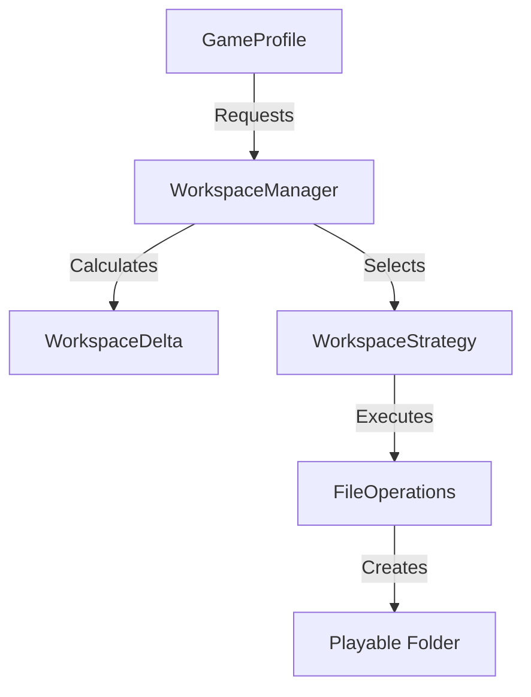
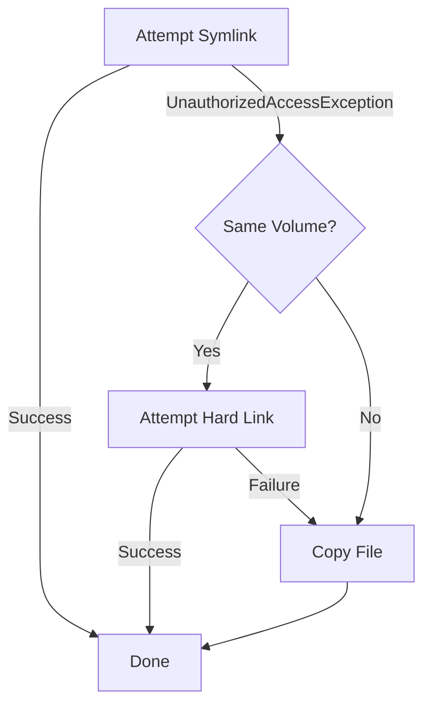

The **Workspace System** is the "Virtual File System" of GeneralsHub. It assembles a playable game folder on demand by combining the base game files with enabled mods, maps, and patches, all without modifying the original installation.

## Architecture

The system uses a **Strategy Pattern** to create workspaces, allowing for different trade-offs between isolation, speed, and disk usage.



## Reconciliation System

Before creating a workspace, the `WorkspaceReconciler` analyzes the existing folder to determine the minimal set of operations needed. This enables **Incremental Updates** (delta patching) rather than full rebuilds.

### Delta Logic

The reconciler compares the `TargetConfiguration` (what files should exist) against the `CurrentState` (what files currently exist).

1. **Conflict Resolution**: If multiple manifests provide the same file (e.g., a mod overwrites `INIZH.big`), the winner is chosen based on **Priority**:
   * `Mod` > `Patch` > `Addon` > `GameInstallation`.
2. **Delta Operations**:
   * **Add**: File is missing.
   * **Update**: File exists but is outdated (Size mismatch, Hash mismatch, or Broken Symlink).
   * **Remove**: File exists but is not in the new configuration.
   * **Skip**: File is already up to date.

> [!TIP]
> **Performance Optimization**: The reconciler primarily uses **File Size** and **Modification Time** to detect changes. Deep SHA256 hashing is skipped during routine launches to ensure the game starts almost instantly.

## Workspace Strategies

The system supports multiple assembly strategies. The `HybridCopySymlink` strategy is the default and recommended choice.

### 1. Hybrid Copy-Symlink (Default)

Balances compatibility with disk usage.

* **Rule**:
  * **Essential Files** (Executables, DLLs, INIs, Scripts, files < 1MB): **Copied**.
  * **Asset Files** (.big archives, Audio, Maps): **Symlinked**.
* **Admin Rights**: Required on Windows for Symlinks.
* **Fallback**: If Admin rights are missing, it attempts to use **Hard Links**. If that fails (cross-volume), it falls back to **Full Copy**.

### 2. Full Copy

Maximum compatibility, maximum disk usage.

* **Mechanism**: Physically copies every file.
* **Pros**: 100% isolation; Modifying the workspace never affects the source.
* **Cons**: Slowest creation time; High disk usage (2GB+ per profile).

### 3. Hard Link

High speed, low disk usage, no Admin rights required.

* **Mechanism**: Creates NTFS Hard Links.
* **Constraints**: Source and Workspace must be on the **same drive volume** (e.g., both on `C:`).
* **Risk**: Modifying the file content in the workspace *changes the source file* because they point to the same data on disk.

### 4. Symlink Only

Minimum disk usage.

* **Mechanism**: Symlinks everything.
* **Pros**: Instant creation.
* **Cons**: Some game engines (like SAGE) behave unexpectedly when essential config files are symlinked.

## CAS Integration

Workspaces are fully integrated with **Content Addressable Storage (CAS)**.

* Manifests can reference files by **Hash** (SHA256).
* Strategies can pull files directly from the CAS pool (`.gemini/antigravity/cas/`).
* This allows multiple mods to share common assets without duplication.

---

## File Classification Logic

The Hybrid strategy classifies files as **Essential** or **Non-Essential** to determine whether to copy or symlink them.

### Classification Algorithm

The `IsEssentialFile()` method evaluates files based on multiple criteria:

```csharp
protected static bool IsEssentialFile(string relativePath, long fileSize)
{
    // 1. Size-based classification
    if (fileSize < 1MB) return true;  // Small files are always copied

    // 2. Extension-based classification
    if (extension in [.exe, .dll, .ini, .cfg, .dat, .xml, .json, .txt, .log])
        return true;

    // 3. C&C-specific essential files
    if (extension in [.big, .str, .csf, .w3d])
        return true;

    // 4. Directory-based classification
    if (directory contains ["mods", "patch", "config", "data", "maps", "scripts"])
        return true;

    // 5. Filename pattern matching
    if (filename contains ["mod", "patch", "config", "generals", "zerohour", "settings"])
        return true;

    // 6. Known non-essential media files
    if (extension in [.tga, .dds, .bmp, .jpg, .png, .wav, .mp3, .ogg, .avi, .mp4, .bik])
        return false;

    // 7. Default to essential for unknown files
    return true;
}
```

### File Size Thresholds

| Threshold | Purpose | Behavior |
|-----------|---------|----------|
| **< 1 MB** | Small files | Always copied (configs, scripts, executables) |
| **≥ 1 MB** | Large files | Classification by extension/directory |
| **≥ 5 MB** | Hash verification | Skipped during routine reconciliation for performance |

### File Type Detection

Detection is performed using:

1. **File Extension**: Primary classification method (case-insensitive)
2. **Directory Path**: Files in essential directories are always copied
3. **Filename Patterns**: Pattern matching for game-specific files
4. **File Size**: Overrides other rules for very small files

---

## Fallback Behavior Chain

The Hybrid strategy implements a three-tier fallback system when creating links for non-essential files:

### Fallback Sequence



### Implementation Details

```csharp
try {
    await CreateSymlinkAsync(destination, source, allowFallback: false);
    symlinkedFiles++;
}
catch (UnauthorizedAccessException) when (AreSameVolume(source, destination)) {
    // Fallback 1: Hard Link (same volume only)
    try {
        await CreateHardLinkAsync(destination, source);
        symlinkedFiles++;  // Still counted as symlinked
    }
    catch (Exception) {
        // Fallback 2: Full Copy
        await CopyFileAsync(source, destination);
        copiedFiles++;
    }
}
```

### Trigger Conditions

| Fallback | Trigger | Requirements | Notes |
|----------|---------|--------------|-------|
| **Symlink → Hard Link** | `UnauthorizedAccessException` | Same volume | No admin rights on Windows |
| **Hard Link → Copy** | Any exception | None | Cross-volume or filesystem limitation |
| **Direct Copy** | Symlink fails + different volumes | None | Maximum compatibility |

### Cross-Volume Detection

```csharp
public static bool AreSameVolume(string path1, string path2)
{
    var root1 = Path.GetPathRoot(Path.GetFullPath(path1));
    var root2 = Path.GetPathRoot(Path.GetFullPath(path2));
    return string.Equals(root1, root2, StringComparison.OrdinalIgnoreCase);
}
```

### Permission Checking

* **Windows**: Symlinks require `SeCreateSymbolicLinkPrivilege` (admin rights)
* **Linux/macOS**: Symlinks work without special permissions
* **Detection**: Attempted at runtime via exception handling (no pre-check)

---

## Workspace Directory Structure

### Root Location

Workspaces are created in: `.gemini/workspaces/`

Full path resolution:

```
{ApplicationDataPath}/.gemini/workspaces/{WorkspaceId}/
```

### Directory Organization

```
.gemini/
├── workspaces/
│   ├── {profile-id-1}/              # Workspace for Profile 1
│   │   ├── generals.exe             # Copied essential files
│   │   ├── game.dat                 # Copied config
│   │   ├── Data/                    # Symlinked directory
│   │   │   └── INI/ -> {source}     # Symlink to source
│   │   └── Maps/ -> {source}        # Symlink to large assets
│   └── {profile-id-2}/              # Workspace for Profile 2
│       └── ...
├── antigravity/
│   └── cas/                         # Content Addressable Storage
│       └── {hash}.blob              # Shared content files
└── workspaces.json                  # Metadata file
```

### Metadata Storage

**Location**: `{ApplicationDataPath}/workspaces.json`

**Structure**:

```json
[
  {
    "Id": "profile-generals-vanilla",
    "WorkspacePath": "C:/Users/.../workspaces/profile-generals-vanilla",
    "GameClientId": "generals-1.8",
    "Strategy": "HybridCopySymlink",
    "CreatedAt": "2025-03-15T10:30:00Z",
    "LastAccessedAt": "2025-03-15T12:45:00Z",
    "FileCount": 623,
    "TotalSizeBytes": 45678912,
    "ManifestIds": ["generals-base", "mod-shockwave"],
    "ManifestVersions": {
      "generals-base": "1.8",
      "mod-shockwave": "1.2.3"
    },
    "IsPrepared": true,
    "IsValid": true
  }
]
```

### Cleanup Policies

1. **Automatic Cleanup**:
   * Workspaces with missing directories are removed from metadata on next scan
   * Orphaned files are detected during reconciliation

2. **Manual Cleanup**:
   * `CleanupWorkspaceAsync(workspaceId)` removes workspace and untracks CAS references
   * Critical: CAS references must be untracked **before** directory deletion

3. **Workspace Reuse**:
   * Existing workspaces are reused if manifest IDs and versions match
   * Strategy changes force recreation
   * `ForceRecreate` flag bypasses reuse logic

---

## Delta Operations Details

### Broken Symlink Detection

```csharp
var fileInfo = new FileInfo(filePath);
if (fileInfo.LinkTarget != null) {
    var targetPath = ResolveAbsolutePath(fileInfo.LinkTarget, filePath);
    if (!File.Exists(targetPath)) {
        // Broken symlink detected
        return true;  // Needs update
    }
}
```

**Detection Method**:

* Check `FileInfo.LinkTarget` property
* Resolve relative symlink targets to absolute paths
* Verify target file existence
* Broken symlinks trigger `WorkspaceDeltaOperation.Update`

### Hash Mismatch Checks

The reconciler uses a **performance-optimized** hash verification strategy:

```csharp
// Regular files
if (manifestFile.Size > 0 && fileInfo.Length != manifestFile.Size) {
    return true;  // Size mismatch = needs update
}

// Hash verification conditions
if (!string.IsNullOrEmpty(manifestFile.Hash) &&
    (forceFullVerification || fileInfo.Length < 5MB)) {
    var hashMatches = await VerifyFileHashAsync(filePath, manifestFile.Hash);
    if (!hashMatches) {
        return true;  // Hash mismatch = needs update
    }
}
```

### When Deep SHA256 Hashing is Performed

| Scenario | Hash Verification | Reason |
|----------|-------------------|--------|
| **Routine Launch** | Skipped for files > 5MB | Performance optimization |
| **Small Files (< 5MB)** | Always performed | Fast enough to verify |
| **Force Verification** | All files | User-requested deep scan |
| **Symlink Targets** | Only if `forceFullVerification` | Trust size match by default |
| **New Files** | Never (no existing file) | Will be added regardless |

### Performance Optimization Strategies

1. **Size-First Comparison**: File size mismatch is checked before hash computation
2. **Symlink Trust**: Valid symlinks with size-matching targets are trusted
3. **Selective Hashing**: Only small files (< 5MB) are hashed during routine launches
4. **Skip Operations**: Files that are already current generate `Skip` deltas (no I/O)

### Delta Operation Types

```csharp
public enum WorkspaceDeltaOperation
{
    Add,     // File missing from workspace
    Update,  // File exists but outdated (size/hash mismatch or broken symlink)
    Remove,  // File exists but not in new manifests
    Skip     // File is already current
}
```

---

## WorkspaceReconciler Implementation

### Scanning Algorithm

```csharp
public async Task<List<WorkspaceDelta>> AnalyzeWorkspaceDeltaAsync(
    WorkspaceInfo? workspaceInfo,
    WorkspaceConfiguration configuration,
    bool forceFullVerification = false)
{
    // 1. Build file occurrence map (handles conflicts)
    var fileOccurrences = new Dictionary<string, List<(ManifestFile, ContentType, ManifestId)>>();

    // 2. Resolve conflicts using priority system
    var expectedFiles = ResolveConflicts(fileOccurrences);

    // 3. Scan existing workspace files
    var existingFiles = ScanWorkspaceDirectory(workspacePath);

    // 4. Generate delta operations
    foreach (var (relativePath, manifestFile) in expectedFiles) {
        if (!existingFiles.Contains(relativePath)) {
            deltas.Add(new WorkspaceDelta { Operation = Add, ... });
        } else {
            var needsUpdate = await FileNeedsUpdateAsync(fullPath, manifestFile, forceFullVerification);
            deltas.Add(new WorkspaceDelta {
                Operation = needsUpdate ? Update : Skip,
                ...
            });
        }
    }

    // 5. Identify files to remove
    foreach (var relativePath in existingFiles) {
        if (!expectedFiles.ContainsKey(relativePath)) {
            deltas.Add(new WorkspaceDelta { Operation = Remove, ... });
        }
    }

    return deltas;
}
```

### Data Structures Used

1. **File Occurrence Map**:

   ```csharp
   Dictionary<string, List<(ManifestFile File, ContentType ContentType, string ManifestId)>>
   ```

   * Key: Relative file path (case-insensitive)
   * Value: All manifests providing this file

2. **Expected Files Dictionary**:

   ```csharp
   Dictionary<string, ManifestFile>
   ```

   * Key: Relative file path (case-insensitive)
   * Value: Winning manifest file after conflict resolution

3. **Existing Files Set**:

   ```csharp
   HashSet<string>
   ```

   * Contains all relative paths currently in workspace

### Conflict Resolution Priority

```csharp
public static class ContentTypePriority
{
    public static int GetPriority(ContentType type) => type switch
    {
        ContentType.Mod => 100,              // Highest priority
        ContentType.Patch => 90,
        ContentType.Addon => 80,
        ContentType.GameInstallation => 10,  // Lowest priority
        _ => 50
    };
}
```

When multiple manifests provide the same file:

1. Sort by `ContentTypePriority` (descending)
2. Winner's file is used in workspace
3. Losers are logged as warnings

### Performance Characteristics

| Operation | Time Complexity | Notes |
|-----------|----------------|-------|
| **File Occurrence Mapping** | O(n) | n = total files across all manifests |
| **Conflict Resolution** | O(m log m) | m = files with conflicts |
| **Directory Scan** | O(k) | k = existing files in workspace |
| **Delta Generation** | O(n + k) | Linear scan of expected + existing |
| **Hash Verification** | O(h) | h = small files (< 5MB) only |

### Memory Usage

* **File Occurrence Map**: ~200 bytes per file entry
* **Expected Files**: ~150 bytes per unique file
* **Existing Files Set**: ~100 bytes per existing file
* **Delta List**: ~250 bytes per delta operation

**Typical Profile** (600 files):

* Memory: ~150 KB
* Scan Time: 50-200ms (without hash verification)
* With Hashing: 500-2000ms (depends on small file count)

---

## Manifest Selection from Profile

### Profile → ManifestPool → WorkspaceManager Flow


### GameProfile Structure

```csharp
public class GameProfile
{
    public string Id { get; set; }
    public string Name { get; set; }
    public GameClient GameClient { get; set; }
    public List<EnabledContent> EnabledContent { get; set; }  // Mods, patches, addons
    public WorkspaceStrategy PreferredStrategy { get; set; }
}

public class EnabledContent
{
    public string ManifestId { get; set; }
    public ContentType ContentType { get; set; }
    public bool IsEnabled { get; set; }
}
```

### WorkspaceConfiguration Construction

```csharp
var configuration = new WorkspaceConfiguration
{
    Id = profile.Id,
    GameClient = profile.GameClient,
    Strategy = profile.PreferredStrategy,
    Manifests = manifestPool.ResolveManifests(profile.EnabledContent),
    WorkspaceRootPath = Path.Combine(appDataPath, ".gemini", "workspaces"),
    BaseInstallationPath = profile.GameClient.InstallationPath,
    ManifestSourcePaths = BuildManifestSourcePaths(profile.EnabledContent)
};
```

### Manifest Resolution Process

1. **Profile Activation**: User selects a GameProfile
2. **Content Resolution**: `ManifestPool` resolves `EnabledContent` references to actual `ContentManifest` objects
3. **Configuration Building**: `WorkspaceConfiguration` is constructed with resolved manifests
4. **Workspace Preparation**: `WorkspaceManager.PrepareWorkspaceAsync()` is called
5. **Strategy Execution**: Selected strategy assembles the workspace

### Workspace Metadata Persistence

After workspace preparation:

```csharp
workspaceInfo.ManifestIds = manifests.Select(m => m.Id.Value).ToList();
workspaceInfo.ManifestVersions = manifests.ToDictionary(
    m => m.Id.Value,
    m => m.Version ?? string.Empty
);
await SaveWorkspaceMetadataAsync(workspaceInfo);
```

This enables:

* Fast workspace reuse detection
* Version change detection (triggers recreation)
* Manifest change detection (triggers reconciliation)

---

## Performance Characteristics

### Strategy Comparison Table

| Strategy | Creation Speed | Disk Usage | Admin Rights | Same Volume | Compatibility | Use Case |
|----------|---------------|------------|--------------|-------------|---------------|----------|
| **Hybrid Copy-Symlink** | Medium | Low-Medium | Yes (Windows) | No | High | **Recommended default** |
| **Full Copy** | Slow | High (2GB+) | No | No | Maximum | Testing, isolation |
| **Hard Link** | Fast | Very Low | No | **Yes** | Medium | Same-drive setups |
| **Symlink Only** | Instant | Minimal | Yes (Windows) | No | Low | Advanced users |

### Benchmarks (600-file workspace)

#### Creation Time

| Strategy | First Creation | Incremental Update | Notes |
|----------|---------------|-------------------|-------|
| **Hybrid** | 2-5 seconds | 100-500ms | Copies ~50MB, symlinks ~1.5GB |
| **Full Copy** | 15-30 seconds | 15-30 seconds | Copies entire 2GB |
| **Hard Link** | 1-2 seconds | 50-200ms | Same volume only |
| **Symlink** | 500ms-1s | 50-100ms | Requires admin |

#### Disk Usage

| Strategy | Typical Usage | Explanation |
|----------|--------------|-------------|
| **Hybrid** | 50-200 MB | Essential files copied, assets symlinked |
| **Full Copy** | 2-3 GB | Complete duplication |
| **Hard Link** | < 1 MB | Metadata only (same inode) |
| **Symlink** | < 1 MB | Link overhead only |

#### Compatibility Score

| Strategy | Windows | Linux | macOS | Cross-Drive | Notes |
|----------|---------|-------|-------|-------------|-------|
| **Hybrid** | ⭐⭐⭐⭐ | ⭐⭐⭐⭐⭐ | ⭐⭐⭐⭐⭐ | ✅ | Admin required on Windows |
| **Full Copy** | ⭐⭐⭐⭐⭐ | ⭐⭐⭐⭐⭐ | ⭐⭐⭐⭐⭐ | ✅ | Works everywhere |
| **Hard Link** | ⭐⭐⭐ | ⭐⭐⭐⭐ | ⭐⭐⭐⭐ | ❌ | Same volume only |
| **Symlink** | ⭐⭐ | ⭐⭐⭐⭐⭐ | ⭐⭐⭐⭐⭐ | ✅ | Admin required on Windows |

### When to Use Each Strategy

1. **Hybrid Copy-Symlink** (Default):
   * General use
   * Cross-drive installations
   * Balance between speed and disk usage

2. **Full Copy**:
   * Testing mod conflicts
   * Complete isolation needed
   * Disk space is not a concern

3. **Hard Link**:
   * Game and workspace on same drive
   * No admin rights available
   * Maximum speed required

4. **Symlink Only**:
   * Development/testing
   * Admin rights available
   * Minimal disk usage critical

---

## Troubleshooting

### Permission Errors

**Symptom**: `UnauthorizedAccessException` when creating symlinks

**Cause**: Windows requires admin rights for symlink creation

**Solutions**:

1. Run GeneralsHub as Administrator
2. Enable Developer Mode (Windows 10+):
   * Settings → Update & Security → For Developers → Developer Mode
3. Switch to Hard Link strategy (same volume only)
4. Switch to Full Copy strategy (slower but no permissions needed)

**Detection**:

```csharp
public override bool RequiresAdminRights =>
    Environment.OSVersion.Platform == PlatformID.Win32NT;
```

### Cross-Drive Failures

**Symptom**: Hard link creation fails with "The system cannot move the file to a different disk drive"

**Cause**: Hard links require source and destination on same volume

**Solutions**:

1. Switch to Hybrid or Symlink strategy
2. Move game installation to same drive as workspace
3. Change workspace root path to same drive as game

**Detection**:

```csharp
if (!AreSameVolume(sourcePath, destinationPath)) {
    throw new IOException("Hard links require same volume");
}
```

### Corrupted Files

**Symptom**: Game crashes or behaves unexpectedly

**Cause**: Hash mismatch or incomplete file copy

**Solutions**:

1. Force full verification:

   ```csharp
   var deltas = await reconciler.AnalyzeWorkspaceDeltaAsync(
       workspaceInfo,
       configuration,
       forceFullVerification: true
   );
   ```

2. Force workspace recreation:

   ```csharp
   configuration.ForceRecreate = true;
   await workspaceManager.PrepareWorkspaceAsync(configuration);
   ```

3. Check source files integrity
4. Clear CAS cache if using CAS-backed content

**Prevention**:

* Hash verification for essential files (< 5MB)
* Size checks for all files
* Broken symlink detection

### Symlink Issues

**Symptom**: Symlinks point to wrong location or are broken

**Cause**: Source files moved, deleted, or relative path resolution failed

**Solutions**:

1. Check symlink target:

   ```bash
   # Windows
   dir /AL workspace_path

   # Linux/macOS
   ls -la workspace_path
   ```

2. Verify source files exist
3. Force workspace recreation
4. Switch to Full Copy strategy temporarily

**Reconciler Detection**:

```csharp
if (fileInfo.LinkTarget != null) {
    var targetPath = ResolveAbsolutePath(fileInfo.LinkTarget, filePath);
    if (!File.Exists(targetPath)) {
        // Broken symlink - will be recreated
        return true;
    }
}
```

### Workspace Reuse Failures

**Symptom**: Workspace recreated every launch despite no changes

**Cause**: Manifest version mismatch or metadata corruption

**Diagnosis**:

```csharp
// Check workspace metadata
var workspaces = await workspaceManager.GetAllWorkspacesAsync();
var workspace = workspaces.Data.FirstOrDefault(w => w.Id == profileId);

// Compare manifest versions
var currentVersions = profile.EnabledContent.Select(c => c.Version);
var cachedVersions = workspace.ManifestVersions;
```

**Solutions**:

1. Verify manifest versions are stable
2. Check `workspaces.json` for corruption
3. Clear workspace metadata and recreate
4. Ensure `ForceRecreate` is not always set

### Performance Issues

**Symptom**: Slow workspace creation or game launch

**Causes & Solutions**:

1. **Deep hash verification on every launch**:
   * Disable `forceFullVerification` for routine launches
   * Only enable for troubleshooting

2. **Full Copy strategy on large installations**:
   * Switch to Hybrid or Hard Link strategy
   * Reduces disk I/O significantly

3. **Antivirus scanning**:
   * Add workspace directory to antivirus exclusions
   * Exclude `.gemini/workspaces/` and `.gemini/antigravity/cas/`

4. **Slow disk (HDD)**:
   * Move workspace root to SSD
   * Use Hard Link strategy (same volume)
   * Reduce number of enabled mods

**Monitoring**:

```csharp
var stopwatch = Stopwatch.StartNew();
await workspaceManager.PrepareWorkspaceAsync(configuration, progress);
logger.LogInformation("Workspace prepared in {Elapsed}ms", stopwatch.ElapsedMilliseconds);
```
